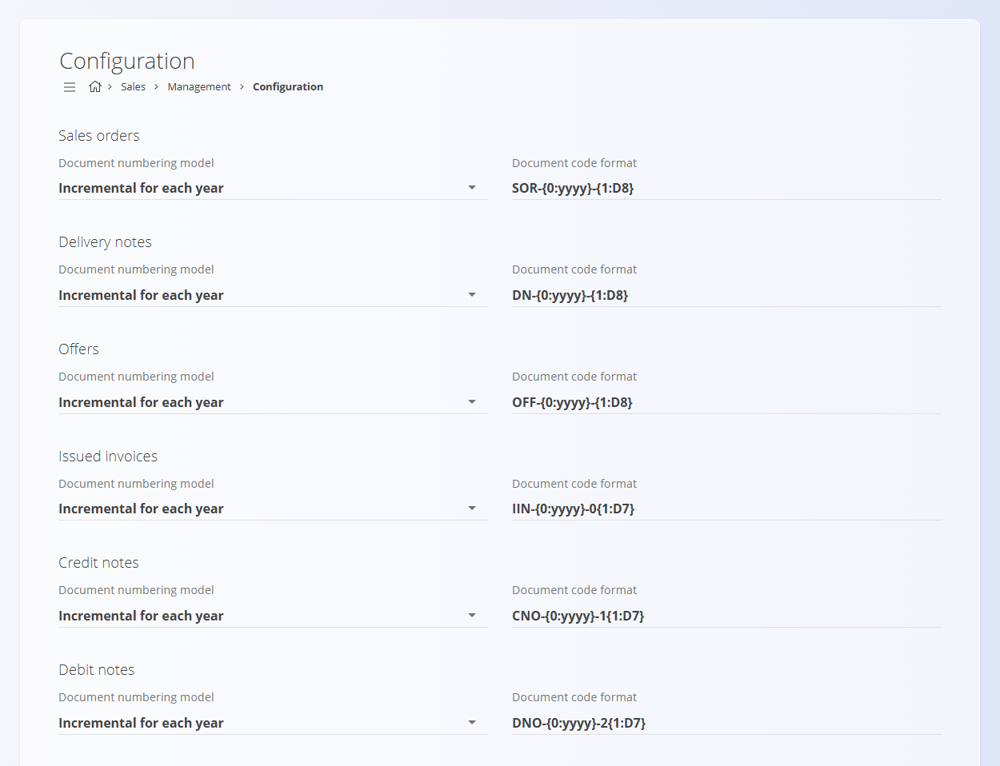

# Konfiguracija prodaje

Konfiguracija **Prodaje** omogoča nastavitev pravil, ki vplivajo na številčenje prodajnih dokumentov. Vse spremembe se shranjujejo samodejno.

Za dostop do te strani pojdite na **Prodaja / Šifranti / Konfiguracija prodaje** v [navigaciji](../../Skupno/UI/Navigacija.md).

## Nastavitve številčenja dokumentov

Izberite model številčenja in obliko kode za prodajne dokumente (Ponudbe, Prodajni nalogi, Dobavnice, Izdani računi, Dobropisi, Breme­pisi).

| Polje | Opis |
|------|------|
| **Model številčenja dokumentov** | • **Zaporedno po letih:** zaporedje se vsako leto ponastavi.   • **Zaporedno:** globalno zaporedje, ki se nikoli ne ponastavi. |
| **Oblika kode dokumenta** | Vzorec, ki določa strukturo kode (npr. PREDPONA-LETO-ŠTEVILKA). |

---
