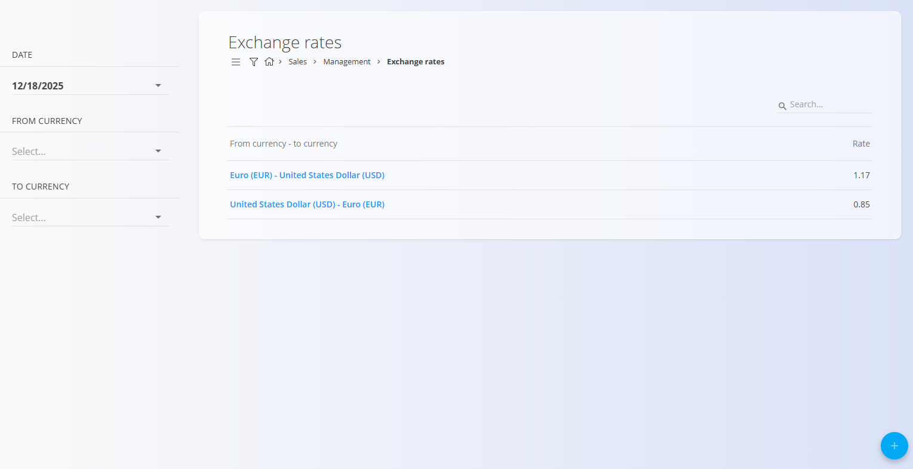
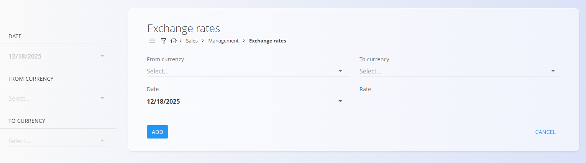

# Menjalni tečaji

Šifrant **Menjalni tečaji** določa menjalne tečaje, ki se uporabljajo po celotnem sistemu pri delu z dokumenti v različnih valutah. Ti tečaji se primarno uporabljajo v področju **Prodaja** za pretvorbo zneskov med **osnovno valuto** in **ciljno valuto** na določen datum.

Menjalni tečaji sistemu omogočajo:
- Pretvorbo denarnih vrednosti med valutami
- Dosledne finančne izračune v prodajnih dokumentih
- Uporabo datumskih menjalnih tečajev za natančno poročanje in fakturiranje

Vsak menjalni tečaj je definiran **iz ene valute v drugo** (Osnovna → Ciljna) za določen datum.

> [!IMPORTANT]
> Šifrant [**Valute**](../../Skupno/Upravljanje/Valute.md) mora biti nastavljen pred ustvarjanjem menjalnih tečajev.

Za dostop do te strani pojdite na **Prodaja / Šifranti / Menjalni tečaji** v [**navigaciji**](../../Skupno/UI/Navigacija.md).

## Shema

| Polje | Opis |
|------|------|
| **Iz valute** | Osnovna valuta za pretvorbo, izbrana iz šifranta [**Valute**](../../Skupno/Upravljanje/Valute.md). |
| **V valuto** | Ciljna valuta, v katero se znesek pretvori, izbrana iz šifranta [**Valute**](../../Skupno/Upravljanje/Valute.md). |
| **Datum** | Datum, za katerega velja menjalni tečaj. |
| **Tečaj** | Faktor pretvorbe iz osnovne v ciljno valuto. |

## Upravljanje

Menjalni tečaji se vzdržujejo ročno in jih je mogoče ustvariti za različne datume in valutne pare.

### Seznam

Seznam prikazuje vse definirane menjalne tečaje glede na izbrane filtre.

Razpoložljivi filtri na levi strani:
- **Datum** — Filtriranje menjalnih tečajev po datumu  
- **Iz valute** — Filtriranje po osnovni valuti  
- **V valuto** — Filtriranje po ciljni valuti  

Vsaka vrstica prikazuje:
- Valutni par (Iz → V)
- Vrednost menjalnega tečaja

## Dejanja

### Ustvarjanje novega menjalnega tečaja

1. Kliknite [**akcijski gumb**](../../Skupno/UI/AkcijskiGumb.md) v spodnjem desnem kotu zaslona za ustvarjanje novega zapisa.

   

2. Izberite **Iz valute** (osnovna valuta).
3. Izberite **V valuto** (ciljna valuta).
4. Izberite **Datum**, za katerega velja tečaj.
5. Vnesite vrednost **Tečaj**.
6. Kliknite **Dodaj**, da shranite menjalni tečaj.

> [!NOTE]  
> - Menjalni tečaji se samodejno uporabljajo povsod, kjer je potrebna pretvorba valut.
> - Tečaji so datum­sko odvisni; preverite, da izberete pravilen datum glede na datum transakcije.
> - Podprte so samo pretvorbe iz osnovne v ciljno valuto; obratne tečaje je treba po potrebi vnesti posebej.

---
