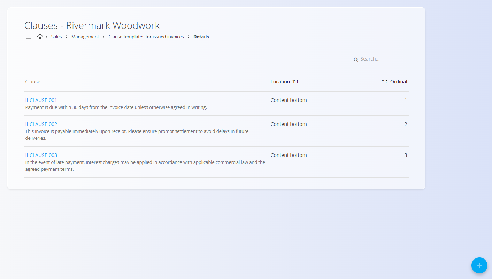
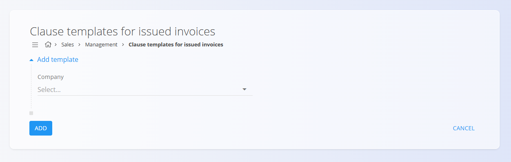
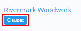

# Predloge klavzul za izdane račune

Šifrant **Predloge klavzul za izdane račune** omogoča definiranje naborov klavzul (predlog), ki se izpišejo na izdanih računih za posamezna podjetja. Predloga vsebuje eno ali več klavzul – kot so pravna obvestila, plačilni pogoji, izjave o omejitvi odgovornosti ali obračunski pogoji – ki se na računu izpišejo na vrhu ali dnu dokumenta v določenem zaporedju.

Za dostop do te strani pojdite na **Prodaja / Šifranti / Predloge klavzul za izdane račune** v [**navigaciji**](../../Skupno/UI/Navigacija.md).

> [!NOTE]  
> **Predpogoji**  
> Pred ustvarjanjem predlog klavzul zagotovite, da je izpolnjeno naslednje:  
> • Partnersko podjetje obstaja v šifrantu [Poslovni imenik](../../Skupno/Upravljanje/PoslovniImenik.md).  
> • Besedilo klavzule obstaja v šifrantu [Vnaprej določena besedila](../../Skupno/Upravljanje/VnaprejDolocenaBesedila.md) (entiteta: *Izdani račun*).

## Shema

### Polja predloge  
| Polje | Opis |
|------|------|
| **Podjetje** | Podjetje, za katerega velja predloga klavzul. Izbira iz šifranta [Poslovni imenik](../../Skupno/Upravljanje/PoslovniImenik.md). (obvezno) |

### Polja klavzul (znotraj predloge)  
| Polje | Opis |
|------|------|
| **Lokacija** | Mesto izpisa klavzule na računu (zgoraj ali spodaj). |
| **Vrstni red** | Zaporedje prikaza klavzule (npr. 1, 2, 3 …). |
| **Klavzula** | Vnaprej določeno besedilo iz šifranta [Vnaprej določena besedila](../../Skupno/Upravljanje/VnaprejDolocenaBesedila.md) (entiteta = *Izdani račun*). |

## Upravljanje

### Seznam

Seznam prikazuje vse obstoječe predloge klavzul, združene po podjetjih:

S klikom na **Klavzule** odprete seznam klavzul za izbrano predlogo. Za iskanje po imenu podjetja lahko uporabite polje **Iskanje**.

### Ustvarjanje nove predloge

Kliknite **akcijski gumb**, da ustvarite novo predlogo. Zahtevano je le eno polje:

Po dodajanju predloge morate klikniti **Klavzule**, da odprete urejevalnik klavzul.

### Dodajanje klavzul v predlogo

V urejevalniku klavzul z akcijskim gumbom dodajte novo klavzulo. Izberite:
- **Lokacija** – mesto izpisa klavzule na izdanem računu  
- **Zaporedna številka** – vrstni red prikaza  
- **Klavzula** – vnaprej določeno besedilo  

### Seznam klavzul

Vse klavzule, dodeljene predlogi, so prikazane v pravilnem zaporedju:

Zaporedje lahko spremenite z urejanjem vrednosti **Zaporedna številka**.

## Dejanja

### Urejanje predlog in klavzul

S klikom na **ime podjetja** odprete predlogo. S klikom na posamezno klavzulo lahko uredite njeno lokacijo, zaporedje ali pripadajoče besedilo.

### Brisanje

Na zaslonu za urejanje kliknite **Izbriši**, da se odpre potrditveno okno:

**Ali ste prepričani, da želite izbrisati ta zapis?**

Ob potrditvi se zapis trajno izbriše, v nasprotnem primeru ostane nespremenjen.

> [!NOTE]  
> Predlogo klavzul ali posamezno klavzulo je mogoče izbrisati le, če ni zahtevana v odvisnih poslovnih procesih.

---
