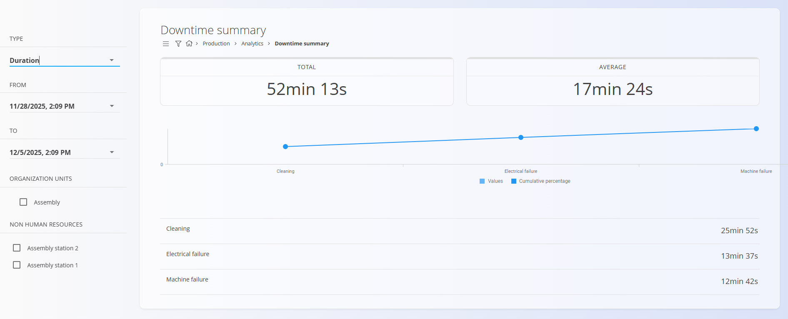

# Povzetek zastojev

Stran **Povzetek zastojev** nudi pregled zabeleženih proizvodnih zastojev v izbranem časovnem obdobju. Omogoča prepoznavanje najpogostejših razlogov za zastoje, oceno njihovega vpliva ter spremljanje uspešnosti po organizacijskih enotah in opremi.

Do strani dostopate preko **Proizvodnja / Analiza / Povzetek zastojev** v [navigaciji](../../Skupno/UI/Navigacija.md).

> [!TIP]
> Za celoten prikaz si oglejte video vodič **[Povzetek zastojev](https://www.youtube.com/watch?v=IdEsZkN2Wv0)**.

## Filtri
Za omejitev prikazanih podatkov uporabite filtre na levi strani.

### Tip
Določa način združevanja podatkov o zastojih:
- **Število** — število zabeleženih zastojev
- **Trajanje** — skupno trajanje zastojev

### Od / Do
Izberite časovno obdobje, za katerega želite prikaz zastojev.

### Organizacijske enote
Filtriranje rezultatov po eni ali več [organizacijskih enotah](../Upravljanje/OrganizacijskeEnote.md).

### Stvarni viri
Filtriranje zastojev glede na izbrano opremo ali delovna mesta.

## Postavitev strani in rezultati
Povzetek zastojev prikazuje dva ključna kazalnika:

| Kazalnik | Pomen |
|--------|-------|
| **Skupaj** | Skupno trajanje zastojev (vsota vseh izbranih dogodkov) |
| **Povprečno** | Povprečno trajanje posameznega zastoja |

Pod kazalniki je prikazan graf z razvrstitvijo zastojev (npr. električna okvara, mehanska okvara), ki vključuje:
- **Vrednosti** — dejansko trajanje zastojev po razlogih
- **Kumulativni odstotek** — delež posameznega razloga v skupnem času zastojev

Na dnu strani je podroben seznam, ki prikazuje:
- **naziv klasifikacije zastoja**
- pripadajoče **trajanje ali število**

## Primer

V zgornjem primeru:
- izbran je način **Trajanje**
- skupni čas zastojev v izbranem obdobju znaša **52 min 13 s**
- povprečno trajanje posameznega zastoja je **17 min 24 s**
- zastoji so razdeljeni na tri tipe:
  - **Čiščenje** — **25 min 52 s**
  - **Električna okvara** — **13 min 37 s**
  - **Okvara stroja** — **12 min 42 s**
- graf in seznam prikazujeta enako razčlenitev po tipih zastojev (vključno s kumulativnim odstotkom)

---