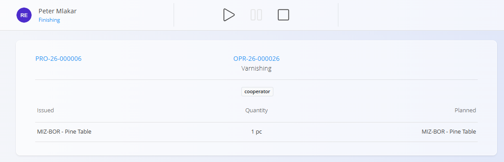
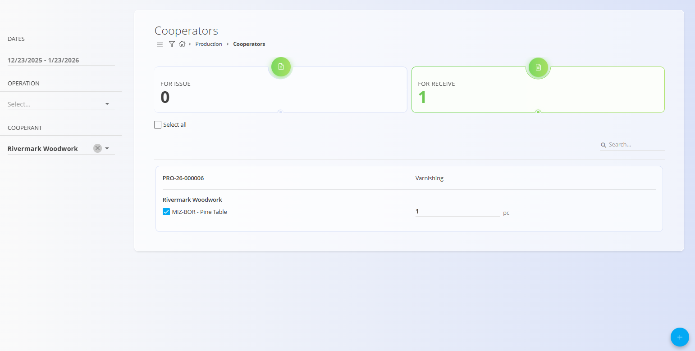

# Kooperanti

**Kooperanti** so zunanja podjetja (definirana v [**Poslovnem imeniku**](../../Skupno/Upravljanje/PoslovniImenik.md)), ki lahko izvajajo določene operacije, povezane s **proizvodnimi** ali **vzdrževalnimi** nalogi.

- V Poslovnem imeniku morajo biti partnerji označeni z vlogo **Kooperant**, da jih je mogoče tukaj izbrati.
- Operacije, namenjene zunanjemu izvajanju, morajo biti označene z oznako `cooperator` (glej **Predpogoji** spodaj).

Ta zaslon zagotavlja namenski delovni tok za **izdajo materiala kooperantom** in **prevzem materiala nazaj**, ko je zunanja operacija zaključena.

Za dostop do tega zaslona pojdite na **Proizvodnja / Kooperanti** v [**navigaciji**](../../Skupno/UI/Navigacija.md).

## Predpogoji

Da je operacija na voljo za kooperante, morajo biti izpolnjeni naslednji pogoji:

- Operacija mora pripadati **[Proizvodnemu nalogu](ProizvodniNalogi.md)** ali domeni **Vzdrževanje** (glej [domeno Vzdrževanje](../../Vzdrzevanje/Domena/Vzdrzevanje.md)).
- V obrazcu za ustvarjanje ali urejanje operacije mora biti dodeljena oznaka `cooperator`.
- Zunanje podjetje mora obstajati v [**Poslovnem imeniku**](../../Skupno/Upravljanje/PoslovniImenik.md) in imeti omogočeno vlogo **Kooperant**.

Na zaslonu **Kooperanti** se prikažejo samo operacije, označene z `cooperator`.

> [!TIP]
> Če se pričakovana operacija ne prikaže, preverite:  
> 1. ali ima operacija oznako `cooperator`,  
> 2. ali je stanje naloga aktivno,  
> 3. ali se operacija izvaja v pogledu **[Izvedba](Izvedba.md)** (kliknite **Začni**).

## Pregled zaslona

Zaslon **Kooperanti** je razdeljen na dva glavna indikatorja na vrhu:

- **Za izdajo** – operacije, ki čakajo na izdajo kooperantu
- **Za prevzem** – operacije, ki čakajo na prevzem od kooperanta

Vsak indikator je mogoče klikniti za prikaz ustreznega seznama.  
Leva stranska vrstica omogoča filtriranje po:

- časovnem obdobju,
- operaciji,
- kooperantu (zunanjem podjetju).

### Pogled operaterja (Izvajanje)

Ko operater odpre operacijo, ki zahteva zunanjega kooperanta, je v pogledu [**Izvedba**](Izvedba.md) jasno prikazano, da se korak izvaja zunanje.

Operater lahko klikne **Začni**, da začne operacijo.  
Ko je operacija zagnana, se prikaže na seznamu **Za izdajo** na zaslonu **Kooperanti**.

> [!NOTE]
> Operacije, ki niso zagnane, ne vstopijo v delovni tok kooperantov.

## Za izdajo

Pogled **Za izdajo** prikazuje operacije, ki so pripravljene za pošiljanje zunanjemu kooperantu.

Tipičen potek dela:

1. Izberite eno ali več operacij s seznama.
2. V levi stranski vrstici izberite **Kooperanta** (iz [**Poslovnega imenika**](../../Skupno/Upravljanje/PoslovniImenik.md)).
3. Kliknite [**akcijski gumb**](../../Skupno/UI/AkcijskiGumb.md).
4. Izberite eno od razpoložljivih možnosti:
   - **Ustvari [Dobavnico](../../Prodaja/Dokumenti/Dobavnice.md)**
   - **Dodaj k obstoječi [Dobavnici](../../Prodaja/Dokumenti/Dobavnice.md)**

Po izbiri se nadaljuje standardni tok:

**[Dobavnica](../../Prodaja/Dokumenti/Dobavnice.md) → [Izdaja](../../Logistika/Dokumenti/Izdajnice.md)**

Ko je material izdan, se operacija odstrani s seznama **Za izdajo**.

> [!EXAMPLE]
> **Primer:**  
>  
> Za lakiranje miz uporabljate zunanje podjetje. V pogledu **Za izdajo** izberete operacijo lakiranja za mizo iz bora, izberete kooperanta, ustvarite **Dobavnico** in nato celotno **Izdajo**. Mize se odpošljejo, operacija pa se premakne na seznam **Za prevzem**.

## Za prevzem

Po izdaji materiala se operacija prikaže v pogledu **Za prevzem**.

Od tu se delovni tok obrne:

1. Izberite operacijo.
2. Kliknite [**akcijski gumb**](../../Skupno/UI/AkcijskiGumb.md).
3. Ustvarite nov **[Nabavni nalog](../../Nabava/Dokumenti/NabavniNalogi.md)** (za evidentiranje storitve dobavitelja in povratne logistike).
4. Nadaljujte standardni tok:
   **[Nabavni nalog](../../Nabava/Dokumenti/NabavniNalogi.md) → [Prevzem](../../Logistika/Dokumenti/Prevzemi.md)**

Ko je material prevzet, operacija ni več v čakanju.

> [!EXAMPLE]
> **Primer:**  
>  
> Lakirane mize iz bora so pripravljene za vračilo od kooperanta. Ustvarite **Nabavni nalog** za storitev lakiranja in nato **Prevzem**, da mize vrnete na zalogo. Operacija izgine s seznama **Za prevzem**.

## Zaključek operacije

Ko je vrnjeni material na voljo:

- operater lahko odpre operacijo v pogledu **[Izvedba](Izvedba.md)** in nadaljuje kot običajno (proizvodnja, beleženje izgub ali zastojev, potrjevanje kontrolnih seznamov),
- ko je delo končano, lahko operacijo ustavi in zaključi.

Po zaključku:

- operacija ni več vidna na zaslonu **Kooperanti**,
- delovni tok kooperanta za to operacijo je zaključen.

## Praktični nasveti in sledljivost

- **Povezave dokumentov:**  
  Uporabite razdelke *Povezano / Povezave* na **[Dobavnicah](../../Prodaja/Dokumenti/Dobavnice.md)**, **[Izdajah](../../Logistika/Dokumenti/Izdajnice.md)**, **[Nabavnih nalogih](../../Nabava/Dokumenti/NabavniNalogi.md)** in **[Prevzemih](../../Logistika/Dokumenti/Prevzemi.md)** za pregled celotne verige.
- **Organizacijske enote:**  
  Prepričajte se, da je na nalogu izbrana pravilna **[Organizacijska enota](../Upravljanje/OrganizacijskeEnote.md)**, da delavci po prevzemu vidijo operacijo v pogledu **[Izvedba](Izvedba.md)**.