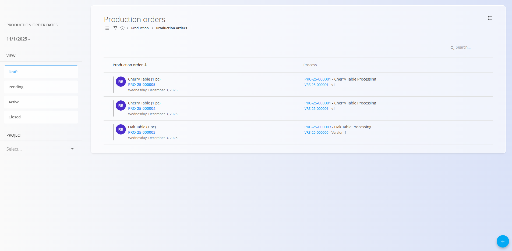
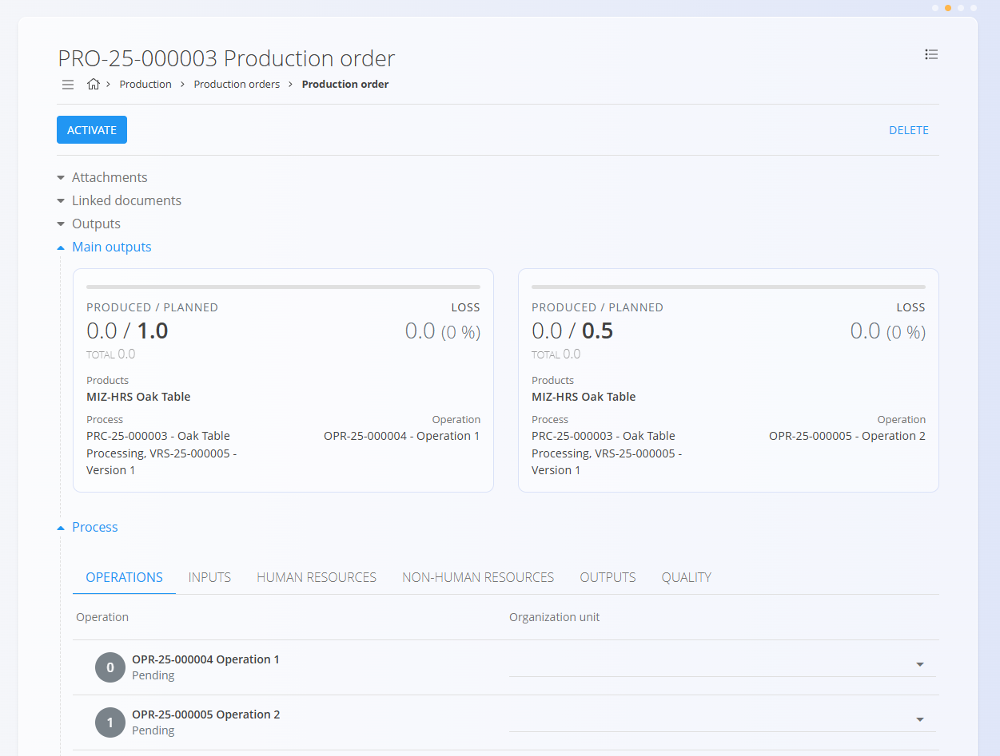
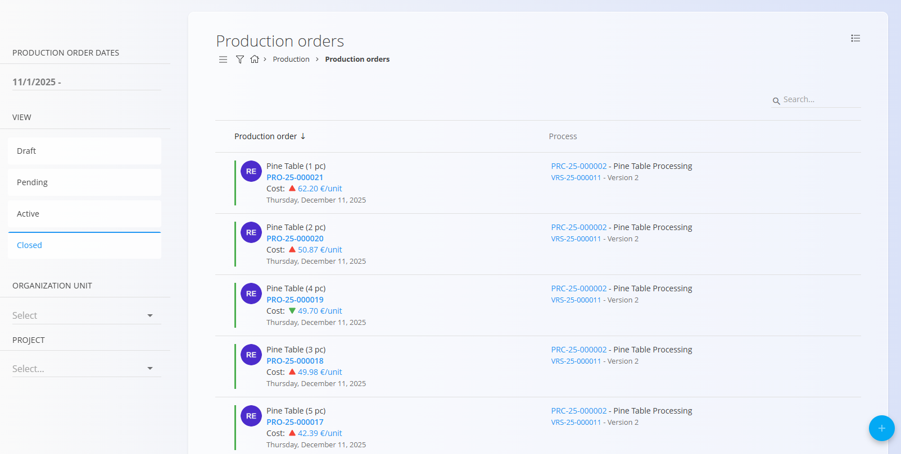
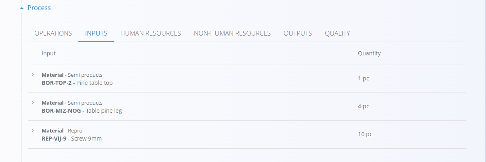
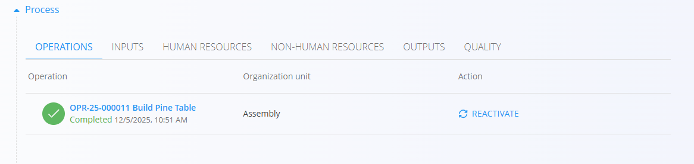

# Proizvodni nalogi

Proizvodni nalogi določajo delo, potrebno za izdelavo izdelkov glede na izbrani proces in verzijo.  
Premikajo se skozi življenjski cikel **Osnutek → V pripravi → Aktiven → Zaključen** in lahko vključujejo več operacij, virov, vhodov, izhodov in kontrol kakovosti glede na dodeljen proces.

> [!NOTE]
> **Predpogoji**  
>
> Pred ustvarjanjem novega proizvodnega naloga zagotovite, da je naslednje že nastavljeno:
> - Vsaj en **[Proces](../Upravljanje/Procesi.md)** z aktivno **verzijo**
> - Dodeljene **[Organizacijske enote](../../Skupno/Upravljanje/PoslovneEnote.md)** za proizvodnjo  
> - Po potrebi dodatne definicije, kot so **[viri](../Upravljanje/Viri.md)**, **[oznake zastojev](../Upravljanje/OznakeZastojev.md)**, **[oznake klasifikacije slabega kosa](../Upravljanje/OznakeKlasifikacijeSlabegaKosa.md)** in **[kontrolne liste](../Upravljanje/KontrolneListe.md)** glede na potek dela (priporočeno)

> [!TIP]
> Za celovit prikaz si oglejte video vodič **[Proizvodni nalog](https://www.youtube.com/watch?v=q4UjiYpWph8)**.

Do proizvodnih nalogov dostopate preko **Proizvodnja / Proizvodni nalogi** v [navigaciji](../../Skupno/UI/Navigacija.md).

## Seznam proizvodnih nalogov

Stran Proizvodni nalogi prikazuje vse naloge, razvrščene po statusu. Za natančnejši prikaz uporabite filtre na levi strani.

### Razpoložljivi filtri

- **Datumi proizvodnih nalogov** – Filtriranje nalogov po časovnem obdobju.  
- **Pogled** – Prikaz nalogov glede na fazo življenjskega cikla:  
  - **Osnutek** — Urejevalni nalog, ustvarjen preko čarovnika
  - **V pripravi** — Zaključen nalog, pripravljen za aktivacijo
  - **Aktiven** — V izvajanju; viden v **[Izvedbi](Izvedba.md)**
  - **Zaključen** — Zaključen; rezultati so zabeleženi
- **Projekt** – Filtriranje proizvodnih nalogov, povezanih z določenim projektom

Iskalno polje na vrhu omogoča filtriranje po šifri proizvodnega naloga ali nazivu materiala.

## Ustvarjanje proizvodnega naloga

Kliknite [**akcijski gumb**](../../Skupno/UI/AkcijskiGumb.md) in sledite vodenemu tristopenjskemu čarovniku:

### **1. korak — Izberi material**

Izberite **Tip materiala** (npr. Izdelki ali Polizdelki), nato izberite konkreten [**material**](../../Sredstva/Domena/Materiali.md) in količino, ki jo želite proizvesti.

### **2. korak — Izberi proces**

Izberite **[Proces](../Upravljanje/Procesi.md)** in **verzijo procesa**, ki določa način izdelave materiala.

> [!NOTE]
> Če v tem koraku ni prikazan noben proces, preverite nastavitve v šifrantu **[Procesi](../Upravljanje/Procesi.md)**.  
> Prepričajte se, da ima proces oznako »Proizvodnja« in aktivno verzijo. Manjkajoča oznaka je pogost razlog, da se proces tukaj ne prikaže.

### **3. korak — Podaj dodatne informacije**

Ta korak določa način izvajanja in časovni razpored.

#### **Način**
Določa obnašanje proizvodnega naloga:

- **Standardni** — Ustvari en sam proizvodni nalog za celotno količino.
- **Nadrejeni** — Ustvari nadrejeni (glavni) nalog, ki služi samo kot vsebnik podrejenih nalogov.  
  Nadrejeni nalog **nima operacij** in se ne izvaja.
- **Nadrejeni z delnimi proizvodnjami** — Ustvari nadrejeni nalog in samodejno generira več podrejenih proizvodnih nalogov, kjer vsak izdela del celotne količine.  
  Prikažeta se dve polji:
  - **Število delnih proizvodnj** — koliko podrejenih nalogov se ustvari  
  - **Količina delne proizvodnje** — samodejno izračunana glede na skupno količino

**Primer:**  
Če je skupna količina = **3 kosi**
- 3 delne proizvodnje → vsaka = **1 kos**
- 2 delni proizvodnji → vsaka = **1,5 kosa**

#### **Datumi**

Po želji določite časovne podatke:
- **Datum roka**
- **Planiran datum začetka**
- **Planiran datum konca**

Kliknite **Zaključi**, da ustvarite proizvodni nalog v stanju **Osnutek**.

## Osnutki proizvodnih nalogov

Novo ustvarjen nalog ima status **Osnutek**.

V osnutku je mogoče urejati:

- Šifro
- Količino  
- Serijo
- Datum uporabnosti
- Opombe

### Objavljanje osnutka

Za prehod v stanje **V pripravi** mora biti izbrana **Organizacijska enota**.

Ko je pripravljeno, kliknite **Objavi**.

## Proizvodni nalogi v pripravi

Nalogi v stanju **V pripravi** so v celoti pripravljeni in čakajo na aktivacijo. Izvajanje proizvodnje še ni mogoče.

V tem stanju lahko:

- Pregledujete operacije  
- Dodajate priloge  
- Dodajate opombe  
- Upravljate povezane dokumente

Ko je nalog pripravljen za proizvodnjo, kliknite **Aktiviraj**.

## Povezani dokumenti

Na proizvodni nalog lahko pripnete druge povezane dokumente, kot so:

- [**Projekti**](../../Projekti/Domena/DomenaProjekti.md)  
- [**Nabavni nalogi**](../../Nabava/Dokumenti/NabavniNalogi.md)
- [**Povpraševanja**](../../Nabava/Dokumenti/Povprasevanja.md)
- Drugi proizvodni nalogi (povezani ali kot vhodni)

Proizvodni nalogi prikazujejo tudi vse dokumente, ustvarjene med življenjskim ciklom naloga, kot so stroškovna in porabna poročila.

## Aktivni proizvodni nalogi

Po aktivaciji nalog postane **Aktiven** in je pripravljen za izvajanje v proizvodnji.

Proizvodni delavci lahko zdaj izvajajo operacije v modulu **Izvedba**.  
Za več informacij glejte **[Izvedba](Izvedba.md)**.

Razdelek **Proces** prikazuje vse planirane operacije, vhode, vire, izhode in kontrole kakovosti za izbrano verzijo.

## Zaključeni proizvodni nalogi

Ko je proizvodnja zaključena in so vse operacije izvedene, se nalog prestavi v stanje **Zaključen**.

Seznam prikazuje tudi strošek na enoto in puščico, ki označuje povečanje ali zmanjšanje stroška v primerjavi s prejšnjim zaključenim nalogom za isti material.

Zaključeni nalogi:

- Ne omogočajo več urejanja  
- Nudijo popolno zgodovino proizvodnje  
- Prikazujejo proizvedene in planirane količine, izgube ter izhode

Razdelek **Proces** prikazuje celotno zgodovino izvedbe. S klikom na zavihke si lahko ogledate podrobnosti, npr. uporabljene vhode:

Zaključeni proizvodni nalogi ponujajo dodatne možnosti v akcijskem meniju:

- Tiskanje
- Izvoz (PDF)
- Povrni v aktivno stanje – omogoča ponovno odprtje naloga za popravke

### Povrnitev v aktivno stanje

Če so po zaključku potrebne spremembe, lahko nalog povrnete v stanje **Aktiven**:

1. Odprite zaključen proizvodni nalog
2. V akcijskem meniju izberite **Povrni v aktivn**
3. Kliknite **Ponovno Aktiviraj** pri želenem procesu

## Brisanje

Proizvodni nalog je mogoče izbrisati samo v stanju **Osnutek** ali **V pripravi** in le, če nanj niso vezani drugi dokumenti.

Uporabite možnost **Izbriši** v glavi dokumenta.

> [!NOTE]
>
> Zaključenih nalogov ni mogoče izbrisati, lahko pa jih po potrebi povrnete v aktivno stanje za popravke.

---
