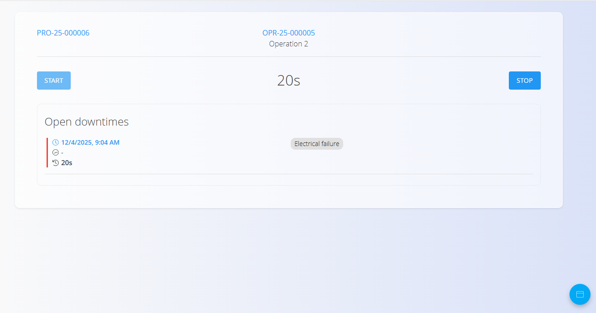
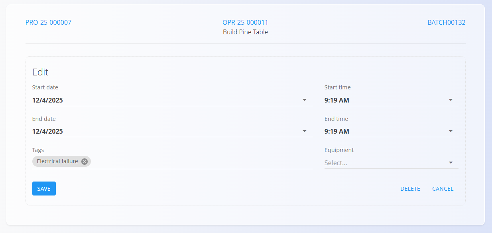

# Zastoj

Aktivnost **Zastoj** beleži prekinitve med izvajanjem operacije (npr. čakanje na material, okvare strojev, menjave nastavitev). Omogoča spremljanje časovnih izgub ter boljšo vidnost za analizo.

**Zastoj** odprete na zaslonu [**Izvedba**](Izvedba.md) prek izbire aktivnosti (tapnite [**akcijski gumb**](../../Skupno/UI/AkcijskiGumb.md) in nato izberite **Zastoj**).

## Beleženje zastoja

1. Odprite stran **Zastoj** iz [**menija aktivnosti izvedbe**](Izvedba.md#meni-aktivnosti-in-dejavnosti).  
2. Kliknite **Zaženi zastoj**, da začnete beleženje prekinitve.  
3. Kliknite **Ustavi zastoj**, ko se prekinitev konča.  
4. Kliknite zapis zastoja za:
    1. izbiro razloga z uporabo **oznak zastojev** – glejte [Oznake zastojev](../Upravljanje/OznakeZastojev.md),  
    2. prilagoditev začetnega in končnega časa po potrebi,  
    3. dodajanje opreme, na katero je zastoj vplival (neobvezno).
5. Shranite.

Shranjeni zastoji so povezani s proizvodnim nalogom in operacijo ter so prikazani v pregledu izvedbe.

### Urejanje in popravki

Izberite zapis zastoja za prilagoditev časov, spremembo oznake, dodajanje opreme ali brisanje zapisa, če je bil dodan pomotoma.

## Analitika in poročila

Zapisi zastojev se uporabljajo v več analitičnih pogledih:

- [Povzetek zastojev](../Analiza/PovzetekZastojev.md)
- [Kazalniki proizvodnje](../Analiza/KazalnikiProizvodnje.md)
- [Zastoji organizacijskih enot](../Analiza/ZastojiOrganizacijskihEnot.md)

Dosledna uporaba oznak izboljša natančnost kazalnikov.

---