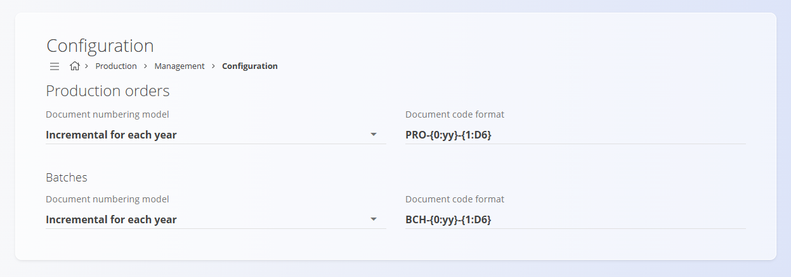

# Konfiguracija proizvodnje

Konfiguracija nastavitev modula **Proizvodnja**, ki vplivajo na številčenje dokumentov. Spremembe se shranijo samodejno.

Za dostop do te strani pojdite na **Proizvodnja / Upravljanje / Konfiguracija** v [**navigaciji**](../../Skupno/UI/Navigacija.md).

## Nastavitve številčenja dokumentov

Določite način številčenja in obliko zapisa šifre dokumentov v proizvodnji (proizvodni nalogi, serije, zahteve, zapisi izvajanja, zapisi kakovosti).

| Polje | Opis |
|------|------|
| **Način številčenja dokumenta** | Določa logiko povečevanja zaporedne številke: • **Povečevanje** – zaporedna številka se ne ponastavlja. • **Povečevanje vsako leto** – zaporedna številka se vsako leto ponastavi. |
| **Oblika zapisa šifre dokumenta** | Določa strukturo zapisa šifre dokumenta (npr. predpona, leto, zaporedna številka). Primer: `PRO-{0:yy}-{1:D6}`. |

### Proizvodni nalogi

Nastavitve številčenja za dokumente **Proizvodni nalogi**.

- **Način številčenja dokumenta**: določa, ali se zaporedna številka povečuje neprekinjeno ali se ponastavi vsako leto.
- **Oblika zapisa šifre dokumenta**: določa format šifre proizvodnega naloga (npr. `PRO-{0:yy}-{1:D6}`).

### Serije

Nastavitve številčenja za dokumente **Serije**.

- **Način številčenja dokumenta**: določa logiko številčenja serij.
- **Oblika zapisa šifre dokumenta**: določa format šifre serije (npr. `BCH-{0:yy}-{1:D6}`).

> [!NOTE]
> Spremembe konfiguracije se uporabijo za nove dokumente. Obstoječi dokumenti se ne preštevilčijo.

---