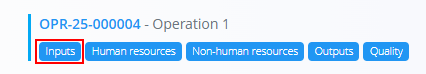
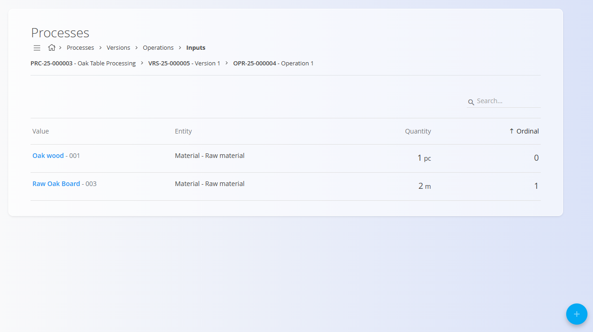

# Vhodi

Vhodi določajo **materiale, potrebne** za izvedbo operacije znotraj verzije procesa. Vsak vhod določa, kateri material je potreben, v kateri enoti in količini ter kako se količina izračuna.  
Vhodi se upravljajo znotraj **operacije**.

Za dostop do te strani odprite verzijo procesa prek **Proizvodnja / Upravljanje / [Procesi](Procesi.md)**, kliknite **[Operacije](Operacije.md)** in nato pri izbrani operaciji izberite **Vhodi**.

> [!TIP]
> Za celovit prikaz si oglejte video vodič **[Inputs & Outputs](https://www.youtube.com/watch?v=647sT70tNZc)**.

## Shema

| Polje | Opis |
|------|------|
| **Entiteta** | Določa vrsto vhoda. Trenutno je podprt **[Material](../../Sredstva/Domena/Materiali.md)**. |
| **Tip materiala** | Kategorija materiala:  • **[Izdelki](../../Sredstva/Materiali/Izdelki.md)** • **[Surovine](../../Sredstva/Materiali/Surovine.md)** • **[Repro materiali](../../Sredstva/Materiali/ReproMateriali.md)** • **[Polizdelki](../../Sredstva/Materiali/Polizdelki.md)** |
| **Material** | Konkreten material, ki se porabi v operaciji. Nabor je odvisen od izbranega **tipa materiala**. |
| **Tip kalkulacije** | Določa način izračuna količine:  • **Dinamično** – količina se izračuna glede na količine v proizvodnem nalogu.  • **Statično** – količina je fiksna in neodvisna od naloga. |
| **Količina** | Zahtevana količina vhoda. **[Merska enota](../../Skupno/Upravljanje/MerskeEnote.md)** je določena z izbranim materialom. |
| **Vrstni red** | Zaporedje vhoda znotraj operacije. Uporablja se za urejanje prikaza. |
| **Oznake** | Neobvezne oznake za dodatno razvrščanje, filtriranje ali analitiko. |

## Seznam

Seznam prikazuje vse vhode, povezane z izbrano operacijo, vključno z materialom, tipom entitete, količino in vrstnim redom. Za filtriranje po nazivu materiala uporabite polje **Iskanje**.

## Dodajanje novega vhoda

1. Kliknite **akcijski gumb** v spodnjem desnem kotu in izberite eno od možnosti:

   - **Kopiraj iz obstoječega vhoda**
   - **Nov**

   

2. Izpolnite zahtevana polja.

   

3. Kliknite **Dodaj**, da shranite novi vhod.

## Urejanje vhoda

Za urejanje obstoječega vhoda:

1. Kliknite vnos na seznamu.
2. Po potrebi prilagodite polja.
3. Kliknite **Shrani**.

## Brisanje

Vhod lahko izbrišete na strani za urejanje s klikom na **Izbriši**. Po potrditvi se vhod odstrani iz operacije.

---