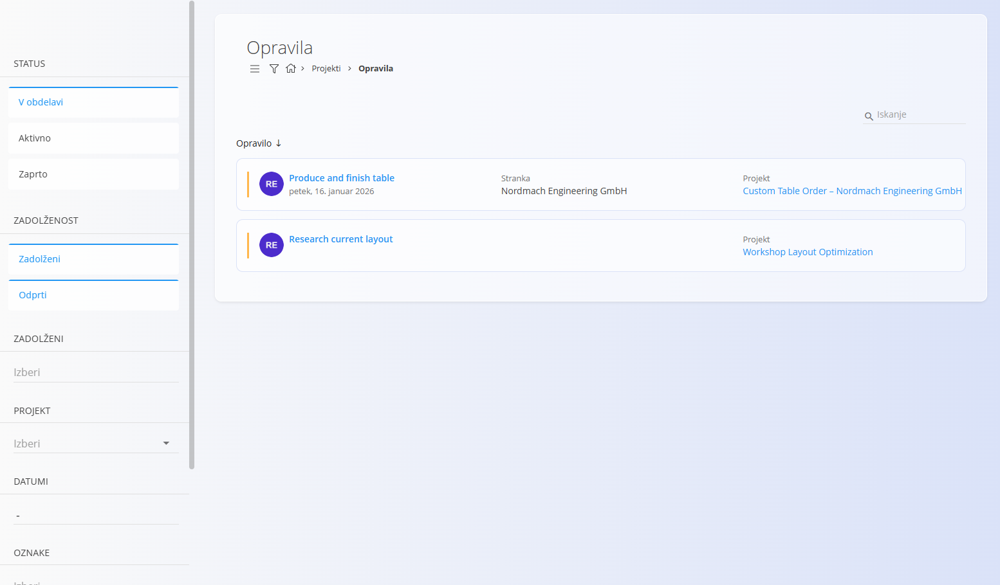
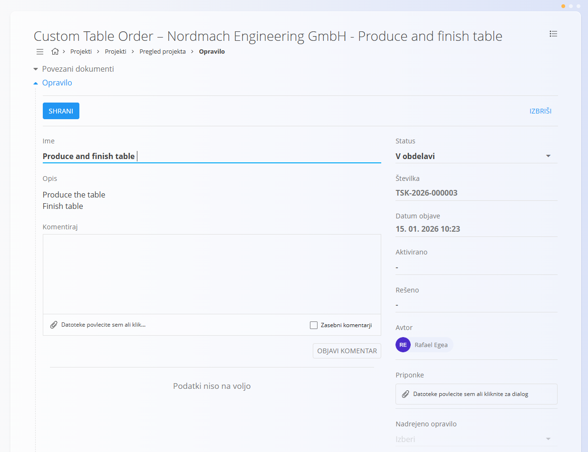
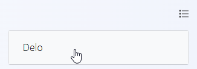
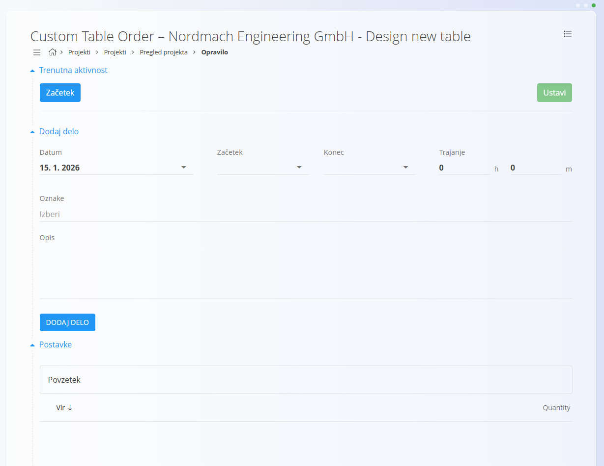
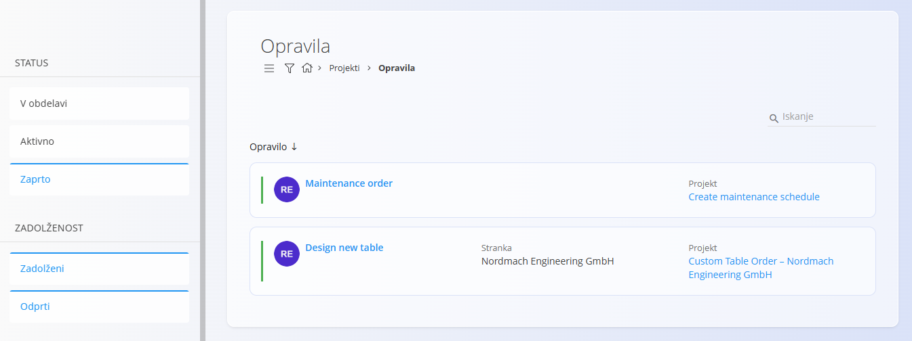

# Opravila

Zaslon **Opravila** omogoča centraliziran pregled vseh opravil v projektih.  
Uporabljajo ga tako vodje kot izvajalci za spremljanje napredka, odpiranje posameznih opravil in beleženje dela.

Opravila vedno pripadajo **projektu** in ne morejo obstajati samostojno.

Za dostop do zaslona pojdite na **Projekti / Opravila** v [navigaciji](../../Common/UI/Navigacija.md).

## Shema

| Polje | Opis |
|------|------|
| **Ime** | Naziv opravila, prikazan v seznamih in pregledih projektov (obvezno) |
| **Opis** | Podroben opis dela, ki ga je treba opraviti |
| **Status** | Trenutno stanje opravila glede na **Kanban stolpce**, definirane za [projekt](../Upravljanje/UpravljanjeProjektov.md) |
| **Številka opravila** | Samodejno dodeljena enolična identifikacijska oznaka |
| **Datum objave** | Datum in čas nastanka opravila |
| **Zadolžen** | Uporabnik, odgovoren za izvedbo opravila |
| **Dodeljeni** | Uporabnik ali uporabniki, ki izvajajo opravilo |
| **Ocenjen čas** | Ocenjen čas ali trajanje opravila |
| **Datum začetka** | Načrtovan datum začetka |
| **Datum zaključka** | Načrtovan datum zaključka |
| **Priponke** | Datoteke, dodane za podporo izvedbi opravila (dokumenti, slike ipd.) |
| **Nadrejeno opravilo** | (Neobvezno) Povezava na drugo opravilo za hierarhično strukturo |

## Seznam opravil

Seznam prikazuje opravila iz vseh projektov, ki ustrezajo izbranim filtrom.

Vsaka kartica opravila prikazuje:
- **Ime opravila**
- **Stranko**
- **Projekt**
- **Trenutni status**

S klikom na opravilo se odpre **podroben pogled opravila**.

### Filtri

Levi panel omogoča filtriranje opravil po:

- **Status**
  - V obdelavi
  - Aktivno
  - Zaprto
- **Zadolženost**
  - Zadolženi
  - Odprti
- **Zadolženi**
- **Projekt**
- **Datumi**
- **Oznake**
- **Stranka**
- **Vodja projekta**

Filtre je mogoče kombinirati za hitrejše iskanje ustreznih opravil.

## Podroben pogled opravila

S klikom na opravilo se odpre **podrobni pogled**, kjer lahko uporabniki:
- pregledajo vse informacije,
- dodajajo komentarje,
- pripenjajo datoteke,
- beležijo opravljeno delo.

## Ustvarjanje opravil

Opravila se ustvarjajo **znotraj projekta**, ne neposredno iz seznama opravil.

Postopek:
1. Odprite projekt na strani **[Projekti](Projekti.md)**  
2. Kliknite [**akcijski gumb**](../../Skupno/UI/AkcijskiGumb.md)
3. Izpolnite podatke in ustvarite opravilo  

## Potek dela z opravili

Opravila podpirajo enostaven in prilagodljiv potek dela, ki odraža dejanski način izvajanja nalog.  
Med izvajanjem uporabniki posodabljajo **status**, po potrebi beležijo **čas** ter dodajajo **komentarje ali priponke**.

### 1. Začetek dela na opravilu

Ko uporabnik odpre opravilo:
- prikažejo se podrobnosti opravila,
- trenutni **status** odraža položaj v projektnem poteku,
- vidni so komentarji, priponke in zgodovina aktivnosti.

Opravila so pripravljena za delo takoj po ustvarjanju.

### 2. Posodabljanje statusa (Kanban potek)

Vsako opravilo ima polje **Status**.  
Možne vrednosti izhajajo iz **Kanban stolpcev**, definiranih za projekt.

Tipični primeri:
- Za narediti
- V pripravi
- V izvajanju
- Zaključeno

Postopek:
1. Izberite nov **Status**
2. Shranite opravilo

S tem se opravilo premika skozi potek projekta in zagotavlja preglednost za vse sodelujoče.

> Življenjski cikel opravila (V obdelavi → Aktivno → Zaprto) je odvisen od sprememb statusa.

### 3. Beleženje časa (neobvezno)

Uporabniki lahko beležijo čas, porabljen za opravilo.  
Beleženje je **neobvezno** in odvisno od pravil podjetja.

Postopek:
1. V podrobnem pogledu opravila odprite razdelek **Delo**

   

2. Izberite način beleženja
3. Shranite vnos

#### Samodejno (Začni / Ustavi)

- Kliknite **Začni**
- Opravite delo
- Kliknite **Ustavi**

Sistem samodejno zabeleži časovni interval.

#### Ročni vnos

Ročno lahko vnesete:
- datum,
- začetek in konec ali skupno trajanje,
- oznake (neobvezno),
- opis (neobvezno).

Kliknite **Dodaj čas** za shranjevanje.

Na eno opravilo je mogoče dodati več vnosov časa.

### 4. Sodelovanje med izvajanjem

Med delom na opravilu lahko uporabniki:
- dodajajo komentarje,
- pripenjajo dokumente ali slike,
- označijo komentarje kot zasebne ali pomembne.

Vsa komunikacija ostane vezana na opravilo.

### 5. Zaključek opravila

Ko je delo končano:
1. Posodobite **Status** na zadnji Kanban stolpec (npr. *Zaključeno*)
2. Opravilo se označi kot **Zaprto** (glede na pravila podjetja)

Zaprta opravila:
- so vidna ob vklopljenem filtru **Zaprto**,
- ohranijo celotno zgodovino komentarjev, priponk in časa.

## Povezana dokumentacija

- **[Projekti](Projekti.md)** – pregled in spremljanje projektov  
- **[Upravljanje projektov](../Upravljanje/UpravljanjeProjektov.md)** – ustvarjanje in nastavitev projektov

---