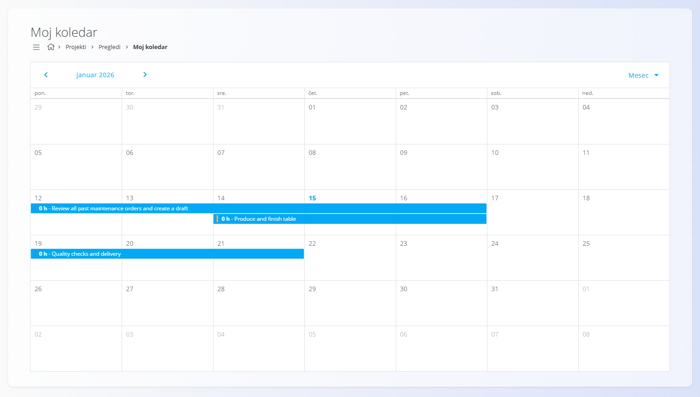
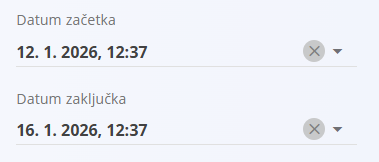

# Moj koledar

Pogled **Moj koledar** omogoča koledarski pregled vseh **[opravil, dodeljenih trenutnemu uporabniku](../Dokumenti/Opravila.md)**. Uporabnikom pomaga razumeti, *kdaj* je delo načrtovano in kako so opravila razporejena skozi čas.

Ta pogled je dostopen v meniju **Projekti / Pregledi / Moj koledar** v [**navigaciji**](../../Skupno/UI/Navigacija.md).

## Pregled koledarja

Opravila so prikazana v koledarski obliki glede na njihov **datum začetka** in **datum zaključka**.

- Vsak vnos v koledarju predstavlja eno opravilo, dodeljeno uporabniku
- Ime opravila je prikazano znotraj koledarske celice
- Prikazano trajanje temelji na nastavljenem začetnem in končnem datumu opravila

Na voljo sta **mesečni** in **tedenski** pogled, med katerima lahko preklapljate z izbirnikom v zgornjem desnem kotu.

## Prikaz opravil v koledarju

Da se opravilo prikaže v pogledu **Moj koledar**, mora imeti določena:

- **Datum začetka**
- **Datum zaključka**

Ta datuma se nastavita neposredno na opravilu.

Ko so datumi shranjeni, se opravilo samodejno prikaže v koledarju dodeljenega uporabnika.

## Interakcija z vnosi v koledarju

S klikom na opravilo v koledarju se odpre **pojavno okno s podrobnostmi opravila**, ki omogoča:

- pregled osnovnih informacij o opravilu,
- navigacijo na celoten pogled opravila,
- nadaljevanje dela na opravilu (npr. dodajanje komentarjev ali beleženje porabljenega časa).

To omogoča hiter dostop do opravil neposredno iz koledarja, brez potrebe po prehajanju skozi sezname projektov ali opravil.

## Tipična uporaba

Pogled **Moj koledar** se najpogosteje uporablja za:

- osebni pregled prihajajočega dela,
- razumevanje časovnega razporeda opravil in morebitnih prekrivanj,
- hitro navigacijo do opravil, načrtovanih za določen dan ali obdobje.

Dopolnjuje pogled **Moja opravila**, saj ponuja časovno usmerjeno perspektivo dodeljenega dela.

Za podrobnejše informacije o strukturi opravil, njihovem življenjskem ciklu in beleženju dela glejte:
- **[Opravila](../Dokumenti/Opravila.md)** — podrobno izvajanje in spremljanje opravil
- **[Upravljanje projektov](../Upravljanje/UpravljanjeProjektov.md)** — nastavitev in konfiguracija projektov

---
