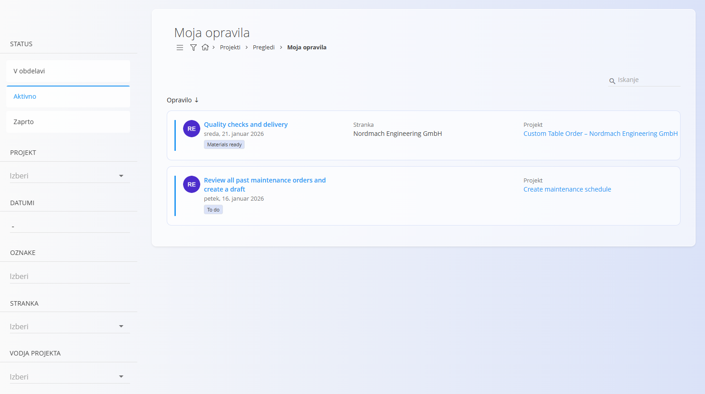

# Moja opravila

Zaslon **Moja opravila** ponuja personaliziran pregled vseh [opravil](../Documents/Opravila.md), ki so **dodeljena vam**. Namenjen je delavcem in vodjem, da se lahko hitro osredotočijo na svoje naloge, brez potrebe po pregledovanju vseh projektov.

Opravila, prikazana na tem zaslonu, vedno pripadajo nekemu [projektu](../Documents/Projekti.md), vendar je seznam filtriran tako, da vključuje samo opravila, relevantna za trenutno prijavljenega uporabnika.

Za dostop do zaslona pojdite na **Projekti / Pregledi / Moja opravila** v [navigaciji](../../Common/UI/Navigacija.md).

## Seznam mojih opravil

Seznam prikazuje opravila, ki so vam dodeljena in ustrezajo izbranim filtrom.

Vsaka kartica opravila prikazuje:
- **Ime opravila**
- **Stranko**
- **Projekt**
- **Trenutni status**

S klikom na opravilo se odpre **pregled opravila**, kjer lahko pregledate podrobnosti, dodajate komentarje, pripenjate datoteke in beležite porabo časa.

## Filtri

Levi panel omogoča filtriranje opravil po:

- **Status**
  - V obdelavi
  - Aktivno
  - Zaprto
- **Projekt**
- **Datumi**
- **Oznake**
- **Stranka**
- **Vodja projekta**

Filtre lahko kombinirate za hitro zoženje prikaza vaših opravil.

Iskalno polje v zgornjem desnem kotu omogoča iskanje opravil po imenu.

## Delo z opravili

Na zaslonu **Moja opravila** lahko:

- odprete dodeljena opravila,
- pregledate podrobnosti opravila,
- dodajate komentarje in priloge,
- beležite porabo časa in napredek,
- spremljate spremembe statusa opravil.

Izvajanje opravil in delo z njimi poteka popolnoma enako kot v splošnem pogledu **Opravila**.

Za podrobnejše informacije o strukturi opravil, njihovem življenjskem ciklu in beleženju časa glejte:
- **[Opravila](Opravila.md)** — podrobno izvajanje in sledenje opravil
- **[Upravljanje projektov](../Management/UpravljanjeProjektov.md)** — nastavitev in upravljanje projektov

---