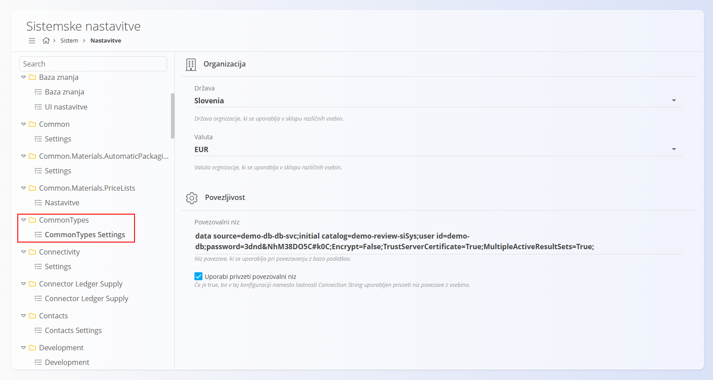
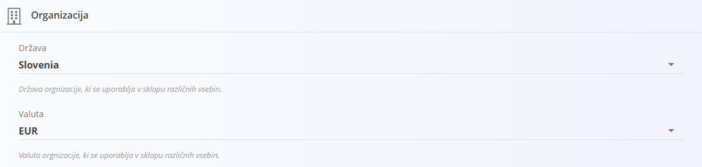
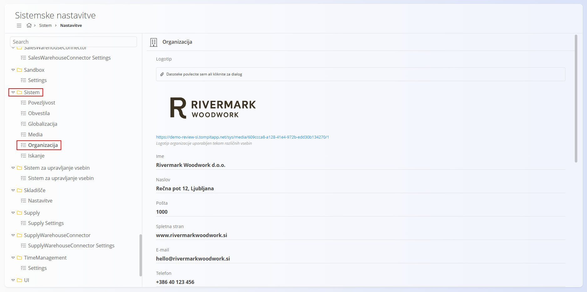
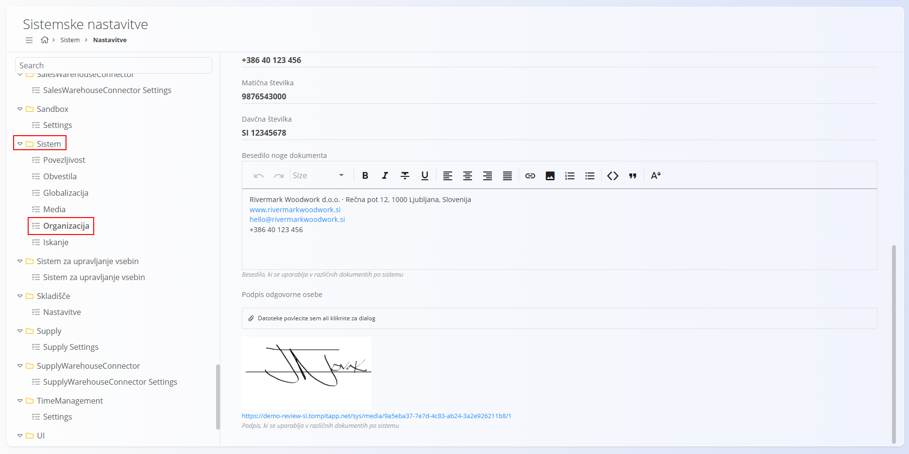

# Sistemske nastavitve

Razdelek **Sistemske nastavitve**, dostopen prek **Sistem / Nastavitve**, vsebuje
osnovne konfiguracije, ki določajo delovanje celotnega sistema na ravni organizacije.

> [!IMPORTANT]
> Te nastavitve uporabljajo skoraj vsa področja sistema
> (npr. [Prodaja](../../Prodaja/Domena/Prodaja.md),
> [Nabava](../../Nabava/Domena/Nabava.md),
> [Logistika](../../Logistika/Domena/Logistika.md),
> [Sredstva](../../Sredstva/Domena/DomenaSredstve.md))
> in jih je treba pravilno nastaviti **pred začetkom operativnega dela**.

Ta dokument opisuje dve ključni konfiguracijski področji:

- **CommonTypes → CommonTypes Settings**
- **Sistem → Organizacija**

Obe nastavitvi vplivata na vse module v sistemu.

> [!WARNING]
> Spremembe v tem razdelku vplivajo na celoten sistem.
> Nastavitve naj spreminjajo samo sistemski administratorji.

## CommonTypes Settings

Razdelek **CommonTypes Settings** določa **privzeto državo** in **privzeto valuto**
organizacije. Ti vrednosti se uporabljata pri lokalizaciji, obračunih, dokumentih
in zakonsko zahtevanih podatkih po celotnem sistemu.

Za dostop pojdite na **CommonTypes / CommonTypes Settings** in izberite **Organizacija**.

### Država

Izberite državo organizacije.

**Država organizacije, ki se uporablja v sklopu različnih vsebin.**

> [!IMPORTANT]
> Država mora biti predhodno definirana v šifrantu [**Države**](../../Skupno/Upravljanje/Drzave.md), sicer je ne bo mogoče izbrati.

### Valuta

Izberite privzeto valuto organizacije.

**Valuta organizacije, ki se uporablja v sklopu različnih vsebin.**

> [!IMPORTANT]
> Valuta mora biti predhodno definirana v šifrantu [**Valute**](../../Skupno/Upravljanje/Valute.md).

Ti dve nastavitvi predstavljata osnovo za vse finančne in poslovne procese.

## Organizacija

Razdelek **Organizacija** določa identiteto podjetja in zakonsko zahtevane
poslovne podatke. Ti podatki se izpisujejo na dokumentih, kot so računi,
dobavnice, naročila in drugi sistemski izpisi.

### Polja

| Polje | Opis |
|-----|------|
| **Država** | Država organizacije. |
| **Valuta** | Privzeta valuta organizacije. |
| **Logotip** | Logotip organizacije. *Datoteke povlecite sem ali kliknite za dialog.* |
| **Ime** | Polno uradno ime podjetja. |
| **Naslov** | Ulica in kraj sedeža podjetja. |
| **Pošta** | Poštna številka. |
| **Spletna stran** | Uradna spletna stran podjetja. |
| **E-mail** | Glavni kontaktni e-poštni naslov. |
| **Telefon** | Kontaktna telefonska številka. |
| **Matična številka** | Uradna matična številka podjetja. |
| **Davčna številka** | Davčna številka (DDV ID). |

### Besedilo noge dokumenta

Polje **Besedilo noge dokumenta** omogoča vnos oblikovanega besedila, ki se
uporablja v različnih dokumentih po sistemu (npr. računi, dobavnice).

Primer vsebine:

Rivermark Woodwork d.o.o. · Rečna pot 12, 1000 Ljubljana, Slovenija  
www.rivermarkwoodwork.si  
hello@rivermarkwoodwork.si  
+386 40 123 456

### Podpis odgovorne osebe

Polje **Podpis odgovorne osebe** omogoča nalaganje slike podpisa, ki se uporablja
na izbranih uradnih dokumentih.

*Datoteke povlecite sem ali kliknite za dialog.*

## Povzetek

Sistemske nastavitve predstavljajo temelj konfiguracije celotnega sistema.
Pravilno nastavljena **država**, **valuta** in **podatki organizacije** zagotavljajo
pravilne izpise, zakonitost dokumentov in dosledno delovanje vseh modulov.

---

