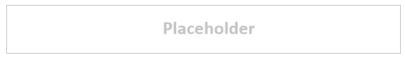
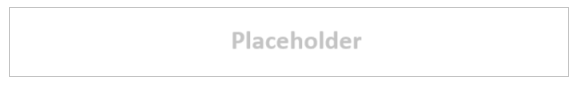

# Skladišče

Predstavlja šifrant skladišč, znotraj katerih se nahajajo [skladiščne lokacije](WarehouseLocation.md). 

Poslovno okolje lahko ima več fizično ali logično ločenih skladišč. 

## Shema

Šifrant skladišč ima naslednjo shemo:

|Polje|Opis
|---|---
|Naziv| **Naziv** oziroma ime skladišča.
|Status| **Status** skladišča. V kolikor je `Status` **Disabled**, operacije nad skladiščem niso dovoljene, skladišča pa na dokumentih ni mogoče izbirati.

## Upravljanje

Upravljanje s šifrantom skladišč je dostopno preko [navigacije](../../Common/UI/Sitemap.md) in sicer preko **Skladišče/Upravljanje/Skladišča**.

## Seznam skladišč

Privzeto se prikaže uporabniški vmesnik s seznamom že vnešenih oziroma obstoječih skladišč. V kolikor je seznam prazen, je uporabniški vmesnik podoben spodnji sliki.

## Dodajanje

S klikom na gumb [dodaj](../../Common/UI/ActionButton.md#dodaj) uporabniški vmesnik preide v način urejanja in sicer se prikaže vnosna maska za dodajanje novega skladišča.

S klikom na gumb **Potrdi** se ustvari novo skladišče in uporabniški vmesnik preide v privzet način, ki prikazuje seznam obstoječih skladišč. S klikom na gumb **Prekliči** pa uporabniški vmesnik preide v privzet način, brez da bi vnešene podatke shranil, torej ne ustvari novega skladišča, ampak postopek prekine brez shranjevanja.

## Urejanje

Za urejanje posameznega skladišča kliknemo na njegov **Naziv**. Uporabniški vmesnik preide v način urejanja skladišča, ki je pravzaprav identično tistemu za vnos, le da so v tem primeru podatki že izpolnjeni. 

Uporabnik spremeni željena polja in s klikom na **Potrdi** shrani spremembe, uporabniški vmesnik pa preide v privzet način, ki prikazuje seznam obstoječih skladišč s posodobljeno vrednostjo. S klikom na gumb **Prekliči** pa uporabniški vmesnik preide v privzet način, brez da bi vnešene podatke shranil, torej ne ustvari novega skladišča, ampak postopek prekine brez shranjevanja.

## Brisanje

Skladišče je mogoče tudi izbrisati, vendar samo pod pogojem, da nima odvisnih zapisov, na primer ne obstaja nobena [skladiščna lokacija](WarehouseLocation.md), ki pripada skladišču, ki ga želimo izbrisati.

Za brisanje skladišča moramo najprej v način [urejanja](#urejanje). V načinu urejanja je viden gumb **Briši**. Klik na gumb **Briši** prikaže potrditveno sporočilo **Ali ste prepričani, da želite izbrisati skladišče?**. S potrditvijo okna se skladišče permanentno izbriše, uporabniški vmesnik preide v privzet način, pri čemer izbrisanega skladišča ni več na seznamu.

V kolikor uporabnik ne potrdi sporočila, uporabniški vmesnik ostane v načinu urejanja.