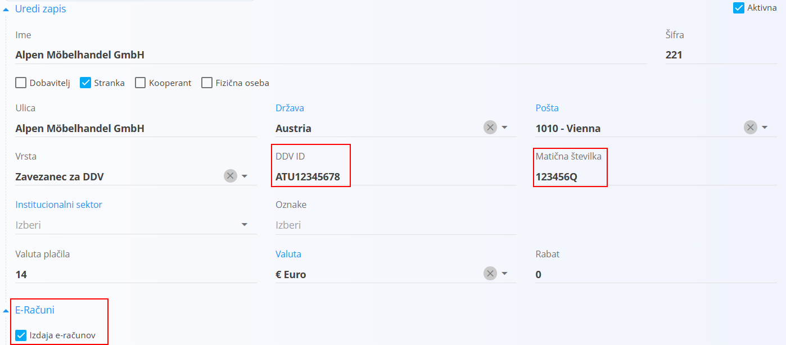
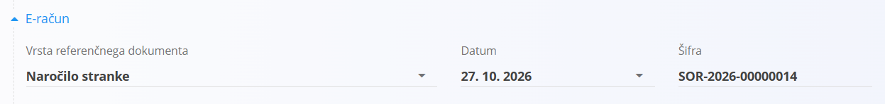

<!-- app_route: /management/contacts/companies -->
<!-- app_label: Poslovni imenik -->
<!-- canonical_source_url: https://tom-pit.github.io/Connected.Docs/sl/Skupno/Koncepti/E-Racuni/ -->
<!-- canonical_source_title: E-računi -->

# E-računi

**E-račun** je strukturirana elektronska oblika računa, ki jo sistem stranke lahko samodejno obdela. V Connected se e-računi pripravijo v slovenskem formatu **eSLOG** XML in jih lahko izvozite iz menija objavljenega dokumenta.

E-račune pripravi storitev za e-račune Tom PIT, ne aplikacija sama. Storitev mora biti nastavljena za vašo organizacijo, preden lahko izvažate e-račune.

## Podprti dokumenti

E-račune lahko izdate iz naslednjih dokumentov:

- [**Izdani računi**](../../Domene/Prodaja/Dokumenti/IzdaniRacuni.md)
- [**Dobropisi**](../../Domene/Prodaja/Dokumenti/Dobropisi.md)

## Predpogoji

### Organizacija

| Zahteva | Opis |
|---------|------|
| **Storitev za e-račune** | Storitev za e-račune je nastavljena za vašo organizacijo. To uredi Tom PIT. Če izvoz vrne napako v konfiguraciji, se obrnite na podporo Tom PIT. |
| **Matična številka** in **Davčna številka** | Vneseni v nastavitvah [**Organizacija**](../../Domene/Sistem/Nastavitve/KonfiguracijaSistema.md#organizacija). |
| [**Bančni račun organizacije**](../../Domene/Prodaja/Upravljanje/BancniRacuniOrganizacije.md) | Izbran na dokumentu. Uporabi se kot račun za prejem plačila. |

### Stranka

Za stranko morajo biti v [**Poslovnem imeniku**](../Upravljanje/PoslovniImenik.md) vneseni naslednji podatki:

| Zahteva | Opis |
|---------|------|
| **E-računi** | V razdelku [**E-računi**](../Upravljanje/PoslovniImenik.md#e-racuni) mora biti označeno potrditveno polje **Izdaja e-računov**. |
| **DDV ID** | Identifikacijska številka stranke za DDV. |
| **Matična številka** | Matična številka podjetja stranke. |
| [**Bančni račun**](../Upravljanje/BancniRacuni.md) | Vsaj en bančni račun stranke. |

### Dokument

| Zahteva | Opis |
|---------|------|
| **Razdelek E-račun** | Vsa polja v razdelku **E-račun** morajo biti izpolnjena (glejte [Izpolnjevanje podatkov za e-račun](#izpolnjevanje-podatkov-za-e-racun)). |
| **Koda namena** | Dokument mora imeti kodo namena, izbrano iz šifranta [Kode namenov plačil](../../Domene/Prodaja/Upravljanje/KodeNamenovPlacil.md). Koda ima lahko največ 4 znake, na primer koda namena po standardu ISO 20022, kot sta **SUPP** ali **GDSV**. |
| **Stanje** | Dokument mora biti objavljen. |

## Izpolnjevanje podatkov za e-račun

Če so za stranko omogočeni e-računi, dokument vsebuje dodaten razdelek **E-račun**.

Razdelek vsebuje sklic na dokument, ki ga je izdala stranka, na primer njeno naročilo ali pogodbo. Vnesite podatke, ki vam jih posreduje stranka.

| Polje | Opis |
|-------|------|
| **Vrsta referenčnega dokumenta** | Vrsta dokumenta stranke (obvezno). |
| **Datum** | Datum dokumenta stranke (obvezno). |
| **Šifra** | Številka ali šifra dokumenta stranke (obvezno). |

Razpoložljive vrste referenčnih dokumentov:

- Dobavnica
- Dobropis
- Izdani račun
- Nabavni nalog
- Naročilo stranke
- Objekt
- Pogodba
- Predračun
- Prejemnica
- Projekt
- Razpis

> [!NOTE]
> Dokumenta ni mogoče objaviti, dokler niso izpolnjena vsa polja v razdelku **E-račun**.

> [!TIP]
> Če ste e-račune za stranko omogočili šele po objavi dokumenta ali če ste podatke za e-račun vnesli napačno, v meniju izberite **Povrni v osnutek**, izpolnite ali popravite polja v razdelku **E-račun** in dokument ponovno objavite.

## Izvoz in pošiljanje e-računa

E-račun lahko iz [menija](MeniDejanja.md) objavljenega dokumenta prenesete ali pošljete po e-pošti. Pri obeh dejanjih v polju **Poročilo** izberete, kaj želite izvoziti ali poslati:

| Poročilo | Vsebina |
|----------|---------|
| **Dokument** | PDF različica dokumenta. |
| **E-račun** | E-račun v formatu eSLOG 2.0 XML, na primer `IIN-2026-00000013.xml`. |
| **E-račun (ovojnica)** | Datoteka ZIP s celotnim paketom e-računa (glejte spodaj). |

<!-- TODO: confirm that the e-invoice options are hidden on drafts and for customers without e-invoices. -->

### Izvoz e-računa

1. Odprite objavljen dokument.
2. Odprite **meni** v zgornjem desnem kotu in razširite **Izvoz**.
3. V polju **Poročilo** izberite **E-račun** ali **E-račun (ovojnica)**.
4. Kliknite **Izvoz**.

<!-- TODO: screenshot of the Izvoz dropdown (EInvoiceExportSL.png) -->

### Pošiljanje e-računa po e-pošti

1. Odprite objavljen dokument.
2. Odprite **meni** v zgornjem desnem kotu in razširite **Pošlji preko e-pošte**.
3. V polju **Poročilo** izberite **E-račun** ali **E-račun (ovojnica)**.
4. V polju **Prejemniki** izberite enega ali več prejemnikov. Na voljo so kontakti stranke: primarni kontakt iz [poslovnega imenika](../Upravljanje/PoslovniImenik.md) in kontakti iz šifranta [Kontakti](../Upravljanje/Kontakti.md).
5. Kliknite **Pošlji**.

Izbrana datoteka je poslana kot priloga e-poštnega sporočila.

<!-- TODO: confirm attachment names in the received email. -->
<!-- TODO: screenshot of the Pošlji preko e-pošte form (EInvoiceEmailSL.png) -->

### Vsebina ovojnice

Datoteka ZIP, ki jo izvozite ali pošljete z možnostjo **E-račun (ovojnica)**, vsebuje:

| Datoteka | Opis |
|----------|------|
| `envelope.env` | Ovojnica s podatki pošiljatelja in prejemnika (naziv, naslov, DDV ID, bančni račun in BIC) ter podatki o plačilu. Banke jo uporabijo za dostavo e-računa prejemniku. |
| `<šifra dokumenta>.xml` | E-račun v formatu eSLOG 2.0 XML. |
| `<šifra dokumenta>.pdf` | PDF različica dokumenta. |

Datoteka ZIP se imenuje po šifri dokumenta, na primer `IIN-2026-00000013.zip`.

> [!TIP]
> Možnost **E-račun** uporabite, ko stranka potrebuje samo datoteko e-računa. Možnost **E-račun (ovojnica)** uporabite, ko e-račun pošiljate prek bančne izmenjave e-računov, na primer prek spletne banke.

## Odpravljanje težav

Če manjka kateri od zahtevanih podatkov, se izvoz ustavi in sporočilo navede, kateri podatek manjka. Vnesite manjkajoči podatek (glejte [Predpogoji](#predpogoji)) in ponovite izvoz.

Če je bil dokument objavljen, preden ste za stranko omogočili e-račune, ne vsebuje podatkov za e-račun in ga ni mogoče izvoziti kot e-račun. Izberite **Povrni v osnutek**, izpolnite razdelek **E-račun** in dokument ponovno objavite.

Druga sporočila:

| Sporočilo | Vzrok | Rešitev |
|-----------|-------|---------|
| *Podatki za e-račune morajo biti izpolnjeni, saj se za stranko izdajajo e-računi.* | Razdelek **E-račun** na dokumentu ni v celoti izpolnjen. | Izpolnite vsa polja v razdelku **E-račun** in ponovno objavite dokument. |
| *An invalid request URI was provided. Either the request URI must be an absolute URI or BaseAddress must be set.* | Storitev za e-račune za vašo organizacijo ni nastavljena. | Obrnite se na podporo Tom PIT. |
