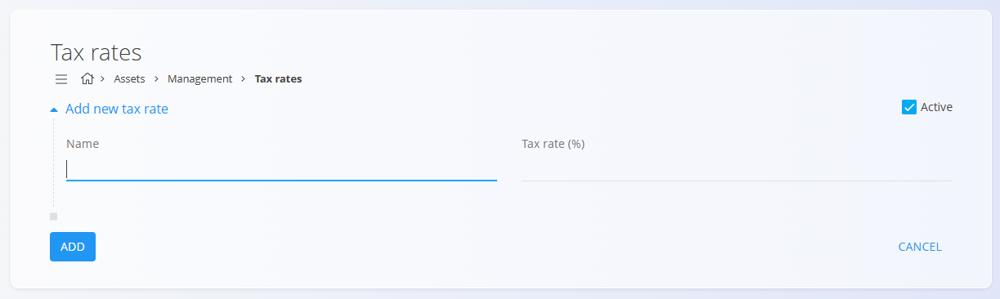

# Davčne stopnje

Šifrant **Davčne stopnje** določa vse davčne stopnje, uporabljene v sistemu. Davčne stopnje določajo odstotek davka, ki se uporablja za izdelke, materiale in storitve v poslovnih dokumentih. Vsak zapis vsebuje opisno ime in številčno vrednost, kar zagotavlja dosledno obračunavanje davkov v vseh digitalnih vsebinah.

## Shema

| Polje | Opis |
|------|------|
| **Naziv** | Opisno ime davčne stopnje (npr. *Standardna davčna stopnja 22* ali *Znižana davčna stopnja 9,5*). |
| **Davčna stopnja (%)** | Številčni odstotek davka (npr. **22** ali **9,5**). |
| **Aktivna** | Označuje, ali je davčna stopnja trenutno v uporabi. Neaktivnih stopenj ni mogoče izbrati v novih vnosih, ostanejo pa vidne v zgodovini. |

## Upravljanje

Do šifranta **Davčne stopnje** lahko dostopate iz različnih domen v [navigaciji](../UI/Navigacija.md). V vseh primerih delate z istimi skupnimi podatki.

Za odpiranje seznama pojdite v razdelek **Upravljanje** v naslednjih domenah:

- **Sredstva**
- **Prodaja**
- **Nabava**

### Seznam davčnih stopenj

Uporabniški vmesnik vsebuje seznam davčnih stopenj. Če zapisi še ne obstajajo, je seznam prazen.

Vsak zapis vključuje indikator stanja levo od imena:
- **Modra** označuje, da je davčna stopnja aktivna
- **Siva** označuje, da je davčna stopnja neaktivna

Seznam prikazuje ime davčne stopnje in pripadajoči odstotek. V zgornjem desnem kotu je na voljo iskalno polje.

## Dejanja

Kliknite [**akcijski gumb**](../UI/AkcijskiGumb.md), da dodate novo davčno stopnjo.

Obrazec vključuje naslednja polja:
- **Naziv**
- **Davčna stopnja (%)**
- **Aktivna**

Kliknite **Dodaj** za shranjevanje ali **Prekliči** za vrnitev na seznam.

## Urejanje

Za urejanje obstoječe davčne stopnje kliknite njeno **Ime** na seznamu.  
Kliknite **Shrani** za potrditev sprememb ali **Prekliči** za zavrnitev.

## Brisanje

Kliknite **Izbriši** na zaslonu za urejanje, da odprete potrditveno pogovorno okno:

**Ali ste prepričani, da želite izbrisati ta zapis?**

Če potrdite, se zapis trajno odstrani; sicer sistem ohrani obstoječe stanje.

> [!NOTE]
> Davčno stopnjo je mogoče izbrisati le, če ni uporabljena v nobenem od odvisnih zapisov.

---
