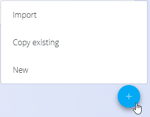

# Akcijski gumb

**Akcijski gumb** se prikaže kot okrogla modra ikona **+** v spodnjem desnem kotu seznamskih strani.  
Njegov glavni namen je ustvarjanje novih zapisov znotraj modula, ki ga trenutno uporabljate.

Ob kliku se odpre kontekstni meni z dejanji, ki so relevantna za trenutni zaslon.  
Najpogostejše dejanje je:

- **Novo** — ustvarjanje novega dokumenta, vnosa v šifrant ali konfiguracijskega zapisa.

Glede na modul lahko akcijski gumb vključuje tudi dodatne možnosti, kot so:

- **Uvoz** — nalaganje ali uvoz podatkov iz zunanjih datotek (npr. Excel predlog).  
- **Kopiraj obstoječe** — ustvarjanje novega zapisa na podlagi obstoječega.  
- **Druga modulno specifična dejanja** — prikazana samo, kadar so na voljo.

### Opombe

- Razpoložljiva dejanja so odvisna od modula in uporabniških pravic.  
- Akcijski gumb je prikazan samo na **seznamskih straneh**, ne pa na obrazcih za urejanje dokumentov.  
- Vsako dejanje odpre ali ustvari **nov osnutek zapisa**, ki ga je nato mogoče dopolniti in potrditi.

---