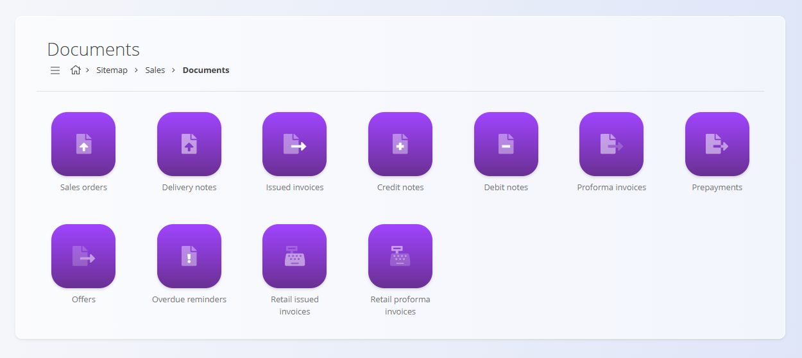
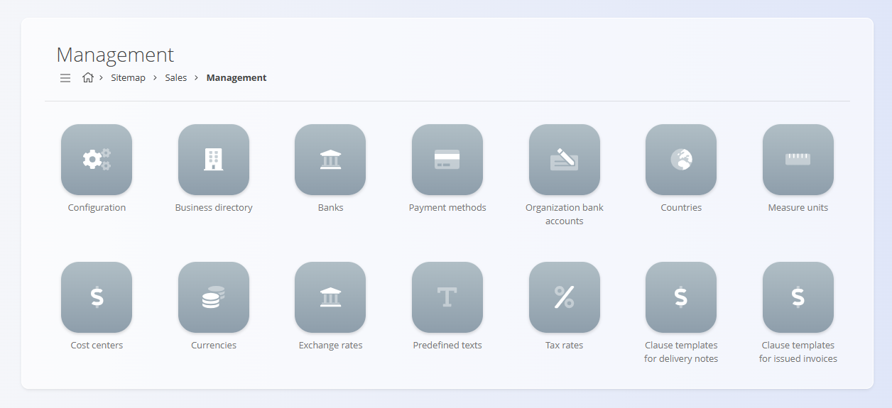

# Navigacija

Platforma je organizirana tako, da omogoča enostavno iskanje dokumentov, pogledov in konfiguracijskih področij glede na vsakodnevno delo. Navigacija poteka predvsem prek **zemljevida strani**, drobtinic in gumbov za hitri dostop.

## Zemljevid strani

**Zemljevid strani** je glavna vstopna točka platforme. Razdeljen je na **domene**, od katerih vsaka predstavlja funkcionalno področje sistema.

Na zemljevid strani se lahko vedno vrnete s klikom na **ikono hiše** v drobtinicah.

### Navigacija z drobtinicami

Drobtinice prikazujejo trenutno pot in omogočajo vračanje nazaj s klikom na katerikoli prejšnji element:

Na številnih zaslonih je v spodnjem desnem kotu na voljo tudi **gumb s puščico nazaj**, ki omogoča vrnitev na prejšnji zaslon:

### Domene

Vsaka domena vsebuje orodja, povezana z določenim poslovnim področjem. Primeri vključujejo:

- **[Prodaja](../../Prodaja/Domena/Prodaja.md)**  
- **[Logistika](../../Logistika/Domena/Logistika.md)**  
- **[Nabava](../../Nabava/Domena/Nabava.md)**  
- **[Proizvodnja](../../Proizvodnja/Domena/Proizvodnja.md)**  

> [!NOTE]
>
> Razpoložljive domene so odvisne od konfiguracije in poslovnega modela podjetja. Podjetje, ki na primer prodaja samo končne izdelke, morda ne bo imelo domene **Proizvodnja**.

Znotraj domen so različni razdelki glede na funkcionalno področje:
- Dokumenti
- Pogledi
- Upravljanje

Primer – razdelki v domeni **Prodaja**:

## Dokumenti

Dokumenti predstavljajo jedro vsakodnevnega operativnega dela. Uporabljajo se za ustvarjanje, obdelavo in sledenje poslovnim transakcijam, kot so:

- **[Prodajni nalogi](../../Prodaja/Dokumenti/ProdajniNalogi.md)**  
- **[Dobavnice](../../Prodaja/Dokumenti/Dobavnice.md)**  
- **[Prevzemi](../../Logistika/Dokumenti/Prevzemi.md)**  
- **[**Izdajnice**](../../Logistika/Dokumenti/Izdajnice.md)**  
- **[**Medskladiščni promet**](../../Logistika/Dokumenti/MedskladiscniPromet.md)**  
- **[Inventure](../../Logistika/Dokumenti/Inventure.md)**
- **[Nabavni nalogi](../../Nabava/Dokumenti/NabavniNalogi.md)**  
- **[Izvajanje](../../Proizvodnja/Dokumenti/Izvajanje.md)**
- **[Proizvodni nalogi](../../Proizvodnja/Dokumenti/ProizvodniNalogi.md)**
- **[Zahteve](../../Proizvodnja/Dokumenti/Zahteve.md)**
- in številni drugi

Primer – vstop v domeno **Prodaja** in razdelek **Dokumenti**:

Dokumenti običajno omogočajo:

- seznam osnutkov in potrjenih dokumentov  
- ustvarjanje novih zapisov  
- filtre za hitro iskanje informacij  
- možnosti tiskanja in izvoza  

## Pogledi

Pogledi omogočajo **analizo in spremljanje** poslovnih informacij. Ne ustvarjajo transakcij, temveč pomagajo razumeti širšo sliko.

Primeri pogledov vključujejo:

- **[Pregledi zalog](../../Logistika/Dokumenti/Zaloge.md)**  
- **[Poročila prodajnih nalogov](../../Prodaja/Pregledi/PoročilaProdajnihNalogov.md)**  
- **[Poročila dobavnic](../../Prodaja/Pregledi/PoročilaDobavnic.md)**  
- **[Kartice podjetij](../../Prodaja/Pregledi/KarticePodjetij.md)**  
- **[Pregledi zalog po lokaciji](../../Logistika/Pregledi/ZalogePoLokaciji.md)**  
- **[KPI proizvodnje](../../Proizvodnja/Analitika/KPIProizvodnje.md)**
- **[Povzetek izgub](../../Proizvodnja/Analitika/PovzetekIzgub.md)**
- **[Povzetek zastojev](../../Proizvodnja/Analitika/PovzetekZastojev.md)**

Primer – **Prodaja / Pogledi**:

Pogledi so namenjeni:

- hitri analizi  
- nadzoru in preverjanju  
- podpori odločanju  
- poročanju  

## Upravljanje

Razdelek **Upravljanje** vsebuje vse šifrante in osnovne nastavitve, ki podpirajo delovanje platforme. Te nastavitve zagotavljajo, da dokumenti in procesi uporabljajo dosledne in veljavne podatke.

Upravljanje vključuje na primer:

- konfiguracijo sistema  
- **[Poslovni imenik](../Sifranti/PoslovniImenik.md)**  
- **[Banke in načini plačila](../../Prodaja/Sifranti/NačiniPlačila.md)**  
- **[Države](../Sifranti/Drzave.md)**, **[valute](../Sifranti/Valute.md)**, **[davčne stopnje](../Sifranti/DavcneStopnje.md)**  
- **[Vnaprej določena besedila](../Sifranti/VnaprejDoločenaBesedila.md)**  
- **[Merske enote](../Sifranti/MerskeEnote.md)**  
- **[Bančni računi organizacije](../../Prodaja/Sifranti/BančniRačuniOrganizacije.md)**  
- **[Procesi](../../Proizvodnja/Sifranti/Procesi.md)**
- **[Vhodi](../../Proizvodnja/Sifranti/Vhodi.md)**, **[Izhodi](../../Proizvodnja/Sifranti/Izhodi.md)**
- **[Nazivi delovnih mest](../Sifranti/NaziviDelovnihMest.md)**, **[Človeški viri](../../Proizvodnja/Sifranti/ČloveškiViri.md)**
- drugi ključni šifranti  

Primer – **Prodaja / Upravljanje**:

Strani za upravljanje običajno vzdržujejo skrbniki ali uporabniki, odgovorni za konfiguracijo sistema.

---
