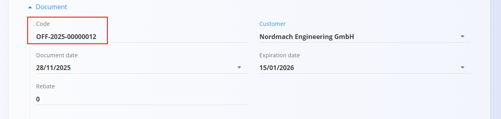
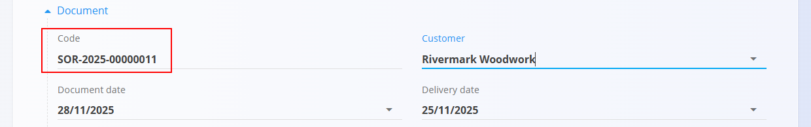

# Šifre dokumentov

Vsak dokument v sistemu prejme samodejno ustvarjeno **šifro dokumenta**.  
Ta šifra enolično identificira dokument in sledi enotni strukturi v vseh modulih.

Šifre dokumentov se uporabljajo za:

- sledenje in referenciranje dokumentov  
- navigacijo znotraj sistema  
- povezovanje dokumentov (Ponudbe → Prodajni nalogi → Dobavnice → Izdani računi)  
- zunanjo komunikacijo (PDF-ji, e-pošta, izvozi)

## Struktura šifre dokumenta

Vse šifre dokumentov sledijo enaki obliki:

**PREDPONA-LETO-ZAPOREDJE**

Kjer:

- `PREDPONA` – 2–3 črke, ki označujejo vrsto dokumenta  
- `LETO` – leto nastanka dokumenta  
- `ZAPOREDJE` – zaporedna številka z vodilnimi ničlami  

Primeri:

- `OFF-2025-00000012`
- `SOR-2025-00002311`

## Primeri predpon po vrsti dokumenta

### Prodajni dokumenti
- `OFF` – Ponudbe  
- `SOR` – Prodajni nalogi  
- `DNO` – Dobavnice  
- `INV` – Izdani računi  

### Nabavni dokumenti
- `INQ` – Povpraševanja  
- `SOR` – Nabavni nalogi  
- `REC` – Prevzemi (delni ali celotni)  

### Finančni / skladiščni dokumenti  
(če je na voljo)
- `PAY` – Plačila  
- `STK` – Premiki zalog  
- `CMP` – Zaključene proizvodne ali montažne serije  

## Kako se šifre ustvarijo

- Šifre so **samodejno dodeljene** ob ustvarjanju dokumenta.  
- Zaporedje se povečuje neodvisno za vsako vrsto dokumenta.  
- Šifre **ni mogoče urejati** po ustvarjanju.  
- Dokumenti, ustvarjeni iz drugih dokumentov (npr. Ponudba → Prodajni nalog), vedno prejmejo **novo šifro**.

## Konfiguracija

Način generiranja šifer (predpone, vzorec, dolžina zaporedja, ločeno številčenje ipd.) je v večini domen nastavljen na zaslonu **Konfiguracija** v razdelku **Upravljanje**. Tipični primeri:

- Logistika: [Konfiguracija logistike](../../Domene/Logistika/Upravljanje/KonfiguracijaLogistike.md)
- Prodaja: [Konfiguracija prodaje](../../Prodaja/Upravljanje/KonfiguracijaProdaje.md)
- Nabava: [Konfiguracija nabave](../../Nabava/Upravljanje/KonfiguracijaNabave.md)

## Kje je šifra prikazana

Šifre so prikazane tudi v:

- seznamskih pogledih  
- povezanih dokumentih  
- PDF-jih  
- e-poštnih izvozih  
- integracijah  

## Zakaj je struktura šifre pomembna

Enotna struktura zagotavlja:

- čisto razvrščanje v seznamih  
- predvidljivo iskanje in filtriranje  
- enostavno referenciranje v računovodstvu, logistiki in operativnih procesih  
- berljivo obliko za uporabnike (leto + zaporedje)

---
