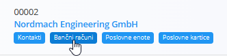
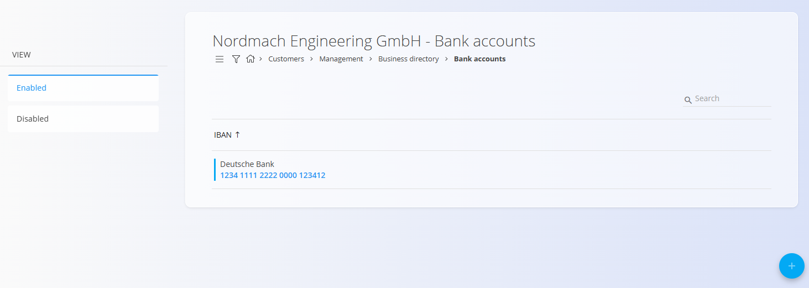

<!-- app_route: /management/contacts/companies -->
<!-- app_label: Poslovni imenik -->
<!-- canonical_source_url: https://github.com/Tom-PIT/Connected.Docs/blob/main/sl/Skupno/Upravljanje/BancniRacuni.md -->
<!-- canonical_source_title: Bančni računi -->

# Bančni računi
Bančni računi pripadajo določenemu **kupcu** ali **dobavitelju** in se upravljajo znotraj [**Poslovnega imenika**](PoslovniImenik.md). Določajo finančne podatke računa, ki se kasneje uporabljajo v dokumentih, kot so izdani računi ali plačila.

Vsak račun je povezan z **banko**, izbrano iz vnaprej definiranega šifranta [**Banke**](Banke.md).

### Dostop do bančnih računov
Bančni računi so prikazani kot oznaka pod vsakim vnosom v poslovnem imeniku. Kliknite to oznako, da odprete vmesnik za upravljanje bančnih računov, povezanih z izbranim partnerjem.

## Shema
| Polje | Opis |
|-------|------|
| [**Banka**](Banke.md) | Finančna institucija, ki zagotavlja račun. Izbrana iz šifranta **Banke** (obvezno). |
| **IBAN** | Celotna mednarodna številka bančnega računa (obvezno). |
| **Aktiven** | Označuje, ali se lahko račun uporablja v dokumentih. |
| **Uporabljaj IBAN masko** | Vizualno oblikuje IBAN (presledki in skupine) brez spreminjanja vrednosti. |

## Seznamski pogled
Seznam bančnih računov prikazuje vse račune, povezane z izbranim vnosom v Poslovnem imeniku.

Uporabite filtre na levi strani (Omogočeno / Onemogočeno) za prikaz samo aktivnih ali neaktivnih računov.

## Dejanja

### Ustvarjanje novega bančnega računa
Za dodajanje novega bančnega računa kliknite [**akcijski gumb**](../UI/AkcijskiGumb.md) v spodnjem desnem kotu.

Izpolnite vsa obvezna polja. Neobvezna polja izpolnite, če so relevantna. Za več podrobnosti o poljih si oglejte zgoraj omenjeno razdelitev [**Shema**](#shema).

Kliknite **Dodaj**, da shranite nov račun.

### Urejanje obstoječega računa
1. Odprite vnos v Poslovnem imeniku.  
2. Kliknite oznako **Bančni računi**.  
3. Izberite račun s seznama.  
4. Posodobite IBAN, stanje aktivnosti ali možnost maske.  
5. Kliknite **Shrani**.

### Brisanje
Bančni račun je mogoče izbrisati na strani za urejanje, vendar le, če ni uporabljen v drugih dokumentih (npr. izdanih računih ali plačilih).

> [!NOTE]
> Brisanje bančnega računa **ne izbriše** vnosa v Poslovnem imeniku, kateremu pripada.