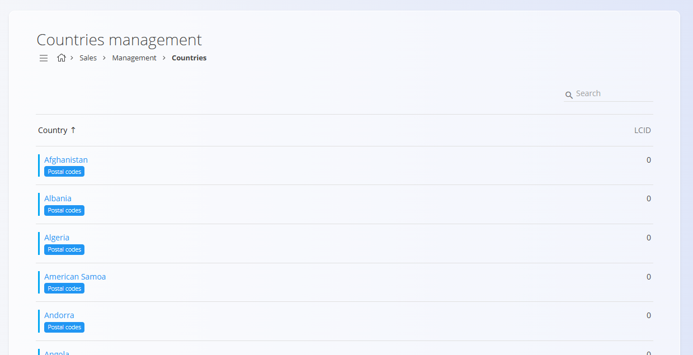
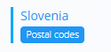

<!-- app_route: management/common-types/countries -->
<!-- app_label: Države -->
<!-- canonical_source_url: https://github.com/Tom-PIT/Connected.Docs/blob/main/sl/Skupno/Upravljanje/Drzave.md -->
<!-- canonical_source_title: Države -->

# Države
<!-- app_route: management/common-types/countries -->
<!-- app_label: Države -->
Ta šifrant predstavlja države, ki se uporabljajo v digitalnih vsebinah sistema. Vsaka država določa lokalizacijske parametre, kot sta LCID in koda ISO, ki zagotavljajo pravilne jezikovne in regionalne nastavitve ter skladnost z mednarodnimi standardi.

Do šifranta **Države** lahko dostopate iz različnih domen v [**navigaciji**](../UI/Navigacija.md). V vseh primerih delate z istimi skupnimi podatki.

Za odpiranje seznama pojdite v razdelek **Upravljanje / Države** v naslednjih domenah:

- **Logistika**
- **Prodaja**
- **Nabava**
- 
## Shema
<!-- app_route: management/common-types/countries -->
<!-- app_label: Države -->
| Polje | Opis |
|------|------|
| **Ime** | Ime države, na primer Slovenija ali **Avstrija**. |
| **LCID** | Lokalizacijski identifikator, ki se uporablja za nastavitev jezika in regionalnih posebnosti države. |
| **ISO šifra (2 znaka)** | Mednarodna standardna koda države (npr. **SI** za Slovenijo ali **AT** za Avstrijo). |
| **Aktiven** | Označuje, ali je država aktivna. Neaktivnih držav ni mogoče uporabiti za nove vnose, vendar ostanejo vidne v zgodovini. |

## Upravljanje

### Seznam držav
<!-- app_route: management/common-types/countries -->
<!-- app_label: Države -->
Uporabniški vmesnik vsebuje seznam držav. Če zapisi še ne obstajajo, je seznam prazen.

Vsak zapis vključuje indikator stanja levo od imena:
- **Modra** označuje, da je država aktivna
- **Siva** označuje, da je država neaktivna



Vsak zapis prikazuje oznako s **povezanimi podatki** — [Poštne številke](PostneStevilke.md).

Klik na to oznako odpre vmesnik za upravljanje povezanih podatkov za izbrano državo.

## Dejanja
<!-- app_route: management/common-types/countries -->
<!-- app_label: Države -->
Kliknite [**akcijski gumb**](../UI/AkcijskiGumb.md) za prikaz naslednjih dejanj:

- Uvoz  
- Nov

### Uvoz
<!-- app_route: management/common-types/countries -->
<!-- app_label: Države -->
Dejanje **Uvoz** omogoča množično ustvarjanje ali posodabljanje zapisov držav. Funkcija je namenjena skrbnikom, ki morajo hkrati dodati ali spremeniti več držav.

Kliknite na [**akcijski gumb**](../UI/AkcijskiGumb.md) in izberite **Uvoz** sistem odpre vmesnik za nalaganje:


Uvoz sprejme **CSV datoteko**. Datoteko lahko povlečete in spustite v območje za nalaganje ali kliknete za odprtje pogovornega okna za izbiro datoteke. Datoteka mora vsebovati zahtevana polja v veljavni strukturi. Primer datoteke lahko prenesete prek menija v zgornjem desnem kotu. Po končanem nalaganju sistem obdela datoteko in ustvari ali posodobi zapise držav na podlagi vsebine CSV.

Kliknite **Prekliči** za vrnitev na seznam držav brez uvoza.

#### Primer strukture CSV
<!-- app_route: management/common-types/countries -->
<!-- app_label: Države -->
```csv
Name,LCID,ISOAlpha2Code,Active
Slovenia,1060,SI,true
Austria,3079,AT,true
Italy,1040,IT,false
```

### Ustvarjanje nove države
<!-- app_route: management/common-types/countries -->
<!-- app_label: Države -->
Kliknite na [**akcijski gumb**](../UI/AkcijskiGumb.md) in izberite **Novo**, da odprete vnosni obrazec za dodajanje nove države.

Izpolnite vsa obvezna polja. Neobvezna polja izpolnite, če so relevantna. Za več podrobnosti o poljih si oglejte zgoraj omenjeno razdelitev [**Shema**](#shema).

Kliknite **Dodaj** za ustvarjanje zapisa ali **Prekliči** za vrnitev na seznam brez shranjevanja.


### Urejanje obstoječega države
<!-- app_route: management/common-types/countries -->
<!-- app_label: Države -->
Za urejanje obstoječega zapisa kliknite **Ime** države na seznamu. Vmesnik se preklopi v način urejanja in prikaže obstoječe vrednosti za spremembe. Kliknite **Shrani** za potrditev sprememb ali **Prekliči** za zavrnitev.

### Poštne številke
<!-- app_route: management/common-types/countries -->
<!-- app_label: Države -->
Oznaka [**Poštne številke**](PostneStevilke.md) odpre vmesnik za upravljanje poštnih številk, povezanih z izbrano državo. Vsak zapis poštne številke vključuje polja, kot sta **Številka** in **Mesto**, kar omogoča vzdrževanje pravilnih geografskih in poštnih podatkov.



### Brisanje
<!-- app_route: management/common-types/countries -->
<!-- app_label: Države -->
Kliknite **Izbriši** na zaslonu za urejanje, da odprete potrditveno pogovorno okno:

**Ali ste prepričani, da želite izbrisati ta zapis?**

Če potrdite, se vnos trajno odstrani; sicer sistem ohrani obstoječe stanje.

> [!NOTE]
> Državo je mogoče izbrisati le, če ni uporabljena v odvisnih zapisih (npr. naslovih ali dokumentih).
