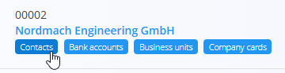

# Kontakti

**Kontakti** pripadajo določenemu **kupcu** ali **dobavitelju** in se upravljajo znotraj [**Poslovnega imenika**](PoslovniImenik.md). Shranjujejo osebe, povezane s podjetjem — kot so skrbniki kupcev, nabavni kontakti, tehniki ali obračunski predstavniki.

Vsak kontakt vključuje **naziv delovnega mesta**, izbran iz vnaprej definiranega šifranta [**Nazivi delovnih mest**](NaziviDelovnihMest.md).

### Dostop do kontaktov

Kontakti so prikazani kot oznaka pod vsakim vnosom v poslovnem imeniku. Kliknite to oznako, da odprete vmesnik za upravljanje kontaktov, povezanih z izbranim partnerjem.

## Shema

| Polje | Opis |
|------|------|
| **Ime** | Ime kontaktne osebe (obvezno). |
| **Priimek** | Priimek kontaktne osebe (obvezno). |
| **Naziv delovnega mesta** | Vloga ali delovno mesto, izbrano iz šifranta [**Nazivi delovnih mest**](NaziviDelovnihMest.md). |
| **E-pošta** | Primarni e-poštni naslov. |
| **Telefon** | Stacionarna ali službena telefonska številka. |
| **Mobitel** | Mobilna ali neposredna telefonska številka. |
| **Faks** | Neobvezna številka faksa. |
| **Oznake** | Klasifikacijske oznake za združevanje ali filtriranje kontaktov. |
| **Aktiven** | Označuje, ali je kontakt na voljo za izbiro v dokumentih. |

## Seznamski pogled

Seznam kontaktov prikazuje vse kontakte, povezane z izbranim vnosom v Poslovnem imeniku.

Uporabite filtre **Omogočeno / Onemogočeno** na levi strani za prikaz aktivnih ali neaktivnih kontaktov.

## Ustvarjanje novega kontakta

Za dodajanje novega kontakta kliknite [**akcijski gumb**](../UI/AkcijskiGumb.md) v spodnjem desnem kotu.

Izpolnite naslednja polja:

- **Ime**  
- **Priimek**  
- **Naziv delovnega mesta** — izbran iz [**Nazivi delovnih mest**](NaziviDelovnihMest.md)  
- **E-pošta**  
- **Telefon** / **Mobilni telefon** / **Faks** (neobvezno)  
- **Oznake** (neobvezno)  
- **Aktiven**

Kliknite **Dodaj**, da shranite nov kontakt.

## Urejanje obstoječega kontakta

1. Odprite vnos v Poslovnem imeniku.  
2. Kliknite oznako **Kontakti**.  
3. Izberite kontakt s seznama.  
4. Posodobite poljubno polje (ime, e-pošta, telefon, naziv delovnega mesta, oznake itd.).  
5. Kliknite **Shrani**.

## Brisanje

Kontakt je mogoče izbrisati na strani za urejanje, vendar le, če ni uporabljen v drugih dokumentih.

> [!NOTE]  
> Brisanje kontakta **ne izbriše** pripadajočega vnosa v Poslovnem imeniku.