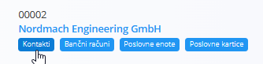

<!-- app_route: /management/contacts/companies -->
<!-- app_label: Poslovni imenik -->
<!-- canonical_source_url: https://github.com/Tom-PIT/Connected.Docs/blob/main/sl/Skupno/Upravljanje/Kontakti.md -->
<!-- canonical_source_title: Kontakti -->

# Kontakti
**Kontakti** pripadajo določenemu **kupcu** ali **dobavitelju** in se upravljajo znotraj [**Poslovnega imenika**](PoslovniImenik.md). Shranjujejo osebe, povezane s podjetjem — kot so skrbniki kupcev, nabavni kontakti, tehniki ali obračunski predstavniki.

Vsak kontakt vključuje **naziv delovnega mesta**, izbran iz vnaprej definiranega šifranta [**Nazivi delovnih mest**](NaziviDelovnihMest.md).

Kontakti so prikazani kot oznaka pod vsakim vnosom v poslovnem imeniku. Kliknite to oznako, da odprete vmesnik za upravljanje kontaktov, povezanih z izbranim partnerjem.

## Shema
| Polje | Opis |
|------|------|
| **Ime** | Ime kontaktne osebe (obvezno). |
| **Priimek** | Priimek kontaktne osebe (obvezno). |
| **Naziv delovnega mesta** | Vloga ali delovno mesto, izbrano iz šifranta [**Nazivi delovnih mest**](NaziviDelovnihMest.md). |
| **E-pošta** | Primarni e-poštni naslov. |
| **Telefon** | Stacionarna ali službena telefonska številka. |
| **Mobitel** | Mobilna ali neposredna telefonska številka. |
| **Faks** | Neobvezna številka faksa. |
| **Oznake** | Klasifikacijske oznake za združevanje ali filtriranje kontaktov. |
| **Aktiven** | Označuje, ali je kontakt na voljo za izbiro v dokumentih. |

## Seznamski pogled

Seznam kontaktov prikazuje vse kontakte, povezane z izbranim vnosom v Poslovnem imeniku.

Uporabite filtre **Omogočeno / Onemogočeno** na levi strani za prikaz aktivnih ali neaktivnih kontaktov.

## Dodati novega kontakta

Za ustvarjanje novega kontakta: 

1. Kliknite [**akcijski gumb**](../UI/AkcijskiGumb.md).
2. Izpolnite vsa obvezna polja. Neobvezna polja izpolnite, če so relevantna.
3.Kliknite **Dodaj**, da shranite nov kontakt.

> [!NOTE]
> Za več podrobnosti o poljih si oglejte zgoraj omenjeno razdelitev [**Shema**](#shema).

## Urediti obstoječega kontakta

Za urejanje obstoječega kontakta:
 
1. Odprite vnos v Poslovnem imeniku.  
2. Kliknite oznako **Kontakti**.  
3. Izberite kontakt s seznama.  
4. Posodobite poljubno polje (ime, e-pošta, telefon, naziv delovnega mesta, oznake itd.).  
5. Kliknite **Shrani**.

## Izbrisati kontakta

Za brisanje kontakta:

1. Odprite vnos v Poslovnem imeniku.
2. Kliknite oznako **Kontakti**.
3. Izberite kontakt s seznama.
4. Kliknite **Izbriši**.

Kontakt je mogoče izbrisati na strani za urejanje, vendar le, če ni uporabljen v drugih dokumentih.