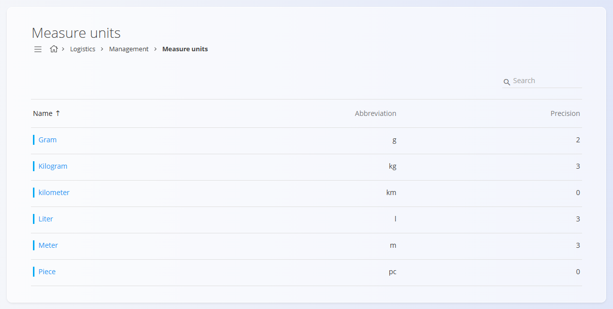
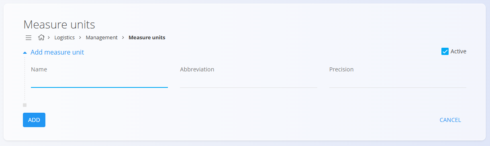

# Merske enote

**Merske enote** določajo, kako se količine štejejo ali merijo (na primer: kos, kilogram, meter, liter). Zagotavljajo doslednost količin v dokumentih, zalogah in izračunih ter nadzorujejo zaokroževanje in oblikovanje vrednosti (npr. 2 kos, 1,75 kg, 3,000 m) v vseh domenah.

Primeri:
- Končni izdelki: stoli v kosih (kos), brez decimalnih mest
- Surovine: barva v litrih z 2 decimalnima mestoma (npr. 1,25 L)
- Komponente: kabel v metrih s 3 decimalnimi mesti (npr. 12,375 m)

> [!TIP]
> Za celovit prikaz si oglejte video vodič **[Merske enote](https://www.youtube.com/watch?v=8swl8Vex6y4)**.

## Shema

| Polje | Opis |
|------|------|
| **Naziv** | Ime merske enote, uporabljeno v seznamih in dokumentih (npr. **kilogram** ali **meter**) (obvezno). |
| **Kratica** | Kratka oznaka merske enote, prikazana po celotnem sistemu (npr. **kg** ali **m**) (obvezno). |
| **Natančnost** | Privzeto število decimalnih mest za vrednosti v tej merski enoti (npr. **3** za **1,255** ali **1** za **2,5**). |
| **Aktiven** | Označuje, ali je merska enota na voljo za uporabo v novih dokumentih. Neaktivne enote ni mogoče izbrati v novih vnosih, vendar ostanejo vidne v zgodovini. |

## Upravljanje

Do šifranta **Merske enote** lahko dostopate iz različnih domen v [**navigaciji**](../UI/Navigacija.md). V vseh primerih delate z istimi skupnimi podatki.

Za odpiranje seznama pojdite v razdelek **Upravljanje** v naslednjih domenah:

- **Sredstva**
- **Logistika**
- **Vzdrževanje**
- **Proizvodnja**
- **Prodaja**
- **Nabava**

### Seznam merskih enot

Uporabniški vmesnik vsebuje seznam merskih enot. Če zapisi še ne obstajajo, je seznam prazen.

Vsak zapis vključuje indikator stanja levo od imena:
- **Modra** označuje, da je merska enota aktivna
- **Siva** označuje, da je merska enota neaktivna

Seznam prikazuje ime merske enote, okrajšavo in natančnost.

## Dejanja

Kliknite [**akcijski gumb**](../UI/AkcijskiGumb.md), da dodate novo mersko enoto.

Obrazec vključuje naslednja polja:
- **Ime**
- **Kratica**
- **Natančnost**
- **Aktiven**

Po vnosu zahtevanih podatkov kliknite **Dodaj** za shranjevanje merske enote ali **Prekliči** za vrnitev na seznam.

## Urejanje

Za urejanje obstoječe merske enote kliknite njeno **Ime** na seznamu. Vmesnik se preklopi v način urejanja in prikaže obstoječe vrednosti za spremembe.

Kliknite **Shrani** za potrditev sprememb ali **Prekliči** za zavrnitev.

## Brisanje

Kliknite **Izbriši** na zaslonu za urejanje, da odprete potrditveno pogovorno okno:

**Ali ste prepričani, da želite izbrisati ta zapis?**

Če potrdite, se vnos trajno odstrani; sicer sistem ohrani obstoječe stanje.

> [!NOTE]
> Mersko enoto je mogoče izbrisati le, če ni uporabljena v nobenem od odvisnih zapisov, kot so materiali ali zalogovne transakcije.

---
