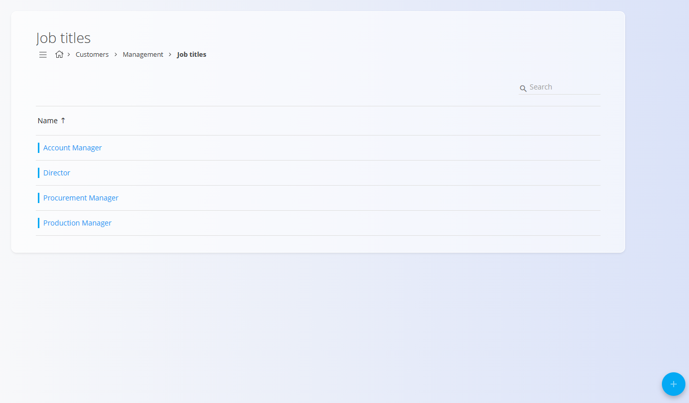

<!-- app_route: /management/contacts/job-titles -->
<!-- app_label: Nazivi delovnih mest -->
<!-- canonical_source_url: https://github.com/Tom-PIT/Connected.Docs/blob/main/sl/Skupno/Upravljanje/NaziviDelovnihMest.md -->
<!-- canonical_source_title: Nazivi delovnih mest -->

# Nazivi delovnih mest
**Nazivi delovnih mest** so del modula **Podpora strankam** in določajo vloge, ki jih je mogoče dodeliti [kontaktom](Kontakti.md) v [**Poslovnem imeniku**](PoslovniImenik.md). Omogočajo razvrščanje oseb, kot so *skrbnik kupcev*, *nabavni referent* ali *direktor*.

Za dostop do te strani pojdite na **Stranke / Upravljanje / Nazivi delovnih mest** v [**navigaciji**](../../Skupno/UI/Navigacija.md).

## Shema
| Polje | Opis |
|------|------|
| **Ime** | Naziv delovnega mesta ali vloga (npr. *Skrbnik kupcev*, *Direktor*). |
| **Aktiven** | Označuje, ali je naziv delovnega mesta na voljo za izbiro pri ustvarjanju kontaktov. |

## Seznamski pogled
Seznam prikazuje vse nazive delovnih mest, definirane v sistemu.

Uporabite filtre **Omogočeno / Onemogočeno** na levi strani za prikaz aktivnih ali neaktivnih nazivov.

## Dejanja

### Ustvarjanje novega naziva delovnega mesta
Za dodajanje novega naziva delovnega mesta kliknite [**akcijski gumb**](../../Skupno/UI/AkcijskiGumb.md) v spodnjem desnem kotu in izberite **Novo**.

Izpolnite **Ime** in nastavite **Aktiven** glede na to, ali želite, da je ta naziv delovnega mesta na voljo za izbiro pri ustvarjanju kontaktov. 

Kliknite **Dodaj**, da shranite nov naziv delovnega mesta.

### Urejanje obstoječega naziva delovnega mesta
1. Odprite **Stranke → Upravljanje → Nazivi delovnih mest**.  
2. Izberite naziv delovnega mesta s seznama.  
3. Posodobite ime ali stanje aktivnosti.  
4. Kliknite **Shrani**.

### Brisanje
Naziv delovnega mesta je mogoče izbrisati na strani za urejanje, vendar le, če ni uporabljen v obstoječih kontaktih.

> [!NOTE]  
> Brisanje naziva delovnega mesta **ne odstrani** vnosov v Poslovnem imeniku.