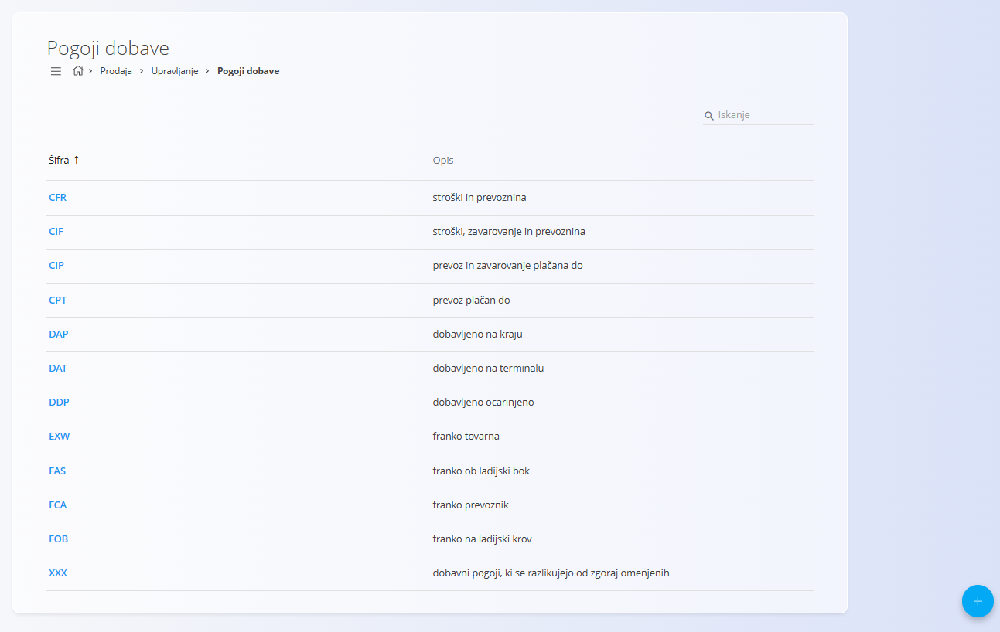

<!-- app_route: management/common/delivery-terms -->
<!-- app_label: Pogoji dobave -->
<!-- canonical_source_url: https://github.com/Tom-PIT/Connected.Docs/blob/main/sl/Skupno/Upravljanje/PogojiDobave.md -->
<!-- canonical_source_title: Pogoji dobave -->

# Pogoji dobave
<!-- app_route: management/common/delivery-terms -->
<!-- app_label: Pogoji dobave -->
<!-- canonical_source_url: https://github.com/Tom-PIT/Connected.Docs/blob/main/sl/Skupno/Upravljanje/PogojiDobave.md -->
<!-- canonical_source_title: Pogoji dobave -->
**Pogoji dobave** določajo pogoje, pod katerimi se blago dobavi med prodajalcem in kupcem, vključno z razdelitvijo stroškov, tveganj in odgovornosti med transportom.

Ti pogoji se najpogosteje uporabljajo v dokumentih **prodaje** za jasno opredelitev dobavnih pogojev.

Večina pogojev dobave temelji na mednarodno priznanih **Incoterms®**, ki jih izdaja Mednarodna trgovinska zbornica (ICC), pri čemer je po potrebi mogoče definirati tudi lastne pogoje.

Za dostop do tega zaslona pojdite na **Računovodstvo / Upravljanje / Intrastat / Pogoji dobave** v [**navigaciji**](../../Skupno/UI/Navigacija.md). Prikazano je tudi pod **Upravljanje** v področju **Prodaja**.

## Shema
<!-- app_route: management/common/delivery-terms -->
<!-- app_label: Pogoji dobave -->
<!-- canonical_source_url: https://github.com/Tom-PIT/Connected.Docs/blob/main/sl/Skupno/Upravljanje/PogojiDobave.md -->
<!-- canonical_source_title: Pogoji dobave -->
| Polje | Opis |
|-----|------|
| **Šifra** | Kratka identifikacija pogoja dobave (na primer EXW, DAP, CIF). |
| **Opis** | Opis dobavnega pogoja. |
| **Navedena lokacija** | Neobvezno polje, uporabljeno pri pogojih dobave, ki zahtevajo navedbo kraja (na primer pristanišče, terminal ali naslov dobave). |

## Seznam pogojev dobave
<!-- app_route: management/common/delivery-terms -->
<!-- app_label: Pogoji dobave -->
<!-- canonical_source_url: https://github.com/Tom-PIT/Connected.Docs/blob/main/sl/Skupno/Upravljanje/PogojiDobave.md -->
<!-- canonical_source_title: Pogoji dobave -->
Seznam prikazuje vse razpoložljive pogoje dobave z njihovimi šiframi in opisi.

Pogoji dobave so **deljeni med domenami** in se lahko uporabljajo v dokumentih, kot so:
- [Prodajni nalogi](../../Domene/Prodaja/Dokumenti/NarocilaStrank.md)
- [Dobavnice](../../Domene/Prodaja/Dokumenti/Dobavnice.md)

Seznam je mogoče preiskovati z iskalnim poljem v zgornjem desnem kotu.

## Dejanja

### Dodaj pogoj dobave
<!-- app_route: management/common/delivery-terms -->
<!-- app_label: Pogoji dobave -->
<!-- canonical_source_url: https://github.com/Tom-PIT/Connected.Docs/blob/main/sl/Skupno/Upravljanje/PogojiDobave.md -->
<!-- canonical_source_title: Pogoji dobave -->
Kliknite [**akcijski gumb**](../../Skupno/UI/AkcijskiGumb.md), da ustvarite nov pogoj dobave.

Izpolnite vsa obvezna polja. Neobvezna polja izpolnite, če so relevantna. Za več podrobnosti o poljih si oglejte zgoraj omenjeno razdelitev [**Shema**](#shema).

> [!NOTE]
> Kadar je to mogoče, uporabljajte standardne **Incoterms®** šifre in opise, da zagotovite jasnost in doslednost v mednarodnem poslovanju.

Po shranjevanju je pogoj dobave na voljo za izbiro v dokumentih, kjer so potrebni dobavni pogoji.

### Urejanje pogoja dobave
<!-- app_route: management/common/delivery-terms -->
<!-- app_label: Pogoji dobave -->
<!-- canonical_source_url: https://github.com/Tom-PIT/Connected.Docs/blob/main/sl/Skupno/Upravljanje/PogojiDobave.md -->
<!-- canonical_source_title: Pogoji dobave -->
Kliknite pogoj dobave v seznamu, da ga odprete v načinu urejanja.  
Po potrebi lahko posodobite **Šifro**, **Opis** ali **Navedeno lokacijo**.

Kliknite **Shrani** za uveljavitev sprememb ali **Prekliči** za zavrnitev.

### Brisanje pogoja dobave
<!-- app_route: management/common/delivery-terms -->
<!-- app_label: Pogoji dobave -->
<!-- canonical_source_url: https://github.com/Tom-PIT/Connected.Docs/blob/main/sl/Skupno/Upravljanje/PogojiDobave.md -->
<!-- canonical_source_title: Pogoji dobave -->
Odprite pogoj dobave s seznama in kliknite **Izbriši**. Brisanje potrdite v pogovornem oknu.

> [!NOTE]
> Pogoj dobave je mogoče izbrisati samo, če ni uporabljen v povezanih zapisih (na primer prodajnih ali nabavnih nalogih).
