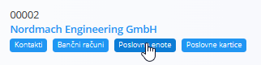
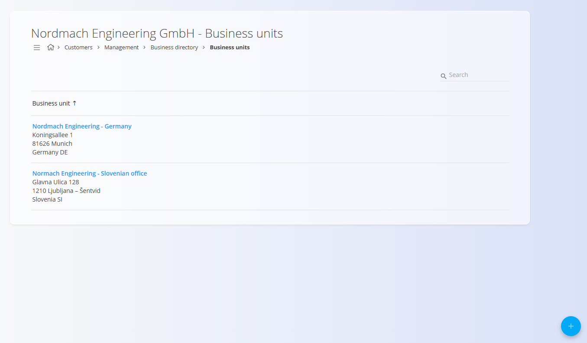
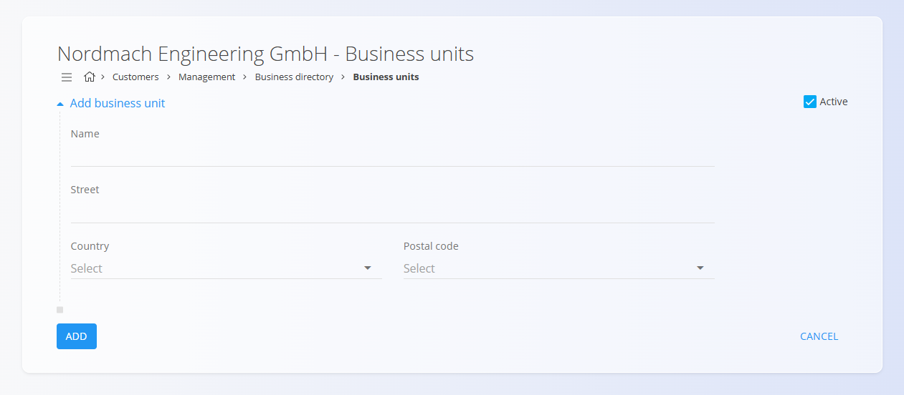

<!-- app_route: /management/contacts/companies -->
<!-- app_label: Poslovni imenik -->
<!-- app_navigation_hint: Odprite Poslovni imenik in kliknite oznako Poslovne enote pod imenom podjetja. -->
<!-- canonical_source_url: https://github.com/Tom-PIT/Connected.Docs/blob/main/sl/Skupno/Upravljanje/PoslovneEnote.md -->
<!-- canonical_source_title: Poslovne enote -->

# Poslovne enote
**Poslovne enote** pripadajo določenemu **kupcu** ali **dobavitelju** in se upravljajo znotraj **Poslovnega imenika**.  Predstavljajo fizične lokacije, podružnice ali organizacijske enote podjetja, vsaka s svojimi naslovnimi podatki.

Poslovne enote so prikazani kot oznaka pod vsakim vnosom v poslovnem imeniku. Kliknite to oznako, da odprete vmesnik za upravljanje poslovnih enot, povezanih z izbranim partnerjem.

## Shema
| Polje | Opis |
|------|------|
| **Ime** | Ime poslovne enote (npr. *Glavni sedež*, *Slovenska podružnica*). |
| **Ulica** | Ulica in hišna številka lokacije. |
| **Država** | Izbrana iz šifranta [**Države**](../../Skupno/Upravljanje/Drzave.md). |
| **Pošta** | Izbrana iz seznama [**Poštne številke**](PostneStevilke.md) glede na državo. |
| **Aktivna** | Označuje, ali je poslovna enota na voljo za izbiro v dokumentih. |

## Seznamski pogled
Seznam poslovnih enot prikazuje vse enote, povezane z izbranim vnosom v Poslovnem imeniku.

Uporabite filtre **Omogočeno / Onemogočeno** na levi strani za prikaz aktivnih ali neaktivnih enot.

## Dejanja

### Dodati novo poslovno enoto

Za dodajanje nove poslovne enote: 

1. Kliknite [**akcijski gumb**](../UI/AkcijskiGumb.md) v spodnjem desnem kotu.
2. Izpolnite vsa obvezna polja. Neobvezna polja izpolnite, če so relevantna.
3. Kliknite **Dodaj**, da shranite novo poslovno enoto.

> [!NOTE]
> Za več podrobnosti o poljih si oglejte zgoraj omenjeno razdelitev [**Shema**](#shema).

### Urediti poslovno enoto

Za ureditev obstoče poslovne enote:

1. Odprite vnos v Poslovnem imeniku.  
2. Kliknite oznako **Poslovne enote**.  
3. Izberite enoto s seznama.  
4. Posodobite ime, naslov, državo, poštno številko ali stanje aktivnosti.  
5. Kliknite **Shrani**.

### Izbrisati poslovno enoto

1. Odprite vnos v Poslovnem imeniku.  
2. Kliknite oznako **Poslovne enote**.  
3. Izberite enoto s seznama. 
4. Kliknite **Izbriši** in potrdite dejanje.

> [!NOTE]  
> Brisanje poslovne enote **ne izbriše** pripadajočega vnosa v Poslovnem imeniku.
