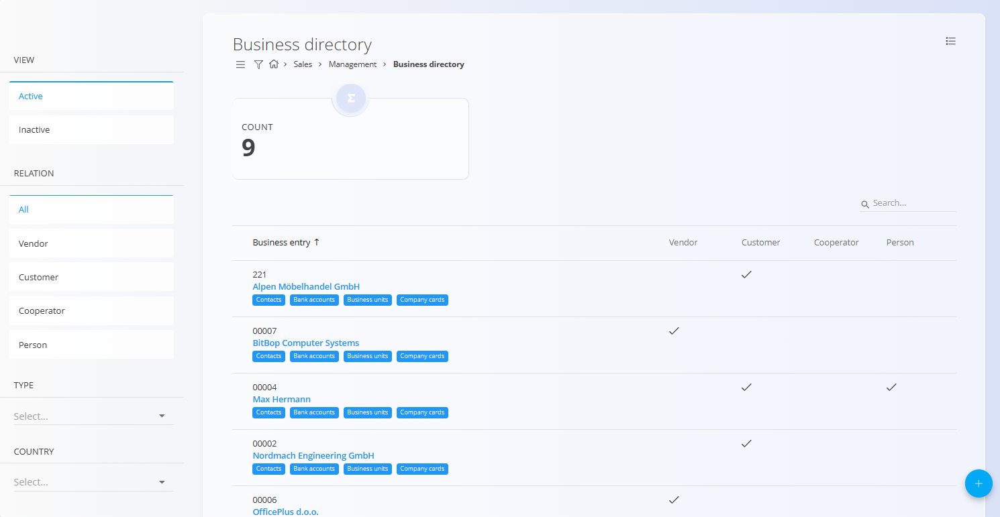

<!-- app_route: /management/contacts/companies -->
<!-- app_label: Poslovni imenik -->
<!-- canonical_source_url: https://github.com/Tom-PIT/Connected.Docs/blob/main/sl/Skupno/Upravljanje/PoslovniImenik.md -->
<!-- canonical_source_title: Poslovni imenik -->

# Poslovni imenik
**Poslovni imenik** vsebuje vsa podjetja in posameznike, s katerimi sodeluje vaša organizacija. To vključuje **kupce**, **dobavitelje**, **kooperante** ali **notranje kontakte**. Vsak vnos hrani pomembne podatke, kot so naslovi, davčni podatki, kontaktne osebe in plačilne nastavitve. To zagotavlja dosledno uporabo istih podatkov o partnerjih v prodajnih, nabavnih, logističnih in finančnih dokumentih.

Do šifranta **Poslovni imenik** lahko dostopate iz različnih domen v [navigaciji](../UI/Navigacija.md). V vseh primerih delate z istimi skupnimi podatki.

Za odpiranje seznama pojdite v razdelek **Upravljanje / Poslovni imenik** v naslednjih domenah:

- **Stranke**
- **Logistika**
- **Prodaja**
- **Nabava**

## Shema
| Polje | Opis |
|------|------|
| **Ime** | Polno ime entitete, na primer **ACME d.o.o.** ali **Janez Novak** (obvezno). |
| **Šifra** | Interna koda, ki zagotavlja enolično identifikacijo (npr. **COK** za *Coca-Cola* ali **ACM** za *ACME d.o.o.*). |
| **Aktivna** | Označuje, ali je vnos aktiven. Neaktivnih vnosov ni mogoče uporabiti v novih dokumentih. |
| **Dobavitelj** | Potrditveno polje, ki označuje, ali entiteta nastopa kot dobavitelj. |
| **Stranka** | Potrditveno polje, ki označuje, ali entiteta nastopa kot stranka. |
| **Kooperant** | Potrditveno polje, ki označuje, ali entiteta nastopa kot kooperant. |
| **Oseba** | Potrditveno polje, ki označuje, ali gre za fizično osebo. |
| **Ulica** | Naslov ulice entitete, na primer **Dunajska cesta 10**. |
| [**Država**](Drzave.md) | Država, v kateri ima entiteta sedež. |
| [**Pošta**](PostneStevilke.md) | Poštna številka sedeža entitete. |
| **Vrsta** | Določa davčni status entitete (glejte razdelek spodaj). |
| **DDV ID** | Identifikacijska številka za DDV, na primer **SI12345678**. |
| **Matična številka** | Matična številka podjetja. |
| [**Institucionalni sektor**](../../Domene/Stranke/Upravljanje/InstitucionalniSektorji.md) | Institucionalni sektor, v katerega spada entiteta. |
| **Oznake** | Oznake za kategorizacijo entitet. |
| **Valuta Plačilna** | Privzeta plačilna valuta, uporabljena v dokumentih. |
| [**Valuta**](Valute.md) | Valuta, povezana z entiteto. |
| **Rabat** | Privzeti odstotek popusta za entiteto. |
| [**Primarni kontakt**](Kontakti.md) | Ime in priimek primarne kontaktne osebe. |
| **Telefon** | Telefonska številka primarne kontaktne osebe. |
| **E-pošta** | E-poštni naslov primarne kontaktne osebe. |
| **Uporabi strankino valuto v dokumentih** | Potrditveno polje, ki določa, ali se v dokumentih uporablja [valuta](Valute.md) partnerja. |

## Upravljanje

### Seznam vnosov v poslovnem imeniku
Uporabniški vmesnik vsebuje seznam vnosov v Poslovnem imeniku.



Kartica prikazuje skupno število vnosov v poslovnem imeniku.

Vsak zapis prikazuje več oznak, ki predstavljajo **povezane podatke**. Na teh straneh lahko dodajate povezane podatke za vsakega poslovnega partnerja:
- [**Kontakti**](Kontakti.md)
- [**Bančni računi**](BancniRacuni.md)
- [**Poslovne enote**](PoslovneEnote.md)
- [**Kartice podjetij**](../../Domene/Prodaja/Pregledi/PoslovneKartice.md)

Filtri na levi strani omogočajo zoženje rezultatov po **pogledu**, **razmerju**, **tipu** in **državi**.

Polje **Vrsta** določa davčni status entitete. Razpoložljive vrednosti so:
- **Zavezanec za DDV**
- **Ni zevezanec za DDV**
- **Končni potrošnik**

## Dejanja
Kliknite [akcijski gumb](../../Skupno/UI/AkcijskiGumb.md) za prikaz razpoložljivih dejanj:

- **Uvoz prek VIES**  
- **Uvoz**  
- **Nov**

### Uvoziti z VIES
Za poenostavitev postopka dodajanja podjetij, registriranih za DDV, v poslovni imenik omogoča dejanje **Uvozi z VIES** samodejno pridobivanje podatkov iz baze podatkov VIES na podlagi podane ID za DDV.

Kliknite na [akcijski gumb](../UI/AkcijskiGumb.md) in izberite **Uvoz z VIES**. V odprtem pogovornem oknu vnesite ID za DDV podjetja, ki ga želite uvoziti (na primer **SI12345678**). Kliknite **Uvozi**, da začnete postopek.

### Uvoziti prek CSV

Kliknite na [akcijski gumb](../UI/AkcijskiGumb.md) in izberite **Uvoz** omogoča množično ustvarjanje ali posodabljanje zapisov podjetij.


#### Primer strukture CSV
```csv
Code,Name,Active,Supplier,Customer,Subcontractor,NaturalPerson,Street,Country,PostalCode,Type,VATID,RegistrationNumber,Tags,PaymentCurrency,DiscountPercent,PrimaryContact,Phone,Email
ACME01,ACME d.o.o.,true,true,true,false,false,Dunajska cesta 10,SI,1000,Liable for tax,SI12345678,1234567-0,wholesale,EUR,5,Janez Novak,+386 1 234 56 78,info@acme.si
CUST01,John Smith,false,false,true,false,true,Glavna ulica 5,SI,2000,Final customer,,,"retail,online",EUR,0,John Smith,+386 31 555 555,john.smith@example.com
```
### Dodati nov zapis

**Poslovni imenik** se uporablja za upravljanje strank, dobaviteljev, kooperantov in fizičnih oseb.

Za ustvarjanje novega zapisa:

1. Kliknite na [akcijski gumb](../UI/AkcijskiGumb.md) in izberite **Nov** odpre vnosni obrazec za ustvarjanje novega zapisa.
2. Izpolnite vsa obvezna polja.
   - Označite **Stranka**, če želite ustvariti stranko.
   - Označite **Dobavitelj**, če želite ustvariti dobavitelja.
   - Označite **Kooperant**, če želite ustvariti kooperanta.
   - Označite **Oseba**, če gre za fizično osebo.
3. Kliknite **Dodaj** za shranjevanje novega zapisa ali **Prekliči** za vrnitev na seznam brez shranjevanja.

> [!NOTE]
> Entiteti lahko dodelite eno ali več vlog z označitvijo ustreznih potrditvenih polj. Na primer, isti zapis je lahko hkrati stranka, dobavitelj in kooperant.


#### Urediti kontakt

Ta razdelek omogoča vnos podatkov o primarni kontaktni osebi poslovnega partnerja (ime, telefonska številka, e-pošta). Polja so neobvezna in služijo kot referenčni podatki, uporabljeni v dokumentih.

#### Valuta
Ta razdelek omogoča določitev, ali poslovni partner v dokumentih uporablja **valuto podjetja**. Če je možnost omogočena, se vse povezane transakcije (npr. prodajni ali nabavni dokumenti) privzeto izvajajo v valuti podjetja namesto v valuti partnerja.


### Urediti zapis

Za urejanje obstoječega zapisa: 

1. Kliknite **Ime** vnosa na seznamu. 
2. Vmesnik se preklopi v način urejanja in prikaže obstoječe podatke za spremembe. 
3. Kliknite **Shrani** za potrditev sprememb ali **Prekliči** za zavrnitev.


### Izbrisati zapis

Za izbrisati obstoječega zapisa:

1. Kliknite **Ime** vnosa na seznamu.
2. Kliknite **Izbriši** na zaslonu za urejanje, da odprete potrditveno pogovorno okno. Potrdite, da želite izbrisati zapis.

> [!NOTE]
> Vnos je mogoče izbrisati le, če ni uporabljen v nobenem od odvisnih zapisov (npr. računi ali naročila).

## Meni

Na tej strani so dejanja menija na voljo na dveh mestih.

### Meni seznama

Meni seznama omogoča dejanja za trenutno prikazan seznam.

Na voljo so naslednja dejanja:

- **Izvoz v CSV**

### Meni dokumenta

Meni dokumenta omogoča dejanja za trenutno odprt dokument.

Na voljo so naslednja dejanja:

- **Izvoz v CSV**

Za podrobnosti o dejanjih menija glejte [**Dejanja menija**](../Koncepti/MeniDejanja.md).