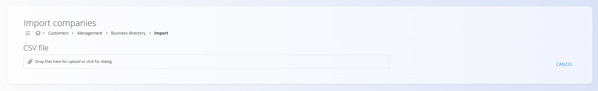
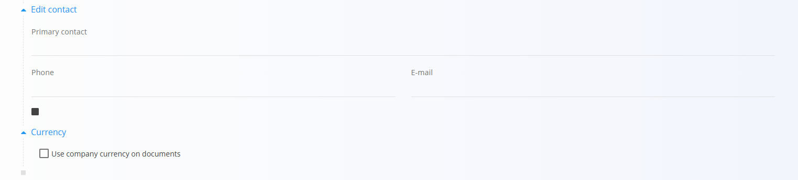

# Poslovni imenik

**Poslovni imenik** vsebuje vsa podjetja in posameznike, s katerimi sodeluje vaša organizacija. To vključuje **kupce**, **dobavitelje**, **kooperante** ali **notranje kontakte**. Vsak vnos hrani pomembne podatke, kot so naslovi, davčni podatki, kontaktne osebe in plačilne nastavitve. To zagotavlja dosledno uporabo istih podatkov o partnerjih v prodajnih, nabavnih, logističnih in finančnih dokumentih.

## Shema

| Polje | Opis |
|------|------|
| **Ime** | Polno ime entitete, na primer **ACME d.o.o.** ali **Janez Novak** (obvezno). |
| **Šifra** | Interna koda, ki zagotavlja enolično identifikacijo (npr. **COK** za *Coca-Cola* ali **ACM** za *ACME d.o.o.*). |
| **Aktivna** | Označuje, ali je vnos aktiven. Neaktivnih vnosov ni mogoče uporabiti v novih dokumentih. |
| **Dobavitelj** | Potrditveno polje, ki označuje, ali entiteta nastopa kot dobavitelj. |
| **Kupec** | Potrditveno polje, ki označuje, ali entiteta nastopa kot kupec. |
| **Kooperant** | Potrditveno polje, ki označuje, ali entiteta nastopa kot kooperant. |
| **Oseba** | Potrditveno polje, ki označuje, ali gre za fizično osebo. |
| **Ulica** | Naslov ulice entitete, na primer **Dunajska cesta 10**. |
| [**Država**](Drzave.md) | Država, v kateri ima entiteta sedež. |
| [**Pošta**](PostneStevilke.md) | Poštna številka sedeža entitete. |
| **Vrsta** | Določa davčni status entitete (glejte razdelek spodaj). |
| **DDV ID** | Identifikacijska številka za DDV, na primer **SI12345678**. |
| **Matična številka** | Matična številka podjetja. |
| [**Institucionalni sektor**](../../Stranke/Upravljanje/InstitucionalniSektorji.md) | Institucionalni sektor, v katerega spada entiteta. |
| **Oznake** | Oznake za kategorizacijo entitet. |
| **Valuta Plačilna** | Privzeta plačilna valuta, uporabljena v dokumentih. |
| [**Valuta**](Valute.md) | Valuta, povezana z entiteto. |
| **Rabat** | Privzeti odstotek popusta za entiteto. |
| [**Primarni kontakt**](Kontakti.md) | Ime in priimek primarne kontaktne osebe. |
| **Telefon** | Telefonska številka primarne kontaktne osebe. |
| **E-pošta** | E-poštni naslov primarne kontaktne osebe. |
| **Uporabi strankino valuto v dokumentih** | Potrditveno polje, ki določa, ali se v dokumentih uporablja [valuta](Valute.md) partnerja. |

## Upravljanje

Do šifranta **Poslovni imenik** lahko dostopate iz različnih domen v [navigaciji](../UI/Navigacija.md). V vseh primerih delate z istimi skupnimi podatki.

Za odpiranje seznama pojdite v razdelek **Upravljanje** v naslednjih domenah:

- **Kupci**
- **Logistika**
- **Prodaja**
- **Nabava**

### Seznam vnosov v poslovnem imeniku

Uporabniški vmesnik vsebuje seznam vnosov v Poslovnem imeniku.


Vsak zapis prikazuje več oznak, ki predstavljajo **povezane podatke**. Na teh straneh lahko dodajate povezane podatke za vsakega poslovnega partnerja:
- [**Kontakti**](Kontakti.md)
- [**Bančni računi**](BancniRacuni.md)
- [**Poslovne enote**](PoslovneEnote.md)
- [**Kartice podjetij**](../../Prodaja/Pregledi/PoslovneKartice.md)

Filtri na levi strani omogočajo zoženje rezultatov po **pogledu**, **razmerju**, **tipu** in **državi**.

Polje **Vrsta** določa davčni status entitete. Razpoložljive vrednosti so:
- **Zavezanec za DDV**
- **Ni zevezanec za DDV**
- **Končni potrošnik**

## Dejanja

Kliknite [akcijski gumb](../../Skupno/UI/AkcijskiGumb.md) za prikaz razpoložljivih dejanj:

- Uvoz prek VIES  
- Uvoz  
- Nov

### Uvoz prek VIES

Omogoča samodejno pridobivanje podatkov iz baze VIES na podlagi vnesene ID-številke za DDV.

### Uvoz

Dejanje **Uvoz** omogoča množično ustvarjanje ali posodabljanje zapisov podjetij.



#### Primer strukture CSV

```csv
Code,Name,Active,Supplier,Customer,Subcontractor,NaturalPerson,Street,Country,PostalCode,Type,VATID,RegistrationNumber,Tags,PaymentCurrency,DiscountPercent,PrimaryContact,Phone,Email
ACME01,ACME d.o.o.,true,true,true,false,false,Dunajska cesta 10,SI,1000,Liable for tax,SI12345678,1234567-0,wholesale,EUR,5,Janez Novak,+386 1 234 56 78,info@acme.si
CUST01,John Smith,false,false,true,false,true,Glavna ulica 5,SI,2000,Final customer,,,"retail,online",EUR,0,John Smith,+386 31 555 555,john.smith@example.com
```
### Nov

Dejanje **Nov** odpre vnosni obrazec za ustvarjanje novega zapisa. Izpolnite obvezna polja, kot so **Ime**, **Koda** in **ID za DDV**. Kliknite **Dodaj** za shranjevanje novega zapisa ali **Prekliči** za vrnitev na seznam brez shranjevanja.


Na voljo so dodatni razširljivi razdelki:

#### Uredi kontakt
Ta razdelek omogoča vnos podatkov o primarni kontaktni osebi poslovnega partnerja (ime, telefonska številka, e-pošta). Polja so neobvezna in služijo kot referenčni podatki, uporabljeni v dokumentih.

#### Valuta
Ta razdelek omogoča določitev, ali poslovni partner v dokumentih uporablja **valuto podjetja**. Če je možnost omogočena, se vse povezane transakcije (npr. prodajni ali nabavni dokumenti) privzeto izvajajo v valuti podjetja namesto v valuti partnerja.



## Meni

**Meni** v zgornjem desnem kotu ponuja možnost **Izvoz**, ki izvozi vse vidne zapise v datoteko CSV za nadaljnjo analizo ali varnostno kopijo.

## Urejanje

Za urejanje obstoječega zapisa kliknite **Ime** vnosa na seznamu. Vmesnik se preklopi v način urejanja in prikaže obstoječe podatke za spremembe. Kliknite **Shrani** za potrditev sprememb ali **Prekliči** za zavrnitev.


## Brisanje

Kliknite **Izbriši** na zaslonu za urejanje, da odprete potrditveno pogovorno okno:

**Ali ste prepričani, da želite izbrisati ta zapis?**

Če potrdite, se vnos trajno odstrani; sicer sistem ohrani obstoječe stanje.

> [!NOTE]
> Vnos je mogoče izbrisati le, če ni uporabljen v nobenem od odvisnih zapisov (npr. računi ali naročila).

---
