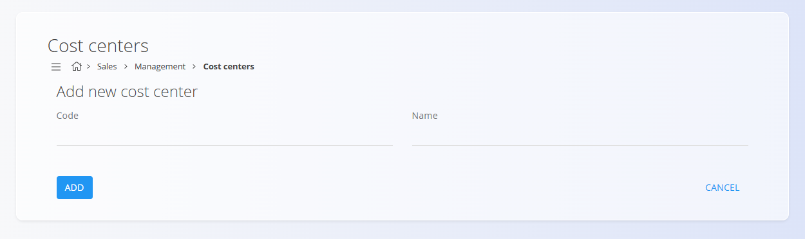

# Stroškovna mesta
<!-- app_route: management/common-types/cost-centers -->
<!-- app_label: Cost centers -->
Šifrant **Stroškovna mesta** opredeljuje oddelke ali funkcije, ki ustvarjajo stroške, vendar ne prihodkov, kot so kadrovska služba ali podporne ekipe. Čeprav te enote ne ustvarjajo dobička, imajo ključno vlogo pri nemotenem delovanju podjetja. Z definiranjem stroškovnih mest in dodeljevanjem stroškov sistem zagotavlja preglednost porazdelitve stroškov po podjetju.

Ta stran je na voljo v domenah **Prodaja** in **Nabava**. Za dostop pojdite na **Upravljanje / Stroškovna mesta** v [**navigaciji**](../../Skupno/UI/Navigacija.md).

## Shema
<!-- app_route: management/common-types/cost-centers -->
<!-- app_label: Cost centers -->
| Polje | Opis |
|------|------|
| **Šifra** | Kratek interni identifikator stroškovnega mesta (obvezno). Na primer **HR** za kadrovsko službo. |
| **Ime** | Polno opisno ime stroškovnega mesta (obvezno). |

## Upravljanje

### Seznamski pogled
<!-- app_route: management/common-types/cost-centers -->
<!-- app_label: Cost centers -->
Seznamski pogled prikazuje vsa evidentirana stroškovna mesta skupaj z njihovim **imenom** in **šifro**.

Za filtriranje stroškovnih mest po imenu ali kodi lahko uporabite **iskalno vrstico**.

## Dejanja

### Dodaj novo stroškovno mesto
<!-- app_route: management/common-types/cost-centers -->
<!-- app_label: Cost centers -->
Kliknite **akcijski gumb**, da odprete obrazec za ustvarjanje in dodate novo stroškovno mesto.

### Urejanje stroškovnega mesta
<!-- app_route: management/common-types/cost-centers -->
<!-- app_label: Cost centers -->
Kliknite katerikoli vnos na seznamu, da odprete zaslon za urejanje, kjer lahko prilagodite **šifro** ali **ime**.

### Brisanje
<!-- app_route: management/common-types/cost-centers -->
<!-- app_label: Cost centers -->
Kliknite **Izbriši** na zaslonu za urejanje, da odprete potrditveno pogovorno okno:

**Ali ste prepričani, da želite izbrisati ta zapis?**

Če potrdite, se zapis trajno odstrani; sicer sistem ohrani obstoječe stanje.

> [!NOTE]  
> Stroškovno mesto je mogoče izbrisati le, če ni uporabljeno v dokumentih ali drugih sistemskih entitetah.
