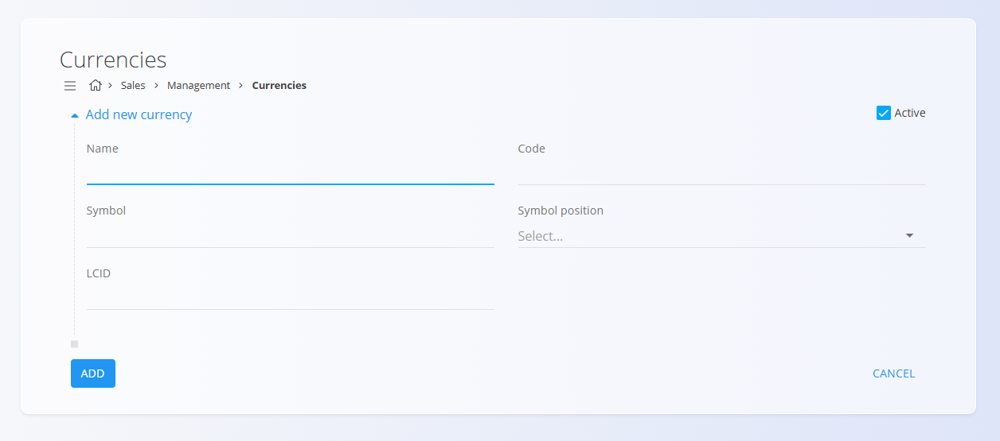

<!-- app_route: management/common-types/currencies -->
<!-- app_label: Valute -->
<!-- canonical_source_url: https://github.com/Tom-PIT/Connected.Docs/blob/main/sl/Skupno/Upravljanje/Valute.md -->
<!-- canonical_source_title: Valute -->

# Valute
<!-- app_route: management/common-types/currencies -->
<!-- app_label: Valute -->
<!-- canonical_source_url: https://github.com/Tom-PIT/Connected.Docs/blob/main/sl/Skupno/Upravljanje/Valute.md -->
<!-- canonical_source_title: Valute -->
Šifrant **Valute** določa vse denarne enote, ki se lahko uporabljajo v sistemu. Vsaka valuta vključuje svojo mednarodno šifro, simbol in pravila oblikovanja, kar zagotavlja dosleden in pravilen prikaz cen, zneskov in finančnih dokumentov. Ta seznam predstavlja osnovo za prikaz zneskov v prodajnih, nabavnih in poročevalskih procesih.

Ta stran je na voljo v domenah **Prodaja** in **Nabava**. Za dostop pojdite na **Upravljanje / Stroškovna mesta** v [**navigaciji**](../../Skupno/UI/Navigacija.md).

> [!NOTE]  
> **Predpogoji**  
> Valuta mora biti konfigurirana, preden se lahko uporablja v cenikih, dokumentih ali finančnih izračunih.

## Shema
<!-- app_route: management/common-types/currencies -->
<!-- app_label: Valute -->
<!-- canonical_source_url: https://github.com/Tom-PIT/Connected.Docs/blob/main/sl/Skupno/Upravljanje/Valute.md -->
<!-- canonical_source_title: Valute -->
| Polje | Opis |
|------|------|
| **Ime** | Polno ime valute, npr. *Evro*, *Ameriški dolar* (obvezno). |
| **Šifra** | Mednarodna trimestna koda valute, npr. *EUR*, *USD* (obvezno). |
| **Simbol** | Simbol valute, uporabljen pri prikazu zneskov in cen, npr. *€*, *$* (obvezno). |
| **Pozicija simbola** | Določa, ali se simbol prikaže **pred** ali **za** zneskom (obvezno). |
| **LCID** | Lokalizacijski identifikator za standardizacijo prikaza števil in valut. |
| **Aktiven** | Označuje, ali je valuta trenutno na voljo za uporabo v sistemu. |

## Upravljanje

### Seznamski pogled
<!-- app_route: management/common-types/currencies -->
<!-- app_label: Valute -->
<!-- canonical_source_url: https://github.com/Tom-PIT/Connected.Docs/blob/main/sl/Skupno/Upravljanje/Valute.md -->
<!-- canonical_source_title: Valute -->
Seznam prikazuje vse konfigurirane valute skupaj z njihovo šifro, simbolom in LCID.

Vsak zapis vključuje indikator stanja levo od imena:
- **Modra** označuje, da je valuta aktivna
- **Siva** označuje, da je valuta neaktivna

Za hitro filtriranje valut po kodi ali imenu lahko uporabite **iskalno vrstico**.

## Dejanja

### Dodaj novo valuto
<!-- app_route: management/common-types/currencies -->
<!-- app_label: Valute -->
<!-- canonical_source_url: https://github.com/Tom-PIT/Connected.Docs/blob/main/sl/Skupno/Upravljanje/Valute.md -->
<!-- canonical_source_title: Valute -->
Kliknite [**akcijski gumb**](../UI/AkcijskiGumb.md), da odprete zaslon za dodajanje nove valute.

Izpolnite vsa obvezna polja. Neobvezna polja izpolnite, če so relevantna. Za več podrobnosti o poljih si oglejte zgoraj omenjeno razdelitev [**Shema**](#shema).

Kliknite **Dodaj**, da shranite novo valuto.

### Urejanje obstoječe valute
<!-- app_route: management/common-types/currencies -->
<!-- app_label: Valute -->
<!-- canonical_source_url: https://github.com/Tom-PIT/Connected.Docs/blob/main/sl/Skupno/Upravljanje/Valute.md -->
<!-- canonical_source_title: Valute -->
Kliknite valuto na seznamu, da odprete zaslon za urejanje.

Kliknite **Shrani** za potrditev sprememb.

### Brisanje
<!-- app_route: management/common-types/currencies -->
<!-- app_label: Valute -->
<!-- canonical_source_url: https://github.com/Tom-PIT/Connected.Docs/blob/main/sl/Skupno/Upravljanje/Valute.md -->
<!-- canonical_source_title: Valute -->
Kliknite **Izbriši** na zaslonu za urejanje, da odprete potrditveno pogovorno okno:

**Ali ste prepričani, da želite izbrisati ta zapis?**

Če potrdite, se zapis trajno odstrani; sicer sistem ohrani obstoječe stanje.

> [!NOTE]  
> Valuto je mogoče izbrisati le, če **ni uporabljena** v cenikih, dokumentih ali drugih finančnih zapisih.
