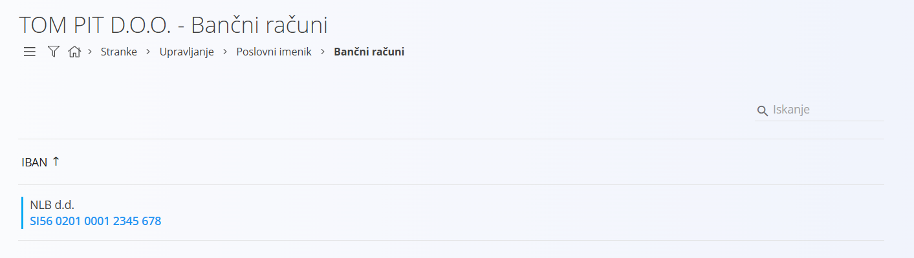
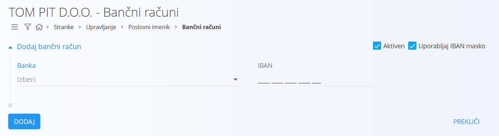
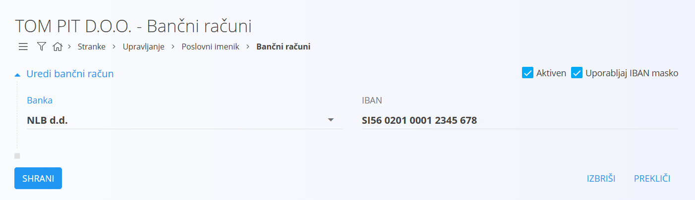

# Bančni račun

Šifrant bančnih računov predstavlja račune, ki jih uporabljajo [poslovni partnerji](PoslovniImenik.md) v okviru poslovanja. Vključujejo se v vse digitalne vsebine sistema, kjer je potrebno evidentirati bančni račun, na primer pri evidentiranju plačil.  

Šifrant je povezan s šifrantom [bank](Banka.md), kar zagotavlja enotno evidenco bančnih računov in pripadajočih bank.  

> [!TIP]  
> Prerekviziti za upravljanje tega šifranta so:
>  
> - [Banke](Banka.md)  
>   
> Poskrbite za omenjene prerekvizite, preden začnete z upravljanjem tega šifranta.

## Shema

|Polje|Opis
|---|---
|**Banka**| [Banka](Banka.md), pri kateri je račun odprt, na primer **NLB d.d.**.
|**IBAN**| Mednarodna številka bančnega računa, na primer **SI56 0201 0001 2345 678**.
|**Aktiven**| Označuje, ali je bančni račun aktiven.
|**Uporabljaj IBAN masko**| Določa, ali se za vnos in prikaz IBAN uporablja maska, ki olajša branje in vnos številke.

## Upravljanje

Upravljanje s šifrantom bančnih računov je dostopno preko **Stranke / Upravljanje / Poslovni imenik / Bančni računi**.  

Uporabniški vmesnik je razdeljen na levi del, kjer so filtri, in desni del, kjer je seznam obstoječih bančnih računov.  

### Seznam bančnih računov

Seznam prikazuje obstoječe bančne račune. V vsakem zapisu se levo od naziva nahaja status v obliki barve. Modra barva pomeni, da je zapis aktiven, siva pa, da je neaktiven. V kolikor seznam ne vsebuje nobenega zapisa, je uporabniški vmesnik prazen.  

### Filtri

Na levi strani uporabniškega vmesnika so filtri, s katerimi lahko omejite prikaz zapisov. Na voljo so naslednje možnosti:  

|Filter|Opis
|--|--
|**Omogočeno**| Prikaže samo aktivne bančne račune.
|**Onemogočeno**| Prikaže samo neaktivne bančne račune.

## Dodajanje

S klikom na [akcijski gumb](../../Splosno/UporabniskiVmesnik/AkcijskiGumb.md) uporabniški vmesnik preide v način dodajanja, kjer se prikaže vnosna maska za vnos novega bančnega računa.  

Ko zaključite z vnosom, s klikom na gumb **Dodaj** ustvarite nov bančni račun. Nato uporabniški vmesnik preide v privzet način in prikaže seznam obstoječih računov. Če kliknete na gumb **Prekliči**, se postopek prekine brez shranjevanja.  

## Urejanje

Za urejanje obstoječega bančnega računa kliknete na njegov **IBAN**. Uporabniški vmesnik preide v način urejanja, kjer so polja že izpolnjena.  

Spremenite želena polja in s klikom na gumb **Shrani** shranite spremembe. Če kliknete na gumb **Prekliči**, se spremembe ne shranijo in uporabniški vmesnik se vrne na seznam.

## Brisanje

Bančni račun lahko izbrišete le, če se ne pojavlja v nobenem odvisnem zapisu. Za brisanje bančnega računa najprej preidete v način [urejanja](#urejanje). V načinu urejanja kliknete **Izbriši**. Odpre se potrditveno okno: **Ali ste prepričani, da želite izbrisati zapis?**  

- V kolikor potrditveno okno potrdite, se bančni račun trajno izbriše in izgine s seznama.  
- V kolikor potrditveno okno prekličete, uporabniški vmesnik ostane v načinu urejanja in bančni račun ostaja v sistemu.  
