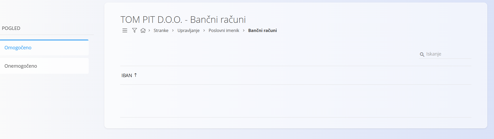

# Bančni račun  

Šifrant bančnih računov omogoča evidentiranje in upravljanje vseh bančnih računov, ki so vezani na poslovne partnerje v digitalnih vsebinah sistema. Na ta način zagotovimo, da so vsi podatki o bančnih računih zbrani na enem mestu in vedno dostopni v nadaljnjih procesih, kot so plačila, izdaje računov ali preverjanje podatkov pri poslovnih partnerjih.  

Šifrant omogoča tudi povezavo z evidenco bank, saj je vsak bančni račun vezan na šifrant [bank](Banka.md).  

> [!TIP]
> Prerekviziti za upravljanje tega šifranta so:
>
> - [Banke](Banka.md)
>
> Poskrbite za omenjene prerekvizite, preden začnete z upravljanjem tega šifranta.

## Shema  

Šifrant bančnih računov ima naslednjo shemo:  

|Polje|Opis  
|---|---  
|**Banka**| Povezava na šifrant [bank](Banka.md), pri kateri je odprt račun. Na primer **NLB d.d.**.  
|**IBAN**| Mednarodna številka bančnega računa. Na primer **SI56 0201 0001 2345 678**.  
|**Aktiven**| Označuje, ali je bančni račun aktiven in se uporablja pri poslovanju. Neaktivnih bančnih računov ne moremo uporabiti v novih dokumentih, ostanejo pa vidni v zgodovini.
|**Uporabljaj IBAN masko**| Določa, ali se pri vnosu in prikazu IBAN uporablja maska, ki razdeli številko v skupine za lažje branje.  

## Upravljanje  

Upravljanje s šifrantom bančnih računov je dostopno preko [poslovnega imenika](PoslovniImenik.md).

Uporabniški vmesnik je razdeljen na levi del s filtri in desni del s seznamom.

## Filtri

Levi del uporabniškega vmesnika omogoča filtriranje bančnih računov.

| Filter      | Opis                                                                                      |
| ----------- | ----------------------------------------------------------------------------------------- |
| **Omogočeno** | Prikaže bančne račune, ki so aktivni. |
| **Onemogočeno** | Prikaže bančne račune, ki so niso aktivni. |

## Seznam bančnih računov  

Privzeto se prikaže uporabniški vmesnik s seznamom obstoječih bančnih računov. V kolikor seznam še ne vsebuje zapisov, je prikazan prazen seznam. 

  

V vsakem zapisu se levo od naziva nahaja status v obliki barve, pri čemer modra barva označuje, da je račun aktiven, siva pa, da je račun neaktiven.  

## Dodajanje  

S klikom na [akcijski gumb](../../Splosno/UporabniskiVmesnik/AkcijskiGumb.md) uporabniški vmesnik preide v način urejanja in prikaže vnosno masko za dodajanje novega bančnega računa.  

  

S klikom na gumb **Dodaj** se ustvari nov bančni račun in uporabniški vmesnik preide nazaj v privzet način, ki prikazuje seznam obstoječih računov.  

S klikom na gumb **Prekliči** pa se vnos prekine brez shranjevanja podatkov.  

  

## Urejanje  

Za urejanje posameznega bančnega računa klikneš na njegov **Naziv**. Uporabniški vmesnik preide v način urejanja, kjer so polja že izpolnjena z obstoječimi vrednostmi.  

  

Po spremembi polj klikneš na gumb **Shrani**, da se podatki posodobijo, ali na gumb **Prekliči**, da se spremembe zavržejo.  

## Brisanje  

Bančni račun je mogoče izbrisati, v kolikor se ne pojavlja v nobenem odvisnem zapisu. V načinu urejanja je na voljo gumb **Izbriši**. Klik na gumb prikaže potrditveno sporočilo **Ali ste prepričani, da želite izbrisati zapis?**. S potrditvijo se bančni račun izbriše, uporabniški vmesnik pa se vrne na seznam, ki ne vsebuje več izbrisanega zapisa.
