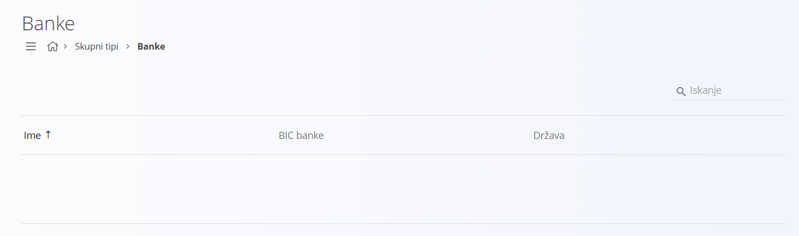
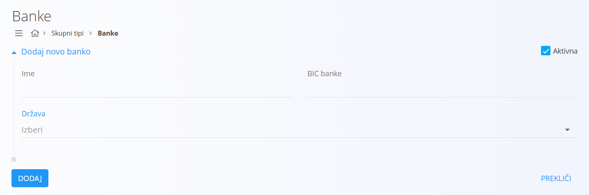
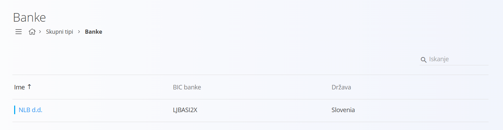
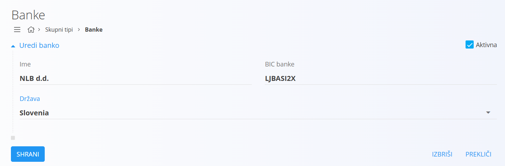

# Banka

Šifrant bank omogoča upravljanje seznama bank, na katere so vezani na [poslovni partnerji](PoslovniImenik.md) in njihovi [bančni računi](BancniRacun.md). Na ta način zagotovimo, da so vsi finančni tokovi v digitalnih vsebinah sistema povezani s pravilno banko in pripadajočimi identifikatorji.

Šifrant omogoča shranjevanje osnovnih podatkov o bankah, kot so ime, BIC koda ter [država](Drzava.md), v kateri ima banka sedež.

> [!TIP]
> Prerekviziti za upravljanje tega šifranta so:
>
> - [Države](Drzava.md)
>
> Poskrbite za omenjene prerekvizite, preden začnete z upravljanjem tega šifranta.
 
## Shema

Šifrant bank ima naslednjo shemo:

| Polje | Opis |
|-------|------|
| **Ime** | Ime banke, na primer **NLB d. d.**|
| **BIC** | Mednarodna identifikacijska koda banke (Business Identifier Code), na primer **LJUBSI2X**. |
| **Država** | [Država](Drzava.md), v kateri ima banka sedež, na primer **Slovenija**. |
| **Aktivna** | Označuje, ali je banka aktivna in se lahko uporablja v postopkih. Neaktivnih bank ne moremo uporabiti v novih dokumentih, ostanejo pa vidne v zgodovini.|

## Upravljanje

Upravljanje s šifrantom banke je dostopno preko [navigacije](../../Common/UI/Sitemap.md) in sicer preko **Skupni tipi/Banke**.

## Seznam bank

Privzeto se prikaže seznam obstoječih bank. V kolikor seznam ne vsebuje zapisov, je uporabniški vmesnik podoben spodnji sliki.

Vsak zapis v seznamu predstavlja eno banko z njenim imenom, BIC kodo in državo. Na levi strani zapisa je prikazana barvna oznaka statusa, pri čemer modra barva označuje, da je banka aktivna, siva pa, da ni aktivna.

## Dodajanje

S klikom na [akcijski gumb](../../Splosno/UporabniskiVmesnik/AkcijskiGumb.md) uporabniški vmesnik preide v način dodajanja nove banke.

Vnosna maska vsebuje polja, opisana v shemi.

S klikom na gumb **Dodaj** se ustvari nova banka in uporabniški vmesnik preide v privzet način, ki prikazuje seznam bank. 

S klikom na gumb **Prekliči** se postopek prekine brez shranjevanja.

## Urejanje

Za urejanje obstoječe banke klikneš na njen **Naziv**. Uporabniški vmesnik preide v način urejanja, kjer so polja že izpolnjena.

S klikom na gumb **Shrani** se spremembe shranijo in seznam se osveži. S klikom na gumb **Prekliči** se postopek prekine brez shranjevanja.

## Brisanje

Banko je mogoče izbrisati, v kolikor se ne pojavlja v nobenem odvisnem zapisu. V načinu urejanja je na voljo gumb **Izbriši**. Klik na gumb prikaže potrditveno sporočilo **Ali ste prepričani, da želite izbrisati zapis?**. S potrditvijo se banka izbriše, uporabniški vmesnik pa se vrne na seznam, ki ne vsebuje več izbrisanega zapisa.
