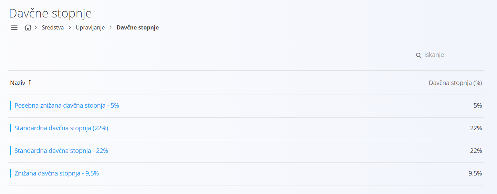
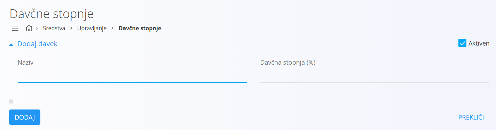
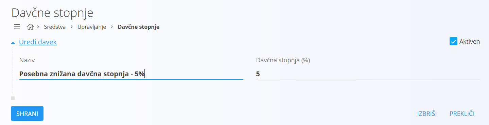

# Davčna stopnja

Šifrant davčnih stopenj se uporablja v sistemu za določanje višine davčne obveznosti pri materialih, izdelkih in dokumentih. Vsaka davčna stopnja omogoča enotno obravnavo davkov v vseh procesih sistema, na primer pri naročilih, računih in poročilih. Na ta način zagotovimo, da se posamezna davčna stopnja vedno obravnava enako, ne glede na modul.

## Shema

Šifrant davčnih stopenj vsebuje naslednja polja:

|Polje|Opis
|---|---
|**Naziv**| Naziv davčne stopnje, na primer standardna davčna stopnja ali znižana davčna stopnja.
|**Davčna stopnja (%)**| Numerična vrednost davčne stopnje v odstotkih.
|**Aktiven**| Označuje, ali je davčna stopnja trenutno v uporabi. Neaktivnih davčnih stopenj ne moremo uporabiti v novih dokumentih, ostanejo pa vidne v zgodovini.

## Upravljanje

Do šifranta davčnih stopenj dostopate preko [navigacije](../../Common/UI/Sitemap.md) in sicer preko **Sredstva / Upravljanje / Davčne stopnje**.

## Seznam davčnih stopenj

Privzeto se prikaže uporabniški vmesnik s seznamom že vnešenih oziroma obstoječih davčnih stopenj. V kolikor seznam ne vsebuje nobene davčne stopnje, je seznam prazen.

V vsakem zapisu se levo od naziva nahaja barvna oznaka, ki ponazarja status davčne stopnje. Modra barva pomeni, da je davčna stopnja aktivna, siva barva pa pomeni, da je neaktivna.

## Dodajanje

S klikom na akcijski gumb se neposredno izvede akcija **Nov** in uporabniški vmesnik preide v način urejanja. Odpre se vnosna maska za dodajanje nove davčne stopnje.

- Kliknite **Dodaj**, da ustvarite novo davčno stopnjo. Uporabniški vmesnik nato preide v privzeti način, ki prikazuje seznam obstoječih davčnih stopenj.  

- Kliknite **Prekliči**, da postopek prekinete brez shranjevanja. Nova davčna stopnja se v tem primeru ne ustvari.

## Urejanje

Za urejanje davčne stopnje v seznamu kliknite na njen **Naziv**. Uporabniški vmesnik preide v način urejanja, ki je enak načinu vnosa, le da so polja že izpolnjena.

- Spremenite želena polja in kliknite **Shrani**, da shranite spremembe. Seznam se posodobi in prikaže posodobljeno vrednost.  
- Kliknite **Prekliči**, da postopek prekinete brez shranjevanja. Spremembe se v tem primeru ne upoštevajo.

## Brisanje

Davčno stopnjo lahko izbrišete le, če ni povezana z nobenim izdelkom, materialom ali dokumentom. Za brisanje davčne stopnje najprej preidite v način [urejanja](#urejanje). V načinu urejanja kliknite **Izbriši**. Odpre se potrditveno sporočilo:  
*Ali ste prepričani, da želite izbrisati zapis?*

- Če potrdite, se davčna stopnja trajno izbriše in izgine s seznama.  
- Če prekličete, uporabniški vmesnik ostane v načinu urejanja in davčna stopnja ostane nespremenjena.
