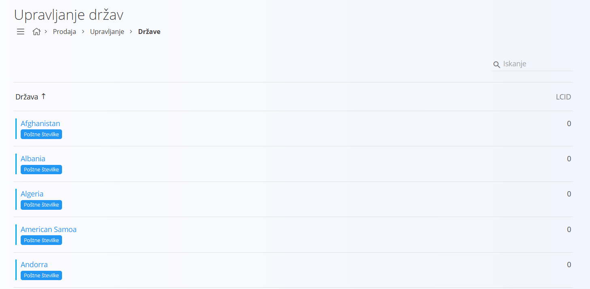
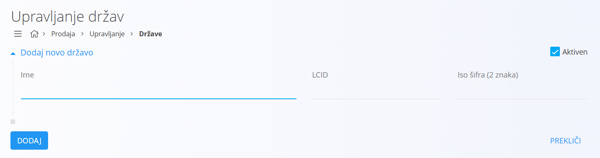
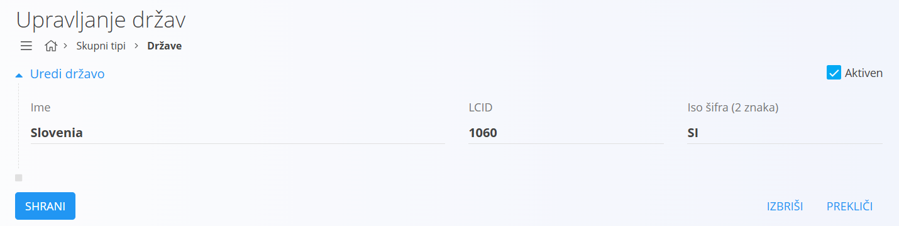
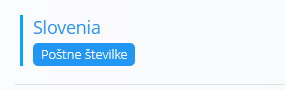

# Država

Države predstavljajo osnovne politične in geografske enote, ki se uporabljajo v mnogih digitalnih vsebinah sistema. So temeljna referenca pri poslovanju, saj so povezane s partnerji, naslovih, dobavami, poštnimi številkami in številnimi drugimi entitetami. Vsaka država ima svojo enolično identifikacijo, ki omogoča enotno in nedvoumno uporabo.

## Shema

| Polje | Opis |
|-------|------|
| **Ime** | Naziv države. Na primer **Slovenija** ali **Avstrija**. |
| **LCID** | Lokalizacijski identifikator, ki se uporablja za nastavitev jezika in regijskih posebnosti države. |
| **Iso šifra** | Mednarodna standardna oznaka države. Na primer **SI** za Slovenijo ali **AT** za Avstrijo. |
| **Aktiven** | Označuje, ali je država aktivna. Neaktivnih držav ne moremo uporabljati pri novih vnosih, ostanejo pa vidne v zgodovini. |

## Upravljanje

Upravljanje s šifrantom držav je dostopno preko [navigacije](../../Common/UI/Sitemap.md) in sicer **Prodaja/Upravljanje/Države**.

### Seznam

Uporabniški vmesnik vsebuje seznam držav. V primeru, da noben zapis še ne obstaja, je seznam prazen. V vsakem zapisu se levo od naziva nahaja status v obliki barve, kjer modra barva pomeni, da je zapis aktiven, siva pa, da je neaktiven.  

Pod nazivom države je prikazana značka **Poštne številke**. S klikom na značko uporabniški vmesnik preide v pogled za upravljanje [poštnih številk](PostnaStevilka.md), vezanih na izbrano državo.

## Akcije

Klik na [akcijski gumb](../../Splosno/UporabniskiVmesnik/AkcijskiGumb.md) prikaže naslednje akcije:

### Uvoz

Z akcijo **Uvoz** vnesete ali posodobite seznam držav iz pripravljene datoteke v obliki CSV. Sistem na ta način omogoča masovno obdelavo podatkov.

### Dodajanje

S klikom na akcijo **Nov** uporabniški vmesnik preide v način dodajanja. Odpre se vnosna maska, kjer izpolnite ustrezna polja za novo državo.  

S klikom na gumb **Dodaj** se ustvari nova država in uporabniški vmesnik preide v seznam držav. S klikom na gumb **Prekliči** uporabniški vmesnik zapre vnosno masko brez shranjevanja podatkov.

## Urejanje

Za urejanje države v seznamu kliknete na njen naziv. Odpre se vnosna maska z že izpolnjenimi podatki. 

Po spremembi polj kliknete **Shrani**, da se podatki posodobijo in vrnete v seznam. S klikom na **Prekliči** uporabniški vmesnik zapre vnosno masko brez shranjevanja sprememb.

## Brisanje

Državo lahko izbrišete le, če se ne pojavlja v nobenem odvisnem zapisu. Za brisanje države najprej preidete v način [urejanja](#urejanje). V načinu urejanja kliknete **Izbriši**. Odpre se potrditveno okno: **Ali ste prepričani, da želite izbrisati zapis?**

- V kolikor potrditveno okno potrdite, se država trajno izbriše in izgine s seznama.  
- V kolikor potrditveno okno prekličete, uporabniški vmesnik ostane v načinu urejanja in država ostane v sistemu.

## Urejanje poštnih številk

Pod nazivom države je prikazana značka **Poštne številke**. 

S klikom na značko uporabniški vmesnik preide v pogled za upravljanje [poštnih številk](PostnaStevilka.md), vezanih na izbrano državo.