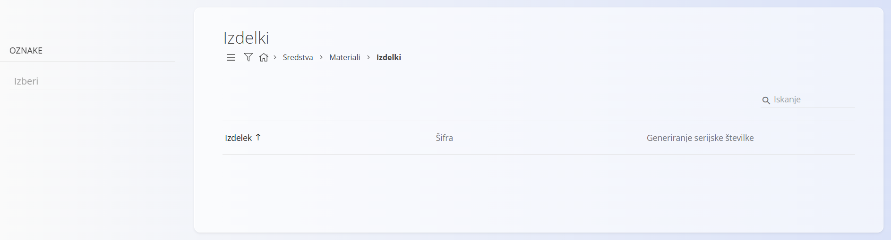
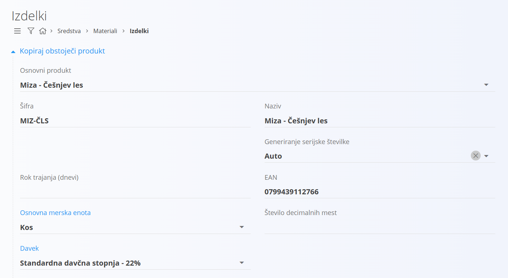
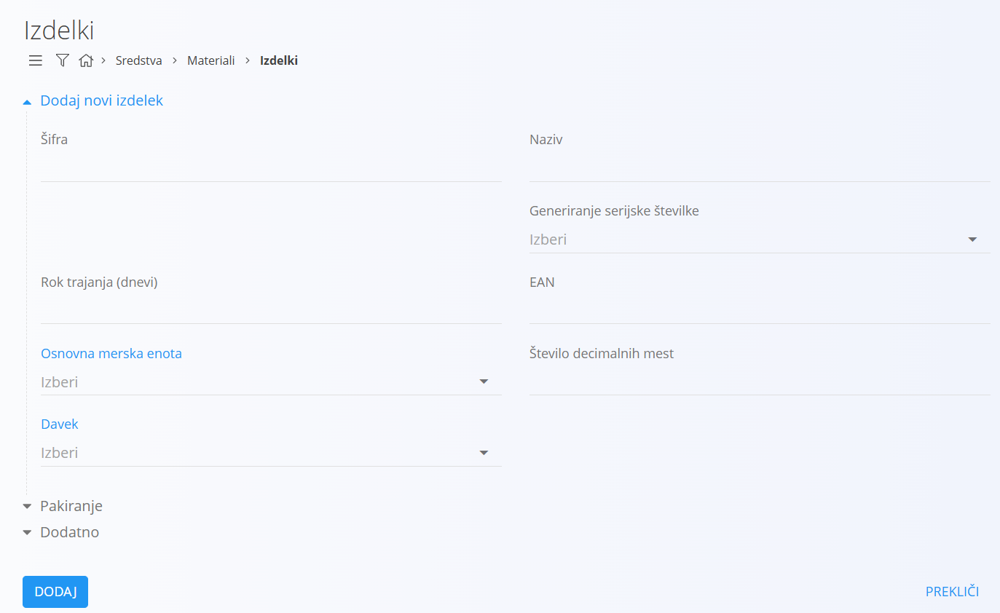
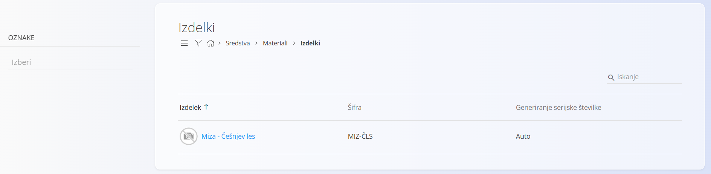
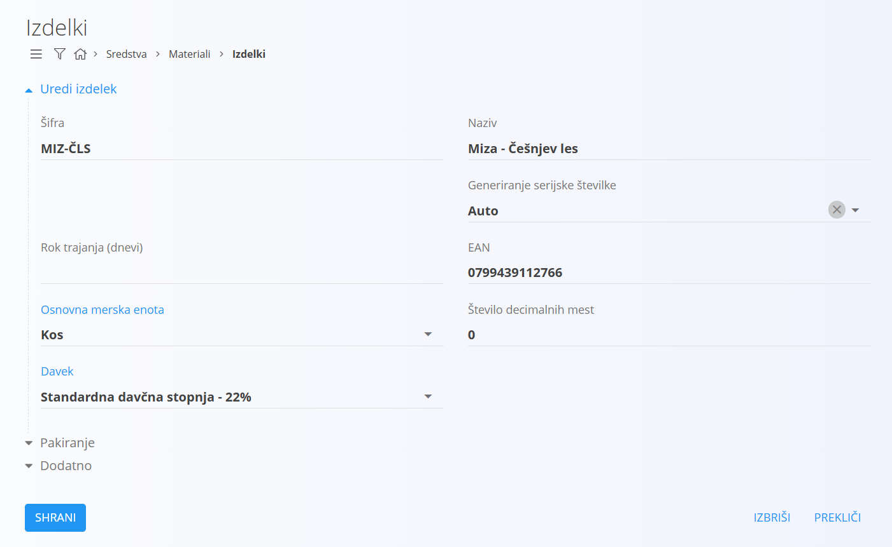

# Izdelek

Predstavlja šifrant končnih izdelkov, ki pripadajo [materialom](../Materiali.md).

## Shema

Šifrant izdelkov ima naslednjo shemo:

|Polje|Opis
|---|---
|Šifra| Šifra izdelka. Šifra mora biti unikatna znotraj celotnega seznama [materialov](../Materiali.md).
|Naziv| Naziv izdelka.
|Rok trajanja| V kolikor gre za pokvarljivo blago, to polje določa rok trajanja v dneh. Ta vrednost je posebej pomembna pri [proizvedenih](../../Proizvodnja/README.md) izdelkih, ki so pokvarljivi.
|Osnovna merska enota| [Merska enota](MerskaEnota.md), v kateri so količine izdelka izražene.
|Davek| [Davčna stopnja](DavcnaStopnja.md) izdelka, uporabljena kot privzeta pri [nabavnem nalogu](../../Nabava/Dokumenti/NabavniNalog.md).
|Generiranje serijske številke| Določa način, po katerem se pri [prevzemu](../../Skladisce/Dokumenti/Prevzem.md) blaga [generira](../../Skladisce/SerijskeStevilke/GeneriranjeSerijskeStevilke.md) serijska številka za izdelek.
|EAN| [EAN](https://en.wikipedia.org/wiki/International_Article_Number) oznaka izdelka.
|Število decimalnih mest| Določa privzeto število decimalnih mest za prikaz vrednosti oziroma količin izdelka.
|Pakiranje|
|Opis|
|Oznake
|Info povezava
|URL do slike izdelka
|Zunanji ključ

## Upravljanje

Upravljanje s šifrantom izdelkom je dostopno preko [navigacije](../../Common/UI/Sitemap.md) in sicer preko **Sredstva/Materiali/Izdelki**.

## Seznam izdelkov
 
Privzeto se prikaže uporabniški vmesnik s seznamom že vnešenih oziroma obstoječih izdelkov. V kolikor je seznam prazen, je uporabniški vmesnik podoben spodnji sliki.

### Filtri

Levi del uporabniškega vmesnika omogoča filtriranje izdelkov. Na voljo so naslednji filtri:

|Filter|Opis
|--|--
|Oznake|Filtrira seznam izdelkov po oznakah. V polje je mogoče vnesti več oznak. V kolikor ta polje vsebuje vrednost, se v seznamu izpišejo izdelki, ki imajo vsaj eno oznako, ki se ujema z vnešenimi oziroma izbranimi oznakami tega polja. V kolikor to polje nima vrednosti, se pri filtriranju ignorira.

## Akcije

Klik na [akcijski gumb](../../Splosno/UporabniskiVmesnik/AkcijskiGumb.md) prikaže naslednje akcije:

- Uvoz
- Kopiraj obstoječi
- Nov

### Uvoz

[Uvoz](UvozMaterialov.md) izdelkov omogoča masovno vnašanje oziroma posodabljanje seznama izdelkov. Uporabnik pripravi datoteko v `CSV` obliki, ki jo prenese v sistem, ki nato samodejno bodisi ustvari bodisi posodobi seznam izdelkov. 

### Kopiraj obstoječi

Ta akcija je zelo podobna akciji **Nov**, s to razliko, da se na uporabniškem vmesniku na vrhu prikaže [spustni seznam](../../Splosno/UporabniskiVmesnik/SpustniSeznam.md) **Osnovni produkt**, ki vsebuje obstoječe izdelke. 

Z izbiro željenega izdelka uporabniški vmesnik samodejno izpolni polja z vrednostmi izbranega izdelka. Po izbiri je postopek za dodajanje izdelka enak, kot v primeru dodajanja novega. Gre pravzaprav za bližnjico ustvarjanja novega izdelka.

### Nov

S klikom na akcijo **Nov** uporabniški vmesnik preide v način urejanja in sicer se prikaže vnosna maska za dodajanje novega izdelka.

S klikom na gumb **Dodaj** se ustvari nov izdelek in uporabniški vmesnik preide v privzet način, ki prikazuje seznam obstoječih izdelkov. 

S klikom na gumb **Prekliči** pa uporabniški vmesnik preide v privzet način, brez da bi vnešene podatke shranil, torej ne ustvari novega izdelka, ampak postopek prekine brez shranjevanja.

## Urejanje

Za urejanje posameznega izdelka v seznamu izdelkov kliknemo na njegov **Naziv**. Uporabniški vmesnik preide v način urejanja izdelka, ki je pravzaprav identičen tistemu za vnos, le da so v tem primeru podatki že izpolnjeni. 

Uporabnik spremeni željena polja in s klikom na **Shrani** shrani spremembe, uporabniški vmesnik pa preide v privzet način, ki prikazuje seznam obstoječih skladišč s posodobljeno vrednostjo. S klikom na gumb **Prekliči** pa uporabniški vmesnik preide v privzet način, brez da bi vnešene podatke shranil, torej ne ustvari posodobi skladišča, ampak postopek prekine brez shranjevanja.

## Brisanje

Izdelek je mogoče tudi izbrisati, vendar samo pod pogojem, da nima odvisnih zapisov, na primer ne obstaja noben [prevzem](../../Skladisce/Dokumenti/Prevzem.md), ki ima postavko izdelka.

Za brisanje skladišča moramo najprej v način [urejanja](#urejanje). V načinu urejanja je viden gumb **Izbriši**. Klik na gumb **Izbriši** prikaže potrditveno sporočilo **Ali ste prepričani, da želite izbrisati zapis?**. S potrditvijo okna se izdelek permanentno izbriše, uporabniški vmesnik preide v privzet način, pri čemer izbrisanega izdelka ni več na seznamu.

V kolikor uporabnik ne potrdi sporočila, uporabniški vmesnik ostane v načinu urejanja.

## Pakiranje

V načinu urejanja se uporabniku ponudi nova možnost in sicer lahko dodaja [pakiranja](../../Skladisce/Pakiranje/README.md). Vsak izdelek lahko ima več pakiranj. Na primer, izdelek se lahko dobavi v embalaži po 5 kosov ali pa v embalaži po 10 kosov, kar pomeni, da gre za dobavo enakega izdelka, le z različnim pakiranjem.