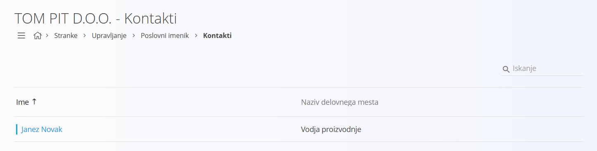
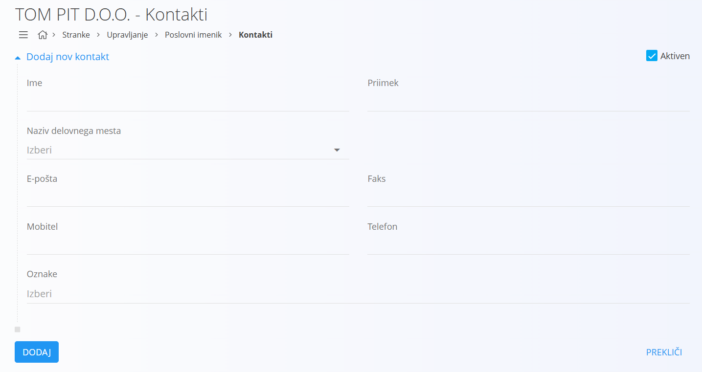
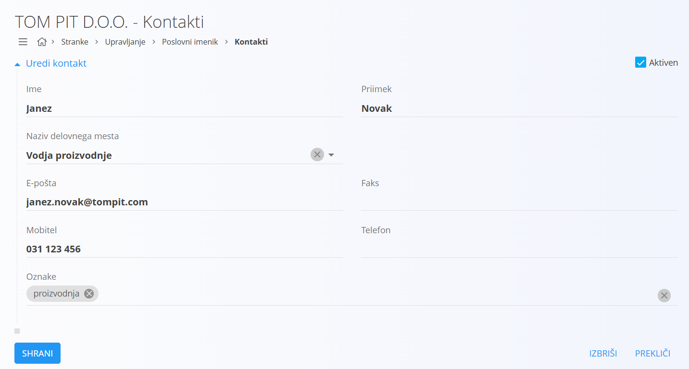

# Kontakt

Kontakti predstavljajo osebe, s katerimi podjetje sodeluje v okviru poslovnih odnosov. Gre za ključne podatke o posameznikih, ki so lahko zaposleni pri dobaviteljih, strankah ali poslovnih partnerjih. Kontakti omogočajo enostavno komuniciranje, saj združujejo osnovne osebne in kontaktne informacije, kot so ime, priimek, telefonske številke in elektronski naslovi. S tem podjetje vzdržuje urejeno evidenco vseh oseb, ki sodelujejo v poslovnih procesih.

Šifrant kontaktov je vezan na [poslovni imenik](PoslovniImenik.md) in omogoča upravljanje oseb, povezanih s partnerji, dobavitelji in strankami. Vsak kontakt je lahko povezan tudi z [delovnimi mesti](DelovnoMesto.md), kar omogoča boljši pregled nad organizacijsko strukturo posamezne organizacije.

> [!TIP]  
> Prerekviziti za upravljanje tega šifranta so:  
>  
> - [Nazivi delovnih mest](NazivDelovnegaMesta.md)  
>  
> Poskrbite za omenjene prerekvizite, preden začnete z upravljanjem tega šifranta.

## Shema

Šifrant kontaktov ima naslednjo shemo:

|Polje|Opis|
|---|---|
|**Ime**|Ime kontaktne osebe. Na primer **Janez**.|
|**Priimek**|Priimek kontaktne osebe. Na primer **Novak**.|
|**Naziv delovnega mesta**|[Delovno mesto](NazivDelovnegaMesta.md), ki ga oseba zaseda. Na primer **Vodja nabave**.|
|**E-pošta**|Elektronski naslov kontaktne osebe. Na primer **janez.novak@primer.si**.|
|**Faks**|Faks številka kontaktne osebe. Na primer **+386 1 234 5678**.|
|**Mobitel**|Mobilna številka kontaktne osebe. Na primer **+386 41 123 456**.|
|**Telefon**|Stacionarna telefonska številka kontaktne osebe. Na primer **+386 1 222 3333**.|
|**Oznake**|Dodatne oznake za kategorizacijo kontaktov. Na primer **nabava**, **vodstvo**.|
|**Aktiven**|Določa, ali je kontakt na voljo za uporabo v novih dokumentih. Neaktivnih ne moremo dodajati v novih dokumentih, ostanejo pa vidni v zgodovini.|

## Upravljanje

Upravljanje s šifrantom kontaktov je dostopno preko [poslovnega imenika](PoslovniImenik.md).  

Uporabniški vmesnik privzeto prikazuje seznam obstoječih zapisov. Seznam je osrednji element in prikazuje že dodane kontakte, v kolikor ti obstajajo. Na desni zgoraj je na voljo iskalno polje za hitro iskanje po seznamu.  

V vsakem zapisu se levo od naziva nahaja barvna oznaka statusa, pri čemer modra barva pomeni, da je zapis aktiven, siva pa, da je neaktiven.

## Dodajanje

S klikom na [akcijski gumb](../../Splosno/UporabniskiVmesnik/AkcijskiGumb.md) uporabniški vmesnik preide v način dodajanja in prikaže vnosno masko za vnos novega kontakta.  

V vnosni maski izpolnite ustrezna polja. S klikom na gumb **Dodaj** se ustvari nov kontakt in uporabniški vmesnik preide v privzet način, ki prikazuje seznam obstoječih kontaktov. S klikom na gumb **Prekliči** pa uporabniški vmesnik preide v privzet način, brez da bi vnešene podatke shranili.  

## Urejanje

Za urejanje posameznega kontakta v seznamu kliknete na njegovo **Ime**. Uporabniški vmesnik preide v način urejanja kontakta, kjer so podatki že izpolnjeni.  

Uporabnik lahko spremeni želena polja in s klikom na gumb **Shrani** shrani spremembe. Uporabniški vmesnik nato preide v privzet način, ki prikazuje seznam obstoječih kontaktov s posodobljeno vrednostjo. Če kliknete na gumb **Prekliči**, uporabniški vmesnik ostane v privzetem načinu, brez shranjevanja sprememb.  

## Brisanje

Kontakt je mogoče izbrisati, vendar samo pod pogojem, da se ne pojavlja v nobenem odvisnem zapisu.  

Za brisanje kontakta morate najprej preiti v način [urejanja](#urejanje). V načinu urejanja je na voljo gumb **Izbriši**. Klik na gumb **Izbriši** prikaže potrditveno okno: **Ali ste prepričani, da želite izbrisati zapis?**  

- Če potrditveno okno potrdite, se kontakt trajno izbriše in izgine s seznama.  
- Če potrditveno okno prekličete, uporabniški vmesnik ostane v načinu urejanja in kontakt ostaja v sistemu.  
