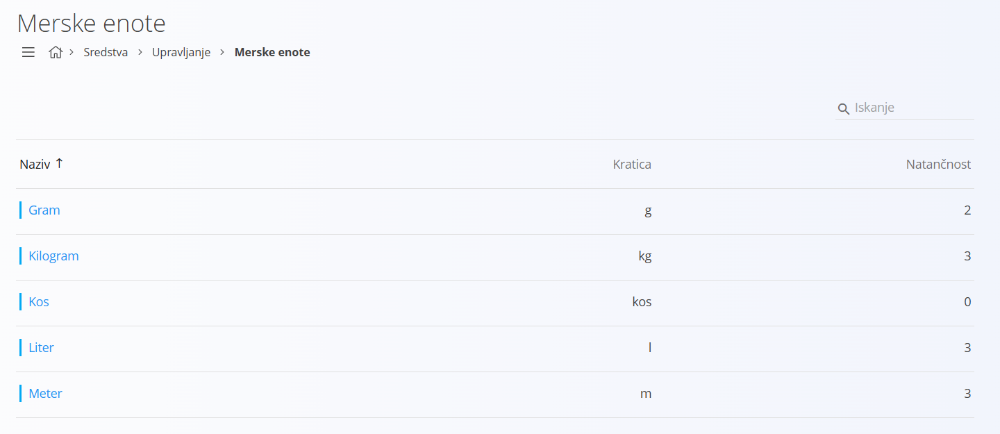

# Merska enota

Šifrant merskih enot se uporablja v sistemu za izražanje količin materialov, izdelkov in drugih postavk. Vsaka merska enota omogoča enotno obravnavo količin v vseh procesih sistema, na primer pri naročilih, skladišču in proizvodnji. Na ta način zagotovimo, da se enota, na primer kilogram, vedno obravnava enako, ne glede na modul.

## Shema

Šifrant merskih enot vsebuje naslednja polja:

|Polje|Opis
|---|---
|**Naziv**| Polno ime merske enote, na primer kilogram, liter ali kos.
|**Kratica**| Kratka oznaka merske enote, na primer kg, l ali kos.
|**Natančnost**| Število decimalnih mest, ki se uporablja pri količinah v tej merski enoti.
|**Aktiven**| Označuje, ali je merska enota trenutno v uporabi. Neaktivnih merskih enot ne moremo uporabiti v novih dokumentih, ostanejo pa vidne v zgodovini.

## Upravljanje

Do šifranta merskih enot dostopate preko [navigacije](../../Common/UI/Sitemap.md) in sicer preko **Sredstva / Upravljanje / Merske enote**.

## Seznam merskih enot

Privzeto se prikaže uporabniški vmesnik s seznamom že vnešenih oziroma obstoječih merskih enot. V kolikor seznam ne vsebuje nobene merske enote, je seznam prazen.

V vsakem zapisu se levo od naziva nahaja barvna oznaka, ki ponazarja status merske enote. Modra barva pomeni, da je merska enota aktivna, siva barva pa pomeni, da je neaktivna.

## Dodajanje

S klikom na akcijski gumb se neposredno izvede akcija **Nov** in uporabniški vmesnik preide v način urejanja. Odpre se vnosna maska za dodajanje nove merske enote.

- Kliknite **Dodaj**, da ustvarite novo mersko enoto. Uporabniški vmesnik nato preide v privzeti način, ki prikazuje seznam obstoječih merskih enot.  

- Kliknite **Prekliči**, da postopek prekinete brez shranjevanja. Nova merska enota se v tem primeru ne ustvari.

## Urejanje

Za urejanje merske enote v seznamu kliknite na njen **Naziv**. Uporabniški vmesnik preide v način urejanja, ki je enak načinu vnosa, le da so polja že izpolnjena.

- Spremenite želena polja in kliknite **Shrani**, da shranite spremembe. Seznam se posodobi in prikaže posodobljeno vrednost.  
- Kliknite **Prekliči**, da postopek prekinete brez shranjevanja. Spremembe se v tem primeru ne upoštevajo.

## Brisanje

Mersko enoto lahko izbrišete le, če ni povezana z nobenim izdelkom, materialom ali dokumentom. Za brisanje merske enote najprej preidite v način [urejanja](#urejanje). V načinu urejanja kliknite **Izbriši**. Odpre se potrditveno sporočilo:  
*Ali ste prepričani, da želite izbrisati zapis?*

- Če potrdite, se merska enota trajno izbriše in izgine s seznama.  
- Če prekličete, uporabniški vmesnik ostane v načinu urejanja in merska enota ostane nespremenjena.
