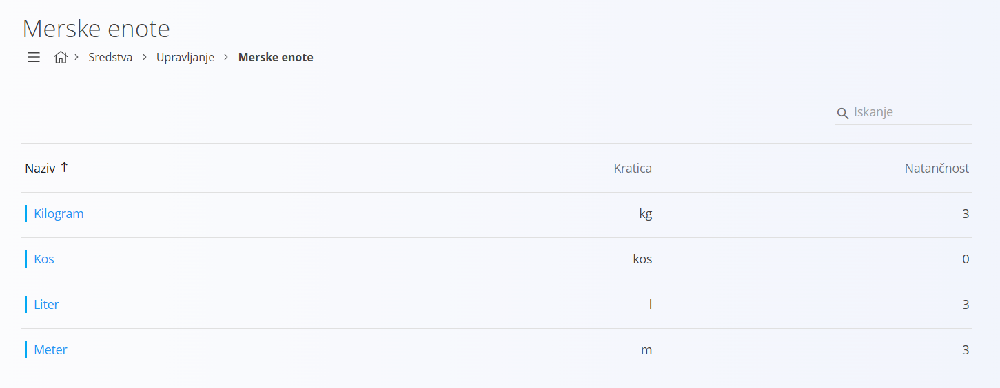
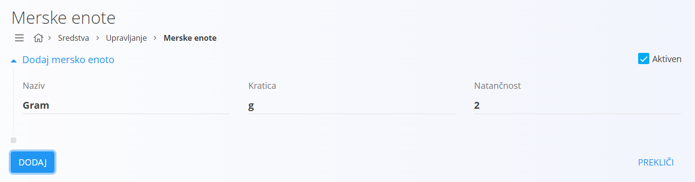
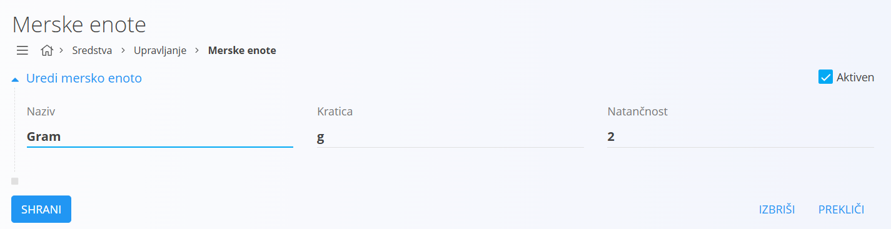

# Merska enota

Merske enote predstavljajo osnovo za kvantitativno izražanje [materialov](../Materiali.md) in blaga v različnih digitalnih vsebinah sistema. Z njimi določimo, kako merimo količine, bodisi v kosih, metrih, kilogramih, litrih ali drugih merskih enotah. So ključen element pri nabavi, skladiščenju, proizvodnji in prodaji, saj omogočajo enotno in standardizirano obravnavo količin.

Šifrant merskih enot omogoča enotno definicijo merskih enot, ki se uporabljajo v različnih dokumentih in postopkih v sistemu. 

## Shema

Šifrant merskih enot ima naslednjo shemo:

|Polje|Opis|
|---|---|
|**Naziv**|Ime merske enote, ki se uporablja v seznamih in dokumentih. Na primer **Kilogram** ali **Meter**.|
|**Kratica**|Kratica za mersko enoto, ki se uporablja v prikazih. Na primer **kg** ali **m**.|
|**Natančnost**|Privzeto število decimalnih mest, ki se uporablja pri vrednostih v tej merski enoti. Na primer **0** ali **3**.|
|**Aktiven**|Določa, ali je merska enota na voljo za uporabo v novih dokumentih. Neaktivnih ne moremo dodajati v novih dokumentih, ostanejo pa vidni v zgodovini.|

## Upravljanje

Upravljanje s šifrantom merskih enot je dostopno preko [navigacije](../../Common/UI/Sitemap.md) in sicer **Nabava/Upravljanje/Merske enote**.  

Uporabniški vmesnik privzeto prikazuje seznam obstoječih merskih enot. Seznam prikazuje obstoječe zapise, ki so razporejeni po nazivih. Na desni zgoraj je na voljo iskalno polje.

V vsakem zapisu se levo od naziva nahaja barvni indikator stanja, modra barva označuje aktiven zapis, siva pa neaktiven.

## Dodajanje

S klikom na akcijski gumb [Nov](../../Splosno/UporabniskiVmesnik/AkcijskiGumb.md) uporabniški vmesnik preide v način urejanja in prikaže se vnosna maska za dodajanje nove merske enote.  

S klikom na gumb **Dodaj** se ustvari nova merska enota in uporabniški vmesnik preide v privzet način, ki prikazuje seznam obstoječih merskih enot. S klikom na gumb **Prekliči** pa uporabniški vmesnik preide v privzet način brez shranjevanja podatkov.

## Urejanje

Za urejanje posamezne merske enote v seznamu kliknete na njen **Naziv**. Uporabniški vmesnik preide v način urejanja, kjer so podatki že izpolnjeni.  

Spremenite želena polja in kliknite na gumb **Shrani**, da se spremembe shranijo. S klikom na gumb **Prekliči** pa uporabniški vmesnik preide v privzet način brez shranjevanja.

## Brisanje

Mersko enoto lahko izbrišete le, če se ne pojavlja v nobenem odvisnem zapisu. Za brisanje merske enote najprej preidete v način [urejanja](#urejanje). V načinu urejanja kliknete na gumb **Izbriši**.  

Odpre se potrditveno okno: **Ali ste prepričani, da želite izbrisati zapis?**

- V kolikor potrditveno okno potrdite, se merska enota trajno izbriše in izgine s seznama.  
- V kolikor potrditveno okno prekličete, uporabniški vmesnik ostane v načinu urejanja in merska enota ostane v sistemu.
