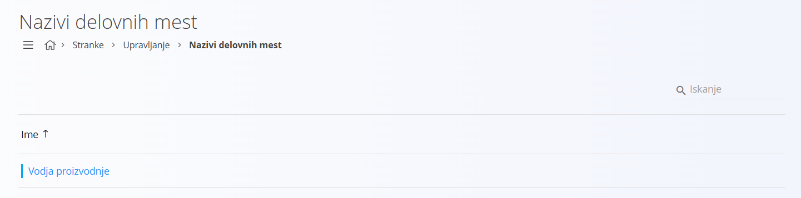
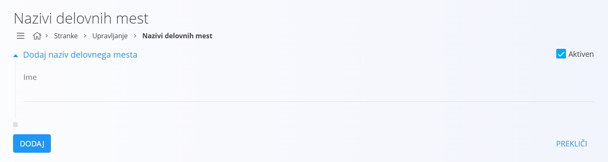
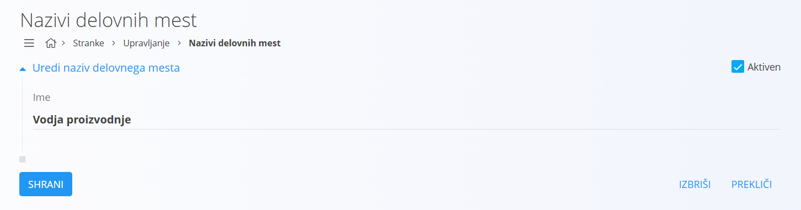

# Naziv Delovnega Mesta

Nazivi delovnih mest predstavljajo osnovne opise funkcij in vlog, ki jih zaposleni opravljajo v okviru organizacij. Vsako delovno mesto določa odgovornosti, pooblastila ter mesto posameznika v hierarhiji podjetja. S pravilno evidenco nazivov delovnih mest zagotovimo boljšo preglednost organizacijske strukture, lažje dodeljevanje nalog ter hitrejše razumevanje poslovnih procesov.

Šifrant nazivov delovnih mest je povezan s šifrantom [kontaktov](Kontakt.md), saj je vsakemu kontaktu mogoče dodeliti ustrezno delovno mesto. Na ta način vzpostavimo pregledno povezavo med posameznikom in njegovo vlogo v organizaciji.

## Shema

Šifrant nazivov delovnih mest ima naslednjo shemo:

|Polje|Opis|
|---|---|
|**Ime**|Naziv delovnega mesta. Na primer **Vodja proizvodnje** ali **Komercialist**.|
|**Aktiven**|Določa, ali je naziv delovnega mesta na voljo za uporabo v novih dokumentih. Neaktivnih ne moremo dodajati v novih dokumentih, ostanejo pa vidni v zgodovini.|

## Upravljanje

Upravljanje s šifrantom nazivov delovnih mest je dostopno preko [navigacije](../../Common/UI/Sitemap.md), in sicer **Stranke/Upravljanje/Nazivi delovnih mest**.  

Uporabniški vmesnik privzeto prikazuje seznam obstoječih zapisov. Seznam je osrednji element in prikazuje že dodane nazive delovnih mest. Na desni zgoraj je na voljo iskalno polje za hitro iskanje po seznamu.  

Na seznamu se levo od naziva prikaže barvni indikator stanja, kjer modra barva pomeni, da je zapis aktiven, siva pa, da je neaktiven.  

## Dodajanje

S klikom na [akcijski gumb](../../Splosno/UporabniskiVmesnik/AkcijskiGumb.md) uporabniški vmesnik preide v način dodajanja in prikaže vnosno masko za vnos novega naziva delovnega mesta.  

V vnosni maski izpolnite ustrezna polja. S klikom na gumb **Dodaj** se ustvari nov naziv delovnega mesta in uporabniški vmesnik preide v privzet način, ki prikazuje seznam obstoječih zapisov. S klikom na gumb **Prekliči** pa uporabniški vmesnik preide v privzet način, brez da bi vnešene podatke shranili.  

## Urejanje

Za urejanje posameznega naziva delovnega mesta v seznamu kliknete na njegovo **Ime**. Uporabniški vmesnik preide v način urejanja, kjer so podatki že izpolnjeni.  

Spremenite želena polja in kliknite na gumb **Shrani**, da bi spremembe shranili. Uporabniški vmesnik nato preide v privzet način, ki prikazuje seznam obstoječih nazivov delovnih mest s posodobljeno vrednostjo. Če kliknete na gumb **Prekliči**, uporabniški vmesnik ostane v privzetem načinu, brez shranjevanja sprememb.  

## Brisanje

Naziv delovnega mesta je mogoče izbrisati, vendar samo pod pogojem, da se ne pojavlja v nobenem odvisnem zapisu.  

Za brisanje naziva delovnega mesta morate najprej preiti v način [urejanja](#urejanje). V načinu urejanja je na voljo gumb **Izbriši**. Klik na gumb **Izbriši** prikaže potrditveno okno: **Ali ste prepričani, da želite izbrisati zapis?**  

- Če potrditveno okno potrdite, se naziv delovnega mesta trajno izbriše in izgine s seznama.  
- Če potrditveno okno prekličete, uporabniški vmesnik ostane v načinu urejanja in naziv delovnega mesta ostaja v sistemu.  
