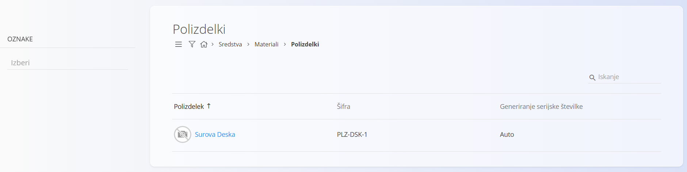
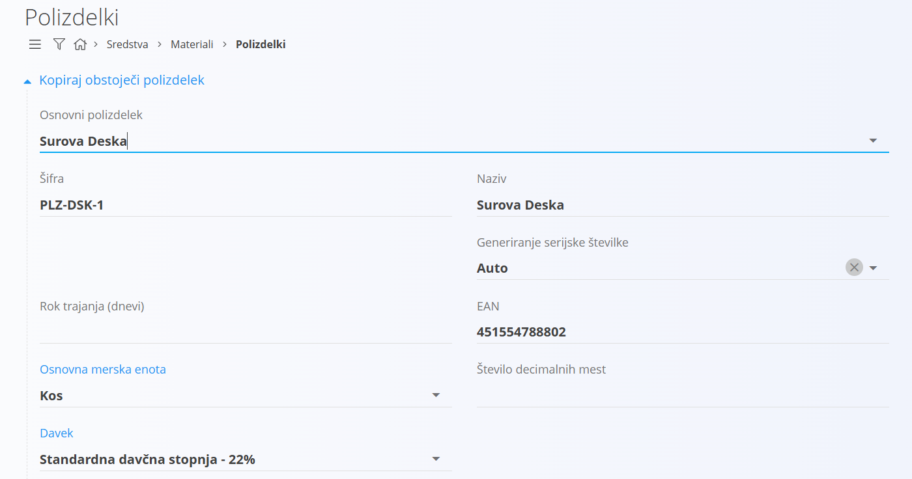
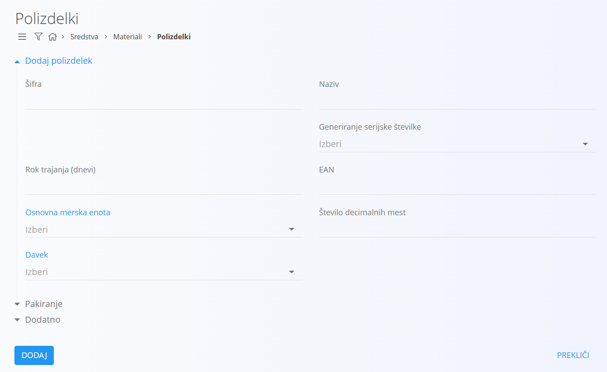
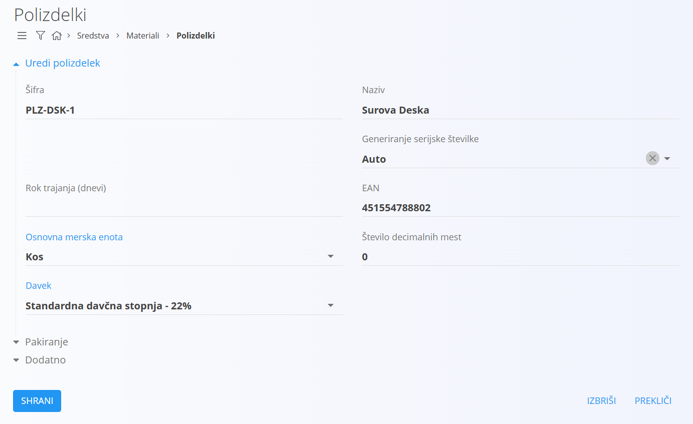

# Polizdelek

Polizdelki predstavljajo proizvode, ki so nastali v vmesni fazi proizvodnega procesa in praviloma še niso namenjeni končni prodaji kupcem. Gre za materialno blago, ki se uporablja kot sestavni del pri izdelavi drugih polizdelkov ali končnih izdelkov. Polizdelki imajo pomembno vlogo v proizvodnji, saj omogočajo postopno in učinkovito sestavljanje končnih proizvodov, obenem pa zagotavljajo večjo fleksibilnost v proizvodnih procesih.

Predstavlja šifrant polizdelkov, ki pripadajo [materialom](../Materiali.md).

> [!TIP]  
> Prerekviziti za upravljanje tega šifranta so:  
>  
> - [Merske enote](MerskaEnota.md)  
> - [Davčne stopnje](DavcnaStopnja.md)  
>  
> Poskrbite za omenjene prerekvizite, preden začnete z upravljanjem tega šifranta.

## Shema

Šifrant polizdelkov ima naslednjo shemo:

|Polje|Opis
|---|---
|**Šifra**| Enolična identifikacijska oznaka polizdelka znotraj seznama materialov. Na primer **2625001** ali **PLZ-123**. Šifra mora biti unikatna znotraj celotnega seznama [materialov](../Materiali.md).|
|**Naziv**|Naziv polizdelka, ki se prikazuje v seznamih in dokumentih. Na primer **Plošča – Hrast**.|
|**Generiranje serijske številke**|Način [dodeljevanja](../../Skladisce/SerijskeStevilke/GeneriranjeSerijskeStevilke.md) serijske številke.|
|**Rok trajanja**|Število dni trajanja, uporabno pri pokvarljivem blagu. Na primer **30** ali **365**.|
|**EAN**|[EAN](https://en.wikipedia.org/wiki/International_Article_Number) koda za optično branje. Na primer **3831234567890**.|
|**Osnovna merska enota**|[Merska enota](MerskaEnota.md), v kateri izražamo količine. Na primer **kos** ali **m**.|
|**Davek**|Privzeta [davčna stopnja](DavcnaStopnja.md) pri poslovnih dokumentih. Na primer **22 %** ali **9,5 %**.|
|**Število decimalnih mest**|Privzeto število decimalnih mest za prikaz vrednosti oziroma količin. Na primer **2** ali **3**.|
|**Opis**|Kratek opis, namenjen pojasnilu rabe ali specifikacij. Na primer **Polizdelana plošča iz hrasta**.|
|**Oznake**|Oznake za kategorizacijo in filtriranje. Na primer **pohištvo**, **notranja proizvodnja**.|
|**Info povezava**|URL do zunanjega opisa polizdelka ali storitve. Na primer **https://primer.domena/opis**.|
|**URL do slike polizdelka**|Javni URL do fotografije polizdelka. Na primer **https://primer.domena/slike/polizdelek.jpg**.|
|**Zunanji ključ**|Identifikator v zunanjem sistemu za povezovanje zapisov. Na primer **SAP-4711**.|
|**Aktivno**|Določa, ali je polizdelek na voljo za uporabo v novih dokumentih. Neaktivnih ne moremo dodajati v novih dokumentih, ostanejo pa vidni v zgodovini.|

## Upravljanje

Upravljanje s šifrantom polizdelkov je dostopno preko [navigacije](../../Common/UI/Sitemap.md) in sicer **Sredstva/Materiali/Polizdelki**.

Uporabniški vmesnik privzeto prikazuje seznam obstoječih zapisov. Vmesnik je razdeljen na levi del s filtri in desni del s seznamom.

V vsakem zapisu se levo od naziva nahaja barvni indikator stanja, modra barva označuje aktiven zapis, siva pa neaktiven. Na desni zgoraj je na voljo iskalno polje.

### Filtri

Levi del uporabniškega vmesnika omogoča filtriranje polizdelkov. Na voljo so naslednji filtri:

|Filter|Opis
|--|--
|**Oznake**|Filtrira seznam polizdelkov po oznakah. V polje lahko dodate več oznak, v seznamu se prikažejo polizdelki, ki imajo vsaj eno ustrezno oznako.|

## Akcije

Klik na [akcijski gumb](../../Splosno/UporabniskiVmesnik/AkcijskiGumb.md) prikaže naslednje akcije:

- [Uvoz](#uvoz)
- [Kopiraj obstoječi](#kopiraj-obstoječi)
- [Nov](#nov)

### Uvoz

[Uvoz](UvozMaterialov.md) polizdelkov omogoča masovno vnašanje oziroma posodabljanje seznama polizdelkov. Pripravite datoteko v `CSV` obliki, jo prenesete v sistem, ki nato samodejno bodisi ustvari bodisi posodobi seznam polizdelkov.

### Kopiraj obstoječi

Ta akcija je zelo podobna akciji **Nov**, s to razliko, da se na uporabniškem vmesniku na vrhu prikaže [spustni seznam](../../Splosno/UporabniskiVmesnik/SpustniSeznam.md) **Osnovni produkt**, ki vsebuje obstoječe polizdelke.

Z izbiro željenega polizdelka uporabniški vmesnik samodejno izpolni polja z vrednostmi izbranega polizdelka. Po izbiri je postopek za dodajanje polizdelka enak, kot v primeru dodajanja novega. Gre pravzaprav za bližnjico ustvarjanja novega polizdelka.

### Nov

S klikom na akcijo **Nov** uporabniški vmesnik preide v način urejanja in sicer se prikaže vnosna maska za dodajanje novega polizdelka.

S klikom na gumb **Dodaj** se ustvari nov polizdelek in uporabniški vmesnik preide v privzet način, ki prikazuje seznam obstoječih polizdelkov. S klikom na gumb **Prekliči** pa uporabniški vmesnik preide v privzet način, brez da bi vnešene podatke shranil, torej ne ustvari novega polizdelka, ampak postopek prekine brez shranjevanja.

## Urejanje

Za urejanje posameznega polizdelka v seznamu polizdelkov kliknete na njegov **Naziv**. Uporabniški vmesnik preide v način urejanja polizdelka, ki je pravzaprav identičen tistemu za vnos, le da so v tem primeru podatki že izpolnjeni.

Spremenite želena polja in kliknite na gumb **Shrani** ter s tem shranite spremembe, uporabniški vmesnik pa preide v privzet način, ki prikazuje seznam obstoječih polizdelkov s posodobljeno vrednostjo. S klikom na gumb **Prekliči** pa uporabniški vmesnik preide v privzet način brez shranjevanja.

## Brisanje

Polizdelek je mogoče tudi izbrisati, vendar samo pod pogojem, da nima odvisnih zapisov, na primer ne obstaja noben [prevzem](../../Skladisce/Dokumenti/Prevzem.md), ki ima postavko polizdelka.

Za brisanje polizdelka morate najprej preiti v način [urejanja](#urejanje). V načinu urejanja je viden gumb **Izbriši**. Klik na gumb **Izbriši** prikaže potrditveno sporočilo **Ali ste prepričani, da želite izbrisati zapis?**. S potrditvijo okna se polizdelek permanentno izbriše, uporabniški vmesnik preide v privzet način, pri čemer izbrisanega polizdelka ni več na seznamu.

V kolikor potrditveno sporočilo ne potrdite, uporabniški vmesnik ostane v načinu urejanja.

## Pakiranje

V načinu urejanja se uporabniku ponudi nova možnost in sicer lahko dodaja [pakiranja](../../Skladisce/Pakiranje/README.md). Vsak polizdelek lahko ima več pakiranj. Na primer, polizdelek se lahko dobavi v embalaži po 5 kosov ali pa v embalaži po 10 kosov, kar pomeni, da gre za dobavo enakega polizdelka, le z različnim pakiranjem.

S klikom na **Dodaj pakiranje** se odpre [vnosna maska](../UporabniskiVmesnik/VnosnaMaska.md) za dodajanje pakiranja. Ta maska je identična maski pri [upravljanju](../../Skladisce/Pakiranje/README.md) s pakiranji in deluje na enak način.
