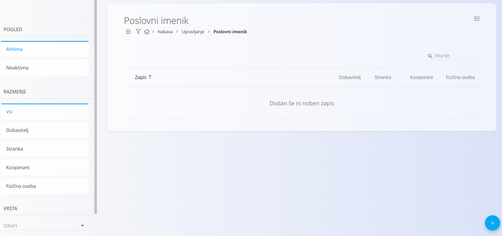
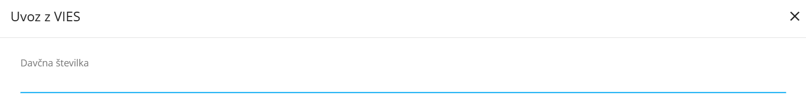
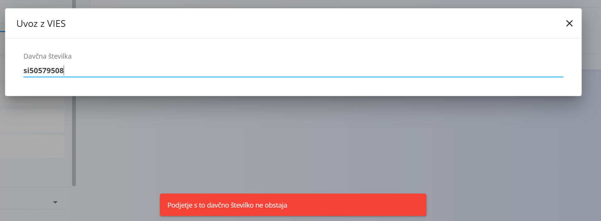
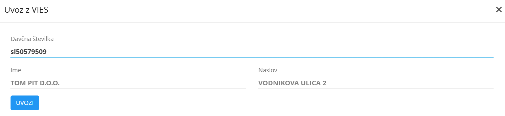
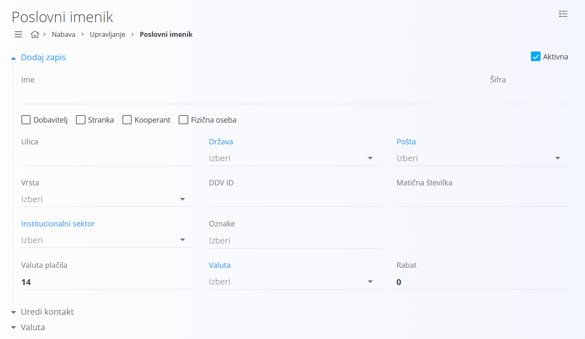
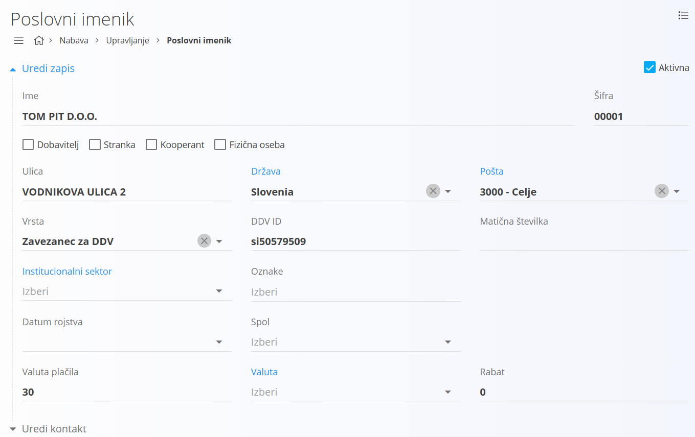

# Poslovni imenik

Poslovni imenik je enoten šifrant kontaktov, ki združuje pravne in fizične entitete. V njem se vodijo vsi poslovni partnerji, kot so **dobavitelji**, **stranke**, **kooperanti** in **fizične osebe**. Omogoča enotno obravnavo partnerjev v vseh digitalnih vsebinah sistema, od nabave, prodaje in skladišča do računovodstva in poročanja.

Šifrant poslovnega imenika je osrednja točka za povezovanje partnerjev z dokumenti in procesi. V njem so zbrani identifikacijski, lokacijski, davčni in kontaktni podatki, skupaj z nastavitvami za poslovno sodelovanje.

## Vrsta

Polje **Vrsta** določa status poslovnega partnerja glede na davčno ureditev. Na voljo so naslednje vrednosti:

- **Zavezanec za DDV** – poslovni partner je identificiran kot zavezanec za DDV in ima veljavno ID številko za DDV.  
- **Ni zavezanec za DDV** – poslovni partner ni registriran kot zavezanec za DDV.  
- **Končni potrošnik** – fizična oseba ali pravna oseba, ki nastopa kot končni kupec blaga ali storitev.

## Shema

Šifrant poslovnega imenika vsebuje naslednja polja:

|Polje|Opis
|---|---
|**Ime**| Polno ime poslovnega partnerja, na primer **ACME d.o.o.** ali **Janez Novak**.
|**Šifra**| Interna šifra partnerja, ki omogoča enolično identifikacijo.
|**Aktiven**| Označuje, ali je partner aktiven. Neaktivnih partnerjev ni mogoče uporabljati v novih dokumentih.
|**Dobavitelj**| Potrditveno polje, ki označuje, ali partner nastopa kot dobavitelj.
|**Stranka**| Potrditveno polje, ki označuje, ali partner nastopa kot stranka oziroma kupec.
|**Kooperant**| Potrditveno polje, ki označuje, ali partner nastopa kot kooperant.
|**Fizična oseba**| Potrditveno polje, ki označuje, ali je partner fizična oseba.
|**Ulica**| Naslovna ulica poslovnega partnerja, na primer **Dunajska cesta 10**.
|**Država**| [Država](Drzava.md), v kateri ima partner sedež.
|**Pošta**| [Poštna številka](PostnaStevilka.md) sedeža partnerja.
|**Vrsta**| Določa davčni status partnerja (glej poglavje [Vrsta](#vrsta)).
|**DDV ID**| Identifikacijska številka za DDV, na primer **SI12345678**.
|**Matična številka**| Matična številka pravne osebe.
|**Institucionalni sektor**| [Institucionalni sektor](InstitucionalniSektor.md), kamor partner sodi.
|**Oznake**| Oznake, ki omogočajo kategorizacijo partnerjev.
|**Valuta plačila**| Privzeta valuta za plačila, ki se uporablja v dokumentih.
|**Valuta**| [Valuta](Valuta.md), povezana s partnerjem.
|**Rabat**| Privzeti odstotek popusta, ki velja za partnerja.
|**Primarni kontakt**| Ime in priimek primarne kontaktne osebe.
|**Telefon**| Telefonska številka primarnega kontakta.
|**E-pošta**| Elektronski naslov primarnega kontakta.
|**Uporabi strankino valuto na dokumentih**| Potrditveno polje, ki določa, ali se na dokumentih uporablja valuta partnerja.

## Upravljanje

Do šifranta poslovnega imenika dostopate preko [navigacije](../../Common/UI/Sitemap.md) in sicer preko **Nabava / Upravljanje / Poslovni imenik**.

## Seznam partnerjev

Privzeto se prikaže uporabniški vmesnik s seznamom že vnešenih oziroma obstoječih partnerjev. V kolikor seznam ne vsebuje nobenega zapisa, je seznam prazen.

Uporabniški vmesnik je razdeljen na levi in desni del. Levi del vsebuje filtre, kjer lahko omejite prikaz zapisov glede na status (aktivni ali neaktivni), razmerje (dobavitelj, stranka, kooperant, fizična oseba), vrsto ali državo. Desni del prikazuje seznam partnerjev s ključnimi podatki in oznakami, ki določajo njihovo razmerje.

Pod nazivom partnerja so prikazane naslednje značke:

- [Kontakti](Kontakt.md)
- [Bančni računi](BancniRacun.md)
- [Poslovne enote](PoslovnaEnota.md)

## Akcije

Klik na [akcijski gumb](../../Splosno/UporabniskiVmesnik/AkcijskiGumb.md) prikaže naslednje akcije:

- Uvoz iz VIES  
- Uvoz  
- Nov  

### Uvoz iz VIES

Akcija **Uvoz iz VIES** omogoča preverjanje in uvoz podatkov o partnerjih neposredno iz evropske baze VIES na osnovi identifikacijske številke za DDV. Tako lahko samodejno dopolnite podatke o partnerju.

Za uvoz partnerja iz VIES potrebujete njegovo davčno številko. Klik na akcijo **Uvoz iz VIES** odpre [modalno okno](../../Splosno/UporabniskiVmesnik/ModalnoOkno.md), kot je prikazano na spodnji sliki.

Vpišemo davčno številko. V kolikor poslovni parzner ni najden, se izpiše sporočilo, ko je prikazano na spodnji sliki.

V kolikor je poslovni partner najden, se prikažejo osnovne njegove informacije.

Kliknite na gumb **Uvozi** za samodejen uvoz novega poslovnega partnerja. Uporabniški vmesnik ustvari novega poslovnega partnerja in takoj preide v način [urejanja](#urejanje).

### Uvoz

[Uvoz](UvozPartnerjev.md) omogoča masovno vnašanje oziroma posodabljanje seznama partnerjev. Uporabnik pripravi datoteko v CSV obliki in jo prenese v sistem. Ta samodejno ustvari nove ali posodobi obstoječe zapise.

### Nov

S klikom na akcijo **Nov** uporabniški vmesnik preide v način urejanja in prikaže vnosno masko za dodajanje novega partnerja.

- Kliknite **Dodaj**, da ustvarite novega partnerja. Zapis se nato prikaže v seznamu.  
- Kliknite **Prekliči**, da postopek prekinete brez shranjevanja.

## Menu

Klik na [menu](../../Splosno/UporabniskiVmesnik/Menu.md) prikaže naslednje možnosti:

- Izvozi

### Izvozi

Akcija **Izvozi** izvozi trenutno prikazane zapise v datoteko v obliki CSV. Izvoz upošteva izbrane filtre, iskanje in vrstni red v seznamu, zato dobiš natančno tisti nabor podatkov, ki ga vidiš na zaslonu. CSV je primeren za nadaljnjo obdelavo v preglednicah ali za uvoz v druge sisteme.

## Urejanje

Za urejanje partnerja v seznamu kliknite na njegovo **Ime**. Uporabniški vmesnik preide v način urejanja, ki je enak načinu vnosa, le da so polja že izpolnjena.

- Spremenite želena polja in kliknite **Shrani**, da shranite spremembe.  
- Kliknite **Prekliči**, da postopek prekinete brez shranjevanja.

### Kontakti

Pod nazivom partnerja je prikazana značka **Kontakti**.

S klikom na značko uporabniški vmesnik preide v pogled za [urejanje kontaktov](Kontakt.md), vezanih na izbranega partnerja.

### Bančni računi

Pod nazivom partnerja je prikazana značka **Bančni računi**.

S klikom na značko uporabniški vmesnik preide v pogled za [urejanje bančnih računov](BancniRacun.md), vezanih na izbranega partnerja.

### Poslovne enote

Pod nazivom partnerja je prikazana značka **Poslovne enote**.

S klikom na značko uporabniški vmesnik preide v pogled za [urejanje poslovnih enot](PoslovnaEnota.md), vezanih na izbranega partnerja.

## Brisanje

Partnerja lahko izbrišete le, če se ne pojavlja v nobenem odvisnem zapisu. Za brisanje partnerja najprej preidite v način [urejanja](#urejanje). V načinu urejanja kliknite **Izbriši**. Odpre se potrditveno sporočilo:  
**Ali ste prepričani, da želite izbrisati zapis?**

- Če potrdite, se partner trajno izbriše in izgine s seznama.  
- Če prekličete, uporabniški vmesnik ostane v načinu urejanja in partner ostane nespremenjen.
