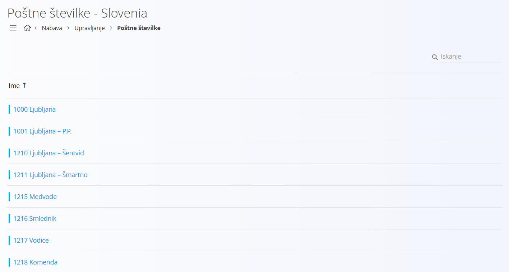
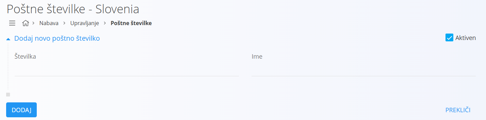
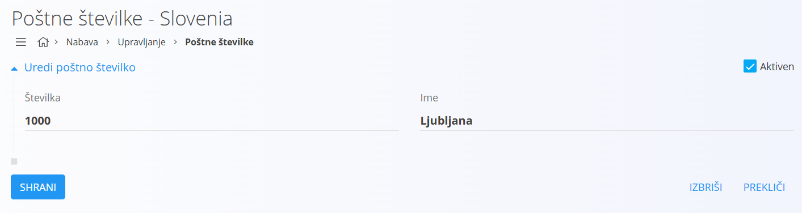

# Poštna številka

Poštna številka je številčna oznaka, ki določa posamezno območje za potrebe poštne dostave. Uporablja se za natančnejše določanje lokacije v naslovih in je vedno vezana na posamezno [državo](Drzava.md). 

Šifrant poštnih številk omogoča enotno obravnavo poštnih številk v vseh digitalnih vsebinah sistema.

## Shema

Šifrant poštnih številk vsebuje naslednja polja:

|Polje|Opis
|---|---
|**Številka**| Numerična oznaka poštnega območja, na primer **1000** ali **2000**.
|**Ime**| Naziv poštnega območja, navadno kraj ali naselje, na primer **Ljubljana** ali **Maribor**.
|**Aktiven**| Označuje, ali je poštna številka v uporabi. Neaktivnih številk ni mogoče uporabiti v novih dokumentih, ostanejo pa vidne v zgodovini.

## Upravljanje

Do šifranta poštnih številk dostopate preko [upravljanja držav](Drzava.md), saj je šifrant podrejen temu šifrantu.

## Seznam poštnih številk

Privzeto se prikaže uporabniški vmesnik s seznamom že vnešenih oziroma obstoječih poštnih številk. V kolikor seznam ne vsebuje nobene poštne številke, je seznam prazen.

Vsak zapis ima na levi strani barvno oznako, ki ponazarja status: modra pomeni, da je poštna številka aktivna, siva pa, da je neaktivna. Zapis prikazuje tudi številko poštnega območja in pripadajoče ime kraja oziroma naselja.

## Akcije

Klik na [akcijski gumb](../../Splosno/UporabniskiVmesnik/AkcijskiGumb.md) prikaže naslednje akcije:

- Uvoz  
- Nov  

### Uvoz

[Uvoz](UvozPostnihStevilk.md) omogoča masovno vnašanje oziroma posodabljanje seznama poštnih številk. Uporabnik pripravi datoteko v CSV obliki in jo prenese v sistem. Ta samodejno ustvari nove ali posodobi obstoječe zapise.

### Nov

S klikom na akcijo **Nov** uporabniški vmesnik preide v način urejanja in prikaže vnosno masko za dodajanje nove poštne številke.

- Kliknite **Dodaj**, da ustvarite novo poštno številko. Zapis se nato prikaže v seznamu.  
- Kliknite **Prekliči**, da postopek prekinete brez shranjevanja.

## Urejanje

Za urejanje poštne številke v seznamu kliknite na njeno **Ime**. Uporabniški vmesnik preide v način urejanja, ki je enak načinu vnosa, le da so polja že izpolnjena.

- Spremenite želena polja in kliknite **Shrani**, da shranite spremembe.  
- Kliknite **Prekliči**, da postopek prekinete brez shranjevanja.

## Brisanje

Poštno številko lahko izbrišete le, če se ne pojavlja v nobenem odvisnem zapisu. Za brisanje poštne številke najprej preidite v način [urejanja](#urejanje). V načinu urejanja kliknite **Izbriši**. Odpre se potrditveno sporočilo:  
**Ali ste prepričani, da želite izbrisati zapis?**

- Če potrdite, se poštna številka trajno izbriše in izgine s seznama.  
- Če prekličete, uporabniški vmesnik ostane v načinu urejanja in poštna številka ostane nespremenjena.
