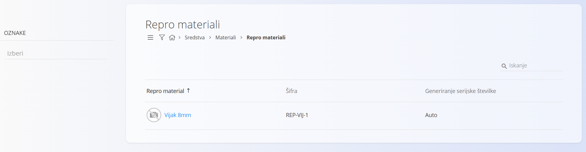
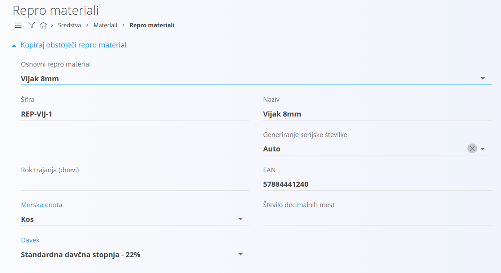
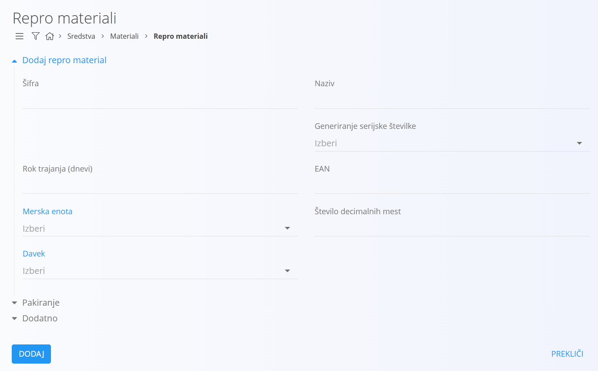
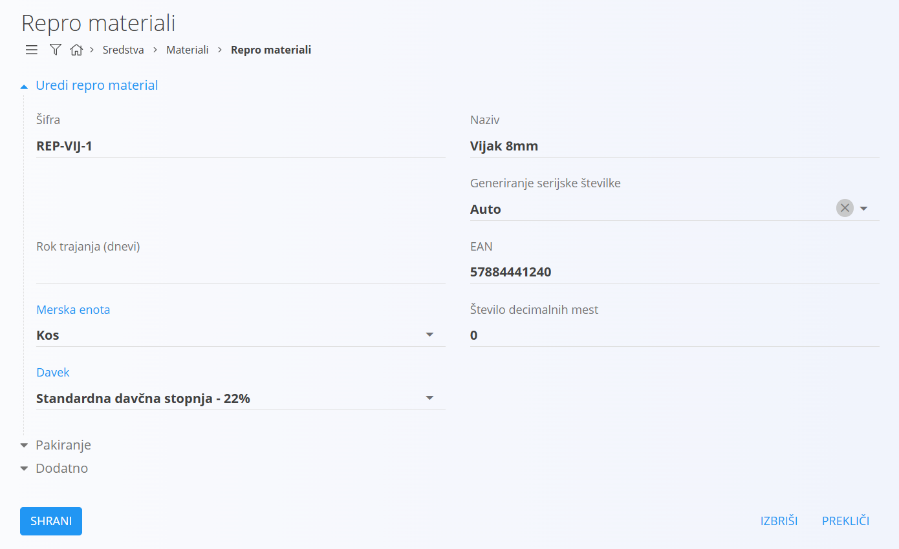

# Repro material

Repro materiali predstavljajo osnovne materiale, ki se uporabljajo v proizvodnih procesih, vendar sami po sebi niso namenjeni končni prodaji, kljub temu, da je v sistemu prodaja tudi teh materialov podprta. Gre za materiale, kot so vijaki, lepila, barve ali druga pomožna sredstva, ki omogočajo izdelavo polizdelkov ali končnih izdelkov. Imajo pomembno vlogo pri zagotavljanju kakovosti, stabilnosti in učinkovitosti proizvodnje.

Predstavlja šifrant repro materialov, ki pripadajo [materialom](../Materiali.md).

> [!TIP]  
> Prerekviziti za upravljanje tega šifranta so:  
>  
> - [Merske enote](MerskaEnota.md)  
> - [Davčne stopnje](DavcnaStopnja.md)  
>  
> Poskrbite za omenjene prerekvizite, preden začnete z upravljanjem tega šifranta.

## Shema

Šifrant repro materialov ima naslednjo shemo:

|Polje|Opis
|---|---
|**Šifra**| Enolična identifikacijska oznaka repro materiala znotraj seznama materialov. Na primer **RM-001** ali **RM-5000**.|
|**Naziv**|Naziv repro materiala, ki se prikazuje v seznamih in dokumentih. Na primer **Vijak M8x50**.|
|**Generiranje serijske številke**|Način [dodeljevanja](../../Skladisce/SerijskeStevilke/GeneriranjeSerijskeStevilke.md) serijske številke.|
|**Rok trajanja**|Število dni trajanja, uporabno pri materialih z omejenim rokom uporabe. Na primer **180** ali **365**.|
|**EAN**|[EAN](https://en.wikipedia.org/wiki/International_Article_Number) koda za optično branje. Na primer **3831234567890**.|
|**Osnovna merska enota**|[Merska enota](MerskaEnota.md), v kateri izražamo količine. Na primer **kos** ali **l**.|
|**Davek**|Privzeta [davčna stopnja](DavcnaStopnja.md). Na primer **22 %** ali **9,5 %**.|
|**Število decimalnih mest**|Privzeto število decimalnih mest za prikaz količin. Na primer **0** ali **2**.|
|**Opis**|Kratek opis, namenjen pojasnilu rabe ali specifikacij. Na primer **Cinkani vijak za konstrukcije**.|
|**Oznake**|Oznake za kategorizacijo in filtriranje. Na primer **kovinski elementi**, **potrošni material**.|
|**Info povezava**|URL do zunanjega opisa materiala. Na primer **https://primer.domena/vijak**.|
|**URL do slike repro materiala**|Javni URL do fotografije repro materiala. Na primer **https://primer.domena/slike/vijak.jpg**.|
|**Zunanji ključ**|Identifikator v zunanjem sistemu. Na primer **SAP-2201**.|
|**Aktivno**|Določa, ali je repro material na voljo za uporabo v novih dokumentih. Neaktivnih ne moremo dodajati v novih dokumentih, ostanejo pa vidni v zgodovini.|

## Upravljanje

Upravljanje s šifrantom repro materialov je dostopno preko [navigacije](../../Common/UI/Sitemap.md) in sicer **Sredstva/Materiali/Repro materiali**.  

Uporabniški vmesnik privzeto prikazuje seznam obstoječih zapisov. Vmesnik je razdeljen na levi del s filtri in desni del s seznamom.  

V vsakem zapisu se levo od naziva nahaja barvni indikator stanja, modra barva označuje aktiven zapis, siva pa neaktiven. Na desni zgoraj je na voljo iskalno polje.

### Filtri

Levi del uporabniškega vmesnika omogoča filtriranje repro materialov. Na voljo so naslednji filtri:

|Filter|Opis
|--|--
|**Oznake**|Filtrira seznam repro materialov po oznakah. V seznamu se prikažejo zapisi, ki imajo vsaj eno ustrezno oznako.|

## Akcije

Klik na [akcijski gumb](../../Splosno/UporabniskiVmesnik/AkcijskiGumb.md) prikaže naslednje akcije:

- [Uvoz](#uvoz)
- [Kopiraj obstoječi](#kopiraj-obstoječi)
- [Nov](#nov)

### Uvoz

[Uvoz](UvozMaterialov.md) repro materialov omogoča masovno vnašanje oziroma posodabljanje seznama.  

### Kopiraj obstoječi

Akcija omogoča podvajanje obstoječega zapisa.  

### Nov

S klikom na akcijo **Nov** preidete v način urejanja in dodajanja novega repro materiala.  

## Urejanje

Za urejanje kliknete na **Naziv** repro materiala.  

Spremenite želena polja in kliknite na gumb **Shrani**.  

## Brisanje

Repro material je mogoče tudi izbrisati, vendar samo pod pogojem, da nima odvisnih zapisov, na primer ne obstaja noben [prevzem](../../Skladisce/Dokumenti/Prevzem.md), ki ima postavko repro materiala.

Za brisanje repro materiala morate najprej preiti v način [urejanja](#urejanje). V načinu urejanja je viden gumb **Izbriši**. Klik na gumb **Izbriši** prikaže potrditveno sporočilo **Ali ste prepričani, da želite izbrisati zapis?**. S potrditvijo okna se repro material permanentno izbriše, uporabniški vmesnik preide v privzet način, pri čemer izbrisanega repro materiala ni več na seznamu.

V kolikor potrditveno sporočilo ne potrdite, uporabniški vmesnik ostane v načinu urejanja.

## Pakiranje

V načinu urejanja se uporabniku ponudi nova možnost in sicer lahko dodaja [pakiranja](../../Skladisce/Pakiranje/README.md). Vsak repro material lahko ima več pakiranj. Na primer, repro material se lahko dobavi v embalaži po 5 kosov ali pa v embalaži po 10 kosov, kar pomeni, da gre za dobavo enakega repro materiala, le z različnim pakiranjem.

S klikom na **Dodaj pakiranje** se odpre [vnosna maska](../UporabniskiVmesnik/VnosnaMaska.md) za dodajanje pakiranja. Ta maska je identična maski pri [upravljanju](../../Skladisce/Pakiranje/README.md) s pakiranji in deluje na enak način.
