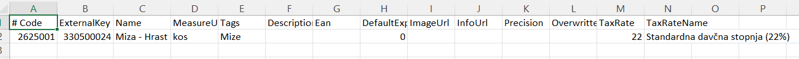
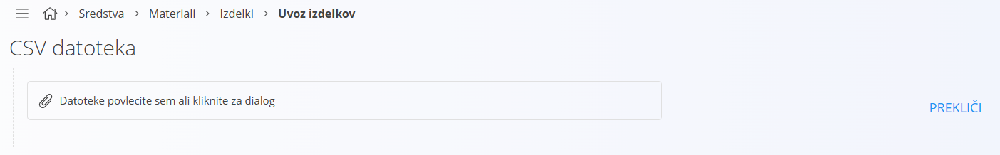
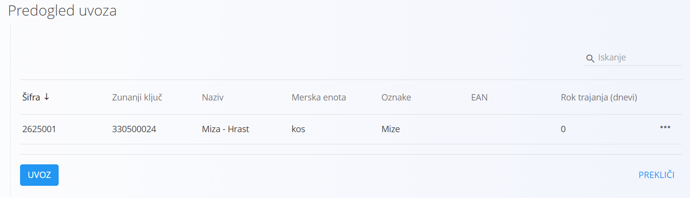

# Uvoz materialov

[Izdelki](Izdelek.md), [polizdelki](Polizdelek.md), [repro material](ReproMaterial.md) in [surovine](Surovina.md), ki jih enotno imenujemo [Materiali](../Materiali.md), podpirajo uvoz zapisov, ki omogoča urejanje seznamov zunaj sistema, nato pa masovno ustvarjanje oziroma posodabljanje celotnega seznama. 

## Shema

Predpripravljeni podatki morajo slediti vnaprej določeni shemi, shema pa mora biti shranjena v `CSV` datoteki, kar pomeni, da morajo biti tako shema kot vrednosti polj ločeni s podpičjem. 

Datoteka mora vsebovati naslednja polja:

- Šifra (Code)
- Zunanji ključ (ExternalKey)
- Naziv (Name)
- Kratica merske enote (MeasureUnitAbbreviation)
- Oznake (Tags)
- Opis (Description)
- EAN
- Rok trajanja (DefaultExpiration)
- URL slike (ImageUrl)
- URL opisa (InfoUrl)
- Število decimalnih mest (Precision)
- Prepis (Overwritten)
- Davčna stopnja (TaxRate)
- Naziv davčne stopnje (TaxRateName)

Primer vsebine datoteke je:

```
# Code;ExternalKey;Name;MeasureUnitAbbreviation;Tags;Description;Ean;DefaultExpiration;ImageUrl;InfoUrl;Precision;Overwritten;TaxRate;TaxRateName
2625001;330500024;Miza - Hrast;kos;Mize;;;0;;;;;22;Standardna davčna stopnja (22%)
```

Polja, ki nimajo vrednosti, pustimo prazna oziroma jih preskočimo s podpičjem. Najenostavnejši način za urejanje tovrstnih datotek je *Excel*.



## Postopek

Postopek uvoza je pri vseh materialih enak. Uporabnik na [akcijskem gumbu](../UporabniskiVmesnik/AkcijskiGumb.md) izbere akcijo **Uvoz** in uporabniški vmesnik preide v način uvoza materiala. 



Uporabnik klikne na **Datoteke povlecite sem ali kliknite za dialog** in odpre se sistemsko [modalno okno](../UporabniskiVmesnik/ModalnoOkno.md) za izbiro datoteke. Uporabnik izbere datoteko in s potrditvijo modalnega okna se datoteka prenese v sistem. Sistem datoteko analizira in v kolikor v datoteki ni napak, prikaže vsebino datoteke.



S klikom na gumb **Uvoz** se prikaže [potrditveno okno](../UporabniskiVmesnik/PotrditvenoOkno.md) z besedilom **Ali ste prepričani, da želite uvoziti izdelke?**

> [!INFO]
> Za druge tipe materialov je sporočilo malenkost drugačno

S potrditvijo okna se prične postopek uvoza. S preklicem pa uporabniški vmesnik preide v privzet način, torej prikaza seznama obstoječih materialov.

Ključ je **Šifra** materiala. Torej, za vsak posamezen zapis sistem ugotavlja, ali material s podano **Šifro** obstaja. V kolikor obstaja, se obstoječ material posodobi z vrednostmi iz datoteke, v kolikor ne, se ustvari nov material.

> [!NOTE]
> Materiali so vezani na dva šifranta, [Merskih enot](MerskaEnota.md) in [Davčnih stopenj](DavcnaStopnja.md). V kolikor v teh šifrantih ni ustreznih zapisov, bo sistem samodejno ustvarih tudi odvisne šifrante.

Po končanem uvozu se izpiše sporočilo o uspešnosti uvoza, uporabniški vmesnik preide v privzet način in seznam prikaže posodobljene vrednosti.