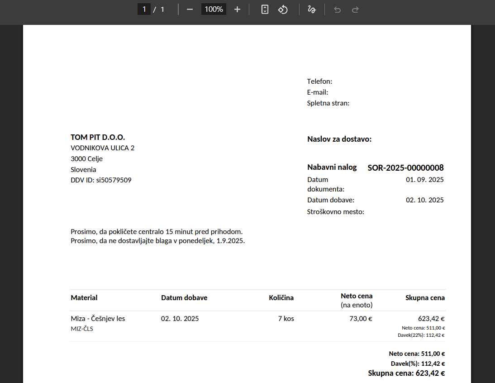
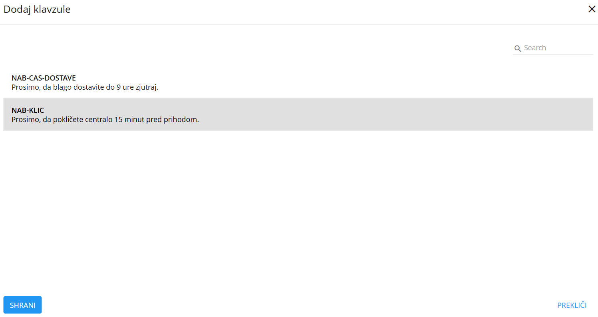
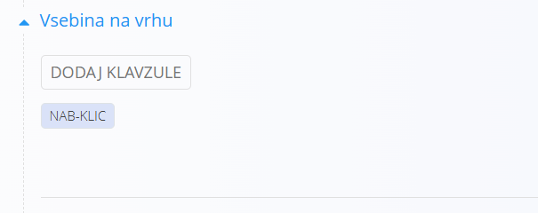
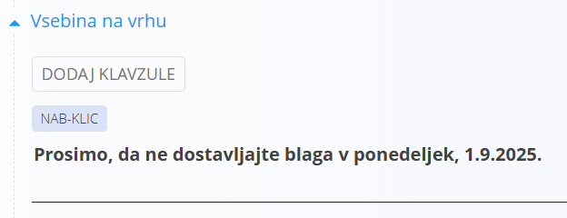

# Klavzule

Nekateri dokumenti podpirajo dodajanje klavzul na različnih mestih, na primer pred izpisom postavk ali pa za samimi postavkami. Dokumenti, ki podpirajo takšna besedila so:

- Nabavni nalog
- Izdani račun
- Dobavnica
- Ponudba

Klavzula oziroma [vnaprej določeno besedilo](../Sifranti/VnaprejDolocenoBesedilo.md) je besedilo, ki je pripravljeno vnaprej in ga lahko na posamezne dokumente po potrebi vključujemo. Namesto, da vedno znova pišemo ista besedila, jih določimo enkrat in nato na dokumente vključimo takrat, ko je to potrebno.

> [!TIP]  
> Prerekviziti za uporabo klavzul so:  
>  
> - [Vnaprej določena besedila](../../Splosno/Sifranti/VnaprejDolocenoBesedilo.md)  
>  
> Poskrbite za omenjene prerekvizite, preden začnete z uporabo teh dokumentov.

Klavzule so praviloma pomembne pri tiskanih verzijah dokumentov, ki jih pošiljamo poslovnim partnerjem ali kupcem, predvsem kadar jim želimo kaj posebej sporočiti.

Dokumenti oziroma sekcije, kjer je možno klavzule dodati, imajo praviloma gumb **Dodaj Klavzulo**. Kliknite na gumb omenjeni gumb in odpre se vam [modalno okno](ModalnoOkno.md), kjer so izpisana vsa obstoječa [vnaprej določena besedila](../Sifranti/VnaprejDolocenoBesedilo.md). 

Izberete lahko poljubno mnogo besedil, ki bodo prikazana v vrstnem redu, po katerem ste jih označevali. Torej, tisto besedilo, ki označite prvo, bo izpisano prvo in tako naprej. Kliknite na gumb **Shrani**, da klavzule na dokument dodate.

v spodnjem delu sekcije za vsebine je na voljo tudi vnosno polje, v katerega lahko vpišete poljubno besedilo. Tudi to besedilo bo vključeno v tiskani obliki dokumenta.

