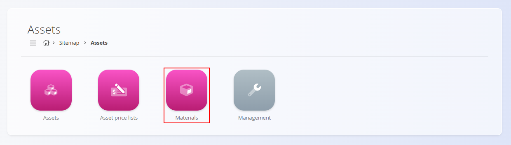

# Materiali

**Materiali** predstavljajo operativne postavke, ki jih organizacija uporablja v **logistiki, proizvodnji, upravljanju zalog** ali **montažnih procesih**. Vključujejo končne izdelke, delno izdelane postavke, osnovne surovine in ponovno uporabne komponente. Dodatni šifranti podpirajo definiranje embalaže, merskih enot in funkcij za množični uvoz.

Za dostop do materialov pojdite na **Sredstva / Materiali** v [navigaciji](../../Skupno/UI/Navigacija.md).

## Kategorije materialov

Razdelek **Materiali** vsebuje štiri glavne šifrante, ki predstavljajo osnovne vrste materialov, uporabljene v operativnih procesih:

- **[Izdelki](../Upravljanje/Izdelki.md)** – Končni izdelki, proizvedeni interno ali kupljeni kot že pripravljene postavke. Izdelki sodelujejo v zalogovnih in logističnih tokovih.
- **[Polizdelki](../Upravljanje/Polizdelki.md)** – Postavke, ki predstavljajo delno dokončane izdelke in se uporabljajo kot vmesne komponente v proizvodnji.
- **[Surovine](../Upravljanje/Surovine.md)** – Osnovni vhodni materiali, uporabljeni v začetnih fazah proizvodnje, kot so les, kovinske plošče ali drugi temeljni materiali.
- **[Repro materiali](../Upravljanje/ReproMateriali.md)** – Povratne ali pomožne komponente, ki se uporabljajo za podporo proizvodnji ali internim dejavnostim.

## Dodatni šifranti, povezani z materiali

Ti šifranti podpirajo upravljanje in natančno definicijo štirih glavnih vrst materialov:

- **[Pakiranje](../Upravljanje/Pakiranje.md)** – Določa, kako je material pakiran, vključno s količino, težo, dimenzijami in morebitnimi alternativnimi merskimi enotami.
- **[Uvoz materialov](../Upravljanje/UvozMaterialov.md)** – Omogoča množični uvoz materialov s pomočjo preglednice, kar je uporabno pri ustvarjanju ali posodabljanju več zapisov hkrati.
- **[Alternativne merske enote](../Upravljanje/AlternativneMerskeEnote.md)** – Dodatne merske enote, ki razširjajo osnovno mersko enoto materiala (npr. kosi, kilogrami, kvadratni metri) ter vključujejo nastavitve pretvorbe.
- **[Ceniki materialov](../Upravljanje/CenikiMaterialov.md)** – Določajo nabavne cene, uporabljene za naročanje in interno vrednotenje materialov.
- **[Garniture](../Upravljanje/Garniture.md)** – Vnaprej določeni sklopi materialov, združeni za lažjo izbiro v logističnih ali proizvodnih opravilih.

---
