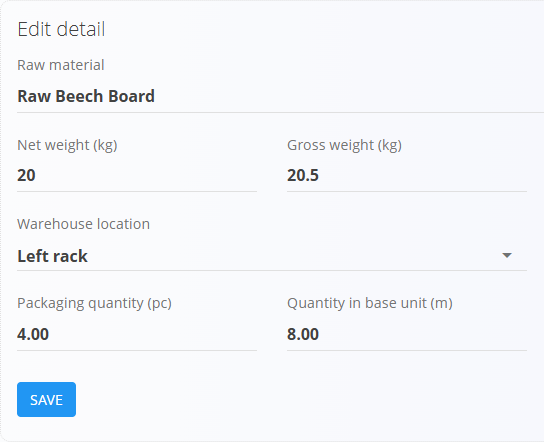

# Alternativne merske enote

**Alternativne merske enote** omogočajo obravnavo materiala z mersko enoto, ki je drugačna od njegove osnovne merske enote.  
To je uporabno v primerih, ko se materiali skladiščijo, pakirajo ali prevzemajo v praktičnih enotah (na primer kosih), zaloga pa se vodi v fizični enoti (na primer metrih).

Za dostop do tega zaslona pojdite na **Sredstva / Materiali / Alternativne merske enote** v [navigaciji](../../Skupno/UI/Navigacija.md).

> [!TIP]
> Za podrobno predstavitev si oglejte video vodič  
> **[Alternativne merske enote](https://www.youtube.com/watch?v=wPmLquFm8fY)**.

## Kako delujejo alternativne merske enote

Vsaka alternativna merska enota določa **fiksno pretvorbo** v osnovno mersko enoto materiala.  
Pretvorba je definirana z dvema obveznima vrednostma:

**Števec alternativne merske enote = Imenovalec osnovne merske enote**

### Primer

Če velja **1 kos = 2 metra**, vnesite:
- **Imenovalec**: `2`
- **Števec**: `1`

## Shema

| Polje | Opis |
|------|------|
| **Vrsta materiala** | Vrsta materiala (na primer surovina ali izdelek). |
| **Entiteta** | Konkreten material, za katerega je definirana alternativna merska enota. |
| **Osnovna merska enota** | Privzeta merska enota materiala (samo za branje). |
| **Merska enota** | Alternativna merska enota (na primer kos). |
| **Imenovalec** | Količina, izražena v **osnovni merski enoti**. |
| **Števec** | Količina, izražena v **alternativni merski enoti**. |

## Upravljanje

Alternativne merske enote se definirajo **na nivoju posameznega materiala**.

V levi stranski vrstici izberite:
- **Vrsto materiala**
- **Entiteto**

Prikazane so samo alternativne merske enote za izbrani material.

### Seznamski pogled

Seznam prikazuje:
- **Ime** (alternativna merska enota)
- **Imenovalec**
- **Števec**

### Ustvarjanje nove alternativne merske enote

1. Izberite **Vrsto materiala** in **Entiteto**.
2. Kliknite **[akcijski gumb](../../Skupno/UI/AkcijskiGumb.md)**.
3. Izberite alternativno **Mersko enoto**.
4. Vnesite **Imenovalec** in **Števec**.
5. Kliknite **Shrani**.

### Urejanje in brisanje

- Kliknite obstoječi zapis za urejanje.
- Uporabite **Shrani** za potrditev sprememb.
- Uporabite **Izbriši** za odstranitev alternativne merske enote.

## Uporaba v drugih funkcionalnostih

### Pakiranje

Alternativne merske enote se uporabljajo v **[Pakiranju](Pakiranje.md)** za določanje količin pakiranja v alternativni merski enoti, medtem ko sistem samodejno izračuna ustrezno količino v osnovni merski enoti.

### Prevzemni dokumenti

V **prevzemnih dokumentih** se količine, vnesene v alternativni merski enoti, samodejno pretvorijo v osnovno mersko enoto pri posodabljanju zaloge.

> [!IMPORTANT]
>
> - Alternativne merske enote so vezane na posamezen material  
> - Osnovne merske enote ni mogoče spreminjati na tem zaslonu  
> - Pretvorbena razmerja se dosledno uporabljajo v celotnem sistemu  
> - Sprememba ali odstranitev alternativne merske enote lahko vpliva na poteke pakiranja in prevzema  

---
