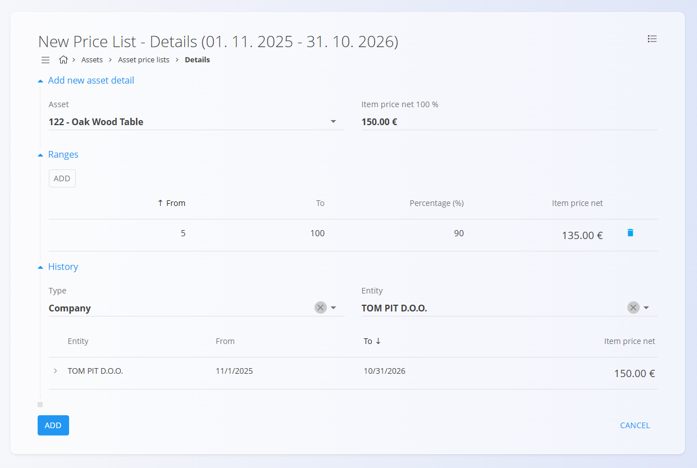
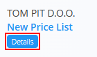

# Ceniki sredstev

**Ceniki sredstev** določajo, koliko določen kupec (ali druga poslovna entiteta) plača za vaša [sredstva](Sredstva.md).  
Omogočajo nastavitev **cen po posameznem kupcu**, veljavnih za določeno časovno obdobje, ter po potrebi vključujejo **količinske popuste** (cenovne razrede).

Za dostop do tega zaslona pojdite na **Sredstva / Ceniki sredstev** v [navigaciji](../../Skupno/UI/Navigacija.md).

## Shema

| Polje | Opis |
|------|------|
| **Tip** | Razvrstitev cenika (npr. *Podjetje*). |
| [**Entiteta**](../../Skupno/Sifranti/PoslovniImenik.md) | Kupec ali drug poslovni partner, za katerega velja cenik. |
| **Ime** | Prikazno ime cenika (obvezno). |
| **Veljavno od** | Datum začetka veljavnosti cenika. |
| **Veljavno do** | Datum konca veljavnosti cenika. |
| [**Sredstvo**](Sredstva.md) | Izbrano sredstvo, za katerega je v ceniku določena cena. |
| **Neto cena (na enoto) 100 %** | Osnovna neto cena sredstva pred popusti. |
| **Razponi** | Neobvezna pravila za količinske popuste, ki prilagodijo neto ceno glede na kupljeno količino. Vključujejo **Od**, **Do**, **Odstotek (%)** in **Neto cena postavke**. |

## Upravljanje

Za dostop do seznama cenikov pojdite na **Sredstva / Ceniki sredstev**.

Seznam prikazuje:
- vse obstoječe cenike  
- njihova obdobja veljavnosti  
- gumb **Podrobnosti** za ogled vsebine cenika  

Seznam je mogoče filtrirati po:
- **Tipu** (npr. Podjetje)
- **Entiteti** (npr. Kupec)

Klik na **ime cenika** odpre zaslon za urejanje.

Klik na gumb **Podrobnosti** odpre stran, kjer se upravljajo sredstva in količinski razponi.

## Dejanja

Glede na to, na katerem zaslonu se nahajate, [**akcijski gumb**](../../Skupno/UI/AkcijskiGumb.md) ponuja različna dejanja:

Na strani **Ceniki sredstev**:
- **Nov**
- **Kopiraj**

Na strani **Podrobnosti**:
- **Uvoz**
- **Nov**

### Nov

Na strani **Ceniki sredstev** ustvari nov cenik. Določiti morate:
- **Tip**
- **Entiteto**
- **Ime**
- **Veljavno od**
- **Veljavno do**

Na strani **Podrobnosti** ustvari nov seznam postavk. Določiti morate:
- **Sredstvo**

Po shranjevanju kliknite **Podrobnosti**, da dodate sredstva in cenovna pravila.

### Kopiraj

Ustvari kopijo obstoječega cenika, vključno z obdobjem veljavnosti in vsebino.

### Uvoz

Zaslon **Uvoz** omogoča uvoz CSV datoteke s seznamom postavk cenika.

## Ustvarjanje novega cenika

Za ustvarjanje delujočega cenika sledite tem korakom:

1. Kliknite **Nov**.
2. Izpolnite zahtevana polja: **Tip**, **Entiteta**, **Ime**, **Veljavno od**, **Veljavno do**.
3. Kliknite **Dodaj**, da shranite glavo cenika.
4. Kliknite gumb **Postavke**, da odprete stran s cenami.
   
   

5. Z uporabo akcijskega gumba dodajte eno ali več **Sredstev** v cenik.
  
   

6. (Neobvezno) Dodajte **Razpone**, da določite količinske popuste. V spodnjem primeru velja, da se pri nakupu med 5 in 100 sredstvi uporabi 90 % cene (10 % popust).

   

7. Shranite podrobnosti. Cenik je zdaj aktiven za izbranega kupca v določenem obdobju.

## Meni

Izvozi tabelo podrobnosti sredstev — skupaj z razponi — v **CSV** datoteko.

## Brisanje

Cenike sredstev je mogoče izbrisati na zaslonu za urejanje, vendar **samo če ne vsebujejo nobenih sredstev**.

Če osnutek še vedno vsebuje sredstva v razdelku **Podrobnosti**:

1. Kliknite **Podrobnosti**, da odprete razdelek.
2. Kliknite sredstvo, da odprete njegov zaslon s podrobnostmi.  
3. Kliknite **Izbriši** v zaslonu podrobnosti sredstva.  
4. Postopek ponovite za vsa preostala sredstva.

Ko dokument ne vsebuje več nobenih sredstev, lahko kliknete **Izbriši**, da odstranite cenik.

---
